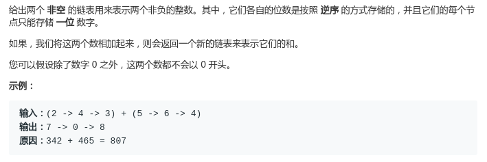
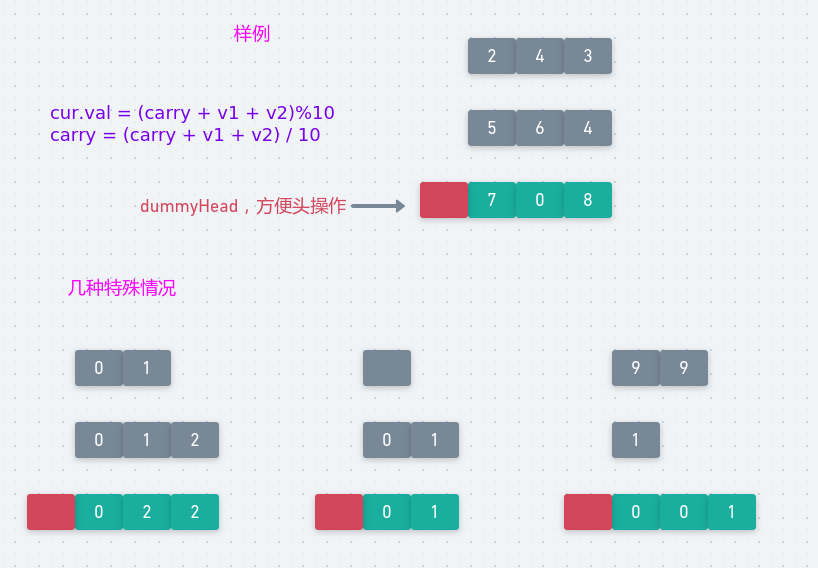

## LeetCode - 2. Add Two Numbers

#### [题目链接]()

> <https://leetcode.com/problems/add-two-numbers/>

#### 题目



## 解析

直接模拟两数加法操作，然后使用一个`carry`记录进位，下一位要加上**上一位的进位**。

注意三种特殊情况:

* 当一个列表比另一个列表长时；
* 当一个列表为空时，即出现空列表；
* **求和运算最后可能出现额外的进位**；

图: 

<div align="center"></div><br>

代码: 

```java
/**
 * Definition for singly-linked list.
 * public class ListNode {
 *     int val;
 *     ListNode next;
 *     ListNode(int x) { val = x; }
 * }
 */
class Solution {
    public ListNode addTwoNumbers(ListNode l1, ListNode l2) {
        ListNode dummyHead = new ListNode(-1);
        ListNode p1 = l1, p2 = l2;
        ListNode p3 = dummyHead;
        int carry = 0;
        while (p1 != null || p2 != null) {
            int v1 = p1 == null ? 0 : p1.val;
            int v2 = p2 == null ? 0 : p2.val;
            p3.next = new ListNode((carry + v1 + v2) % 10);//当前位的值
            carry = (v1 + v2 + carry) / 10;
            p3 = p3.next;
            if (p1 != null) p1 = p1.next;
            if (p2 != null) p2 = p2.next;
        }
        if (carry != 0) p3.next = new ListNode(carry);//最后别忘了进位
        return dummyHead.next;
    }
}
```

