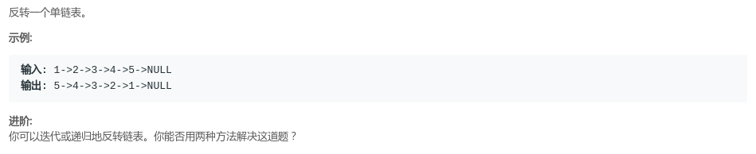
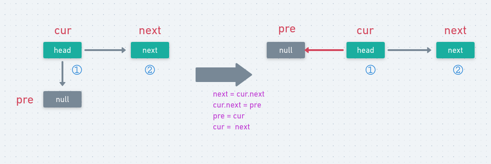
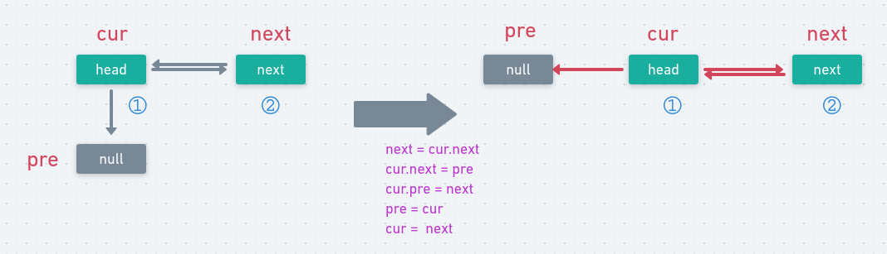
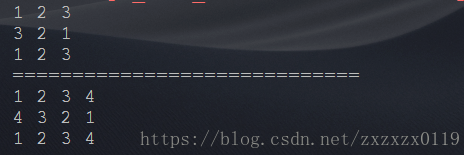

# LeetCode - 206. Reverse Linked List单链表反转(递归和非递归)(以及双向链表的反转)
 - 单链表的反转
 - 双向链表的反转
 - 完整测试代码

#### [题目链接](https://leetcode.com/problems/reverse-linked-list/description/)

> https://leetcode.com/problems/reverse-linked-list/description/

#### 题目


### 单链表的反转

单链表的反转主要是利用两个辅助的结点: 
* `pre` 和 `next` 分别代表当前要处理的节点的前一个结点和后一个结点；
* 然后通过改变结点的`next`域的指向来反转整个链表，通过循环处理，每次反转一个之后，`pre`指向下一个结点，也就是`head`，`head`更改为`head`的下一个结点，也就是`next`，这样直到`head`为空，返回`pre`就反转了整个单链表；

可以看一下下面的两个步骤:



可以用递归版本和非递归版本的写法，代码如下 : 

非递归版本

```java
class Solution {
    public ListNode reverseList(ListNode head) {
        if(head == null || head.next == null)
            return head;
        ListNode pre = null, next = null, cur = head;
        while(cur != null){
            next = cur.next;
            cur.next = pre;
            pre = cur;
            cur = next;
        }
        return pre;
    }
}
```

递归版本

```java
class Solution {
    public ListNode reverseList(ListNode head) {
        if(head == null || head.next == null)
            return head;
        return reverse(head,null);
    }
    
    private ListNode reverse(ListNode cur,ListNode pre){
        if(cur == null)
            return pre;
        ListNode next = cur.next;
        cur.next = pre;
        return reverse(next,cur);
    }
}
```

### 双向链表反转

和单链表区别不大，不过要注意反转的时候，**`head`的`pre`域要指向`next`**，因为双向链表的任意一个结点要同时有前驱和后继，所以这里要同时给出`head`的`pre`和`next`域，可以参考下图。




同样可以两种方式实现

```java
//双向链表反转(非递归)
static DoubleNode reverseList(DoubleNode head){
    DoubleNode pre = null;
    DoubleNode next = null;
    while(head != null) {
        next = head.next;
        head.next = pre;
        head.pre = next;
        pre = head;
        head = next;
    }
    return pre;
}

//递归
static DoubleNode reverseList2(DoubleNode head){
    return process(head,null);
}
static DoubleNode process(DoubleNode cur,DoubleNode pre){
    if(cur == null){
        return pre;
    }
    DoubleNode next = cur.next;
    cur.next = pre;
    cur.pre = next;
    return process(next,cur);
}
```

### 完整测试代码

```java
/**
 * 反转单向链表和双向链表
 *　这里写的是不带头结点的　(改成带头结点的不难) (带头结点的就是第一个节点一般没有数据域(插入删除的时候比不带头结点的方便))
 */
public class ReverseList {

    static class ListNode{
        public int val;
        public ListNode next;

        public ListNode(int value) {
            this.val = value;
        }
    }

    //翻转单向链表　(不带头结点)
    static ListNode reverseList(ListNode head){
        ListNode pre = null;
        ListNode next = null;
        while(head != null){
            next = head.next; //记录原先的下一个结点
            head.next = pre;  //指向前一个结点　，如果是第一个,那么前一个结点就是null
            //进行下一次的循环
            pre = head;
            head = next;
        }
        return pre; //这个时候head = null head的前一个就是头结点了
    }


    static ListNode reverseList2(ListNode head){
        return process(head,null);
    }

    static ListNode process(ListNode cur,ListNode pre){
        if(cur == null){
            return pre;
        }
        ListNode next = cur.next;
        cur.next = pre;
        return process(next,cur);
    }


    //打印单向链表
    static void printList(ListNode head){
        ListNode node = head;
        while(node != null){
            System.out.print(node.val + " ");
            node = node.next;
        }
        System.out.println();
    }

    static class DoubleNode{
        public int value;
        public DoubleNode pre;
        public DoubleNode next;

        public DoubleNode(int value) {
            this.value = value;
        }
    }

    //双向链表反转
    static DoubleNode reverseList(DoubleNode head){
        DoubleNode pre = null;
        DoubleNode next = null;
        while(head != null) {
            next = head.next;
            head.next = pre;
            head.pre = next;
            pre = head;
            head = next;
        }
        return pre;
    }


    static DoubleNode reverseList2(DoubleNode head){
        return process(head,null);
    }
    static DoubleNode process(DoubleNode cur,DoubleNode pre){
        if(cur == null){
            return pre;
        }
        DoubleNode next = cur.next;
        cur.next = pre;
        cur.pre = next;
        return process(next,cur);
    }

    //打印双向链表
    static void printDoubleList(DoubleNode head){
        DoubleNode node = head;
        while(node != null){
            System.out.print(node.value + " ");
            node = node.next;
        }
        System.out.println();
    }

    public static void main(String[] args) {
        //测试单链表 1 2 3
        ListNode head1 = new ListNode(1);
        head1.next = new ListNode(2);
        head1.next.next = new ListNode(3);
        printList(head1);
        head1 = reverseList(head1);
        printList(head1);
        head1 = reverseList2(head1);
        printList(head1);


        System.out.println("=============================");

        //测试双向链表  1 2 3 4
        DoubleNode head2 = new DoubleNode(1);
        head2.next = new DoubleNode(2);
        head2.next.pre = head2;

        head2.next.next = new DoubleNode(3);
        head2.next.next.pre= head2.next;

        head2.next.next.next = new DoubleNode(4);
        head2.next.next.next.pre = head2.next.next;

        printDoubleList(head2);
        head2 = reverseList(head2);
        printDoubleList(head2);
        head2 = reverseList2(head2);
        printDoubleList(head2);

    }
}

```
测试结果



