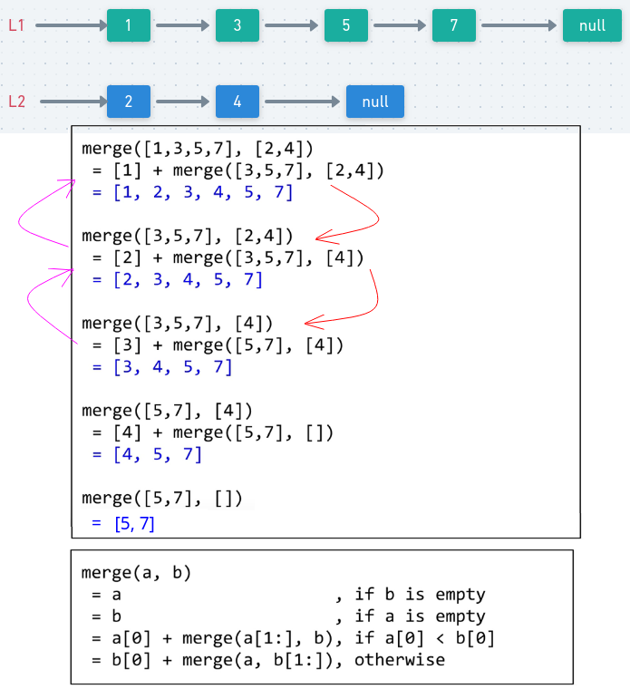

## LeetCode - 21. Merge Two Sorted Lists(合并两个有序链表)(非递归和递归)

 - 非递归
 - 递归
***
#### [题目链接](https://leetcode.com/problems/merge-two-sorted-lists/description/)

> https://leetcode.com/problems/merge-two-sorted-lists/description/

#### 题目


**这个题目[剑指Offer](https://github.com/ZXZxin/ZXNotes/blob/master/%E5%88%B7%E9%A2%98/Other/%E5%89%91%E6%8C%87Offer/%E5%89%91%E6%8C%87Offer%20-%2016%20-%20%E5%90%88%E5%B9%B6%E4%B8%A4%E4%B8%AA%E6%8E%92%E5%BA%8F%E7%9A%84%E9%93%BE%E8%A1%A8.md)中也出现过。**

### 非递归解法
非递归解法很简单，就是每次比较两个结点，把较小的加到结果链表中，并且那个指针向后移动，代码如下: 

```java
class Solution {
    public ListNode mergeTwoLists(ListNode l1, ListNode l2) {
        if (l1 == null)
            return l2;
        if (l2 == null)
            return l1;
        ListNode dummyHead = new ListNode(-1);
        ListNode cur = dummyHead;
        while (l1 != null && l2 != null) {
            if (l1.val <= l2.val) {
                cur.next = l1;
                l1 = l1.next;
            } else {
                cur.next = l2;
                l2 = l2.next;
            }
            cur = cur.next;
        }
        if (l1 != null)
            cur.next = l1;
        if (l2 != null)
            cur.next = l2;
        return dummyHead.next;
    }
}
```

***
### 递归解法
非递归的解法就是每次比较两个链表的头部，将较小的头部单独取出来，然后剩下的两个部分继续递归，具体流程看下图 : 



```java
class Solution {
    public ListNode mergeTwoLists(ListNode l1, ListNode l2) {
        if (l1 == null || l2 == null)
            return l1 == null ? l2 : l1;
        if (l1.val < l2.val) {
            l1.next = mergeTwoLists(l1.next, l2);
            return l1;
        } else {
            l2.next = mergeTwoLists(l1, l2.next);
            return l2;
        }
    }
}
```

