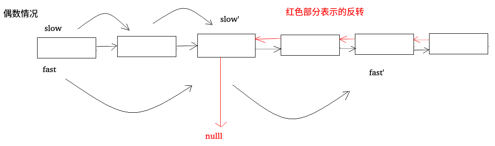

## LeetCode - 234. Palindrome Linked List(回文链表)
 - 方法一 : 使用一个栈(O(n)的空间复杂度)
 - 方法二 : 使用快慢指针，以及O(n/2)的空间复杂度
 - 方法三 : 使用快慢指针并反转链表(不需要额外的空间复杂度)
***
#### [题目链接](https://leetcode.com/problems/palindrome-linked-list/description/)

> https://leetcode.com/problems/palindrome-linked-list/description/

#### 题目


### 方法一 : 使用一个栈(O(n)的空间复杂度)

 这个方法很简单，先遍历一遍链表，把整个链表都压入栈中，然后再遍历一遍，每次从栈顶拿出一个元素进行比较，如果所有元素都相同，则返回`true`，否则只要有一个不同就返回`false`。

```java
class Solution {
    public boolean isPalindrome(ListNode head) {
        if(head == null || head.next == null)
            return true;
        
        Stack<ListNode>stack = new Stack<>();
        ListNode cur = head;
        while(cur != null){
            stack.push(cur);
            cur = cur.next;
        }
        
        cur = head;
        while(!stack.isEmpty()){
            if(stack.pop().val != cur.val){
                return false;
            }
            cur = cur.next;
        }
        return true;
    }
}
```

***
### 方法二 : 使用快慢指针，以及O(n/2)的空间复杂度

这个就是在第一种方法的基础上进行简单的改进：
* 首先定义两个指针`fast`和`slow`，每次让`fast`指针走两步，`slow`指针走一步；

* 然后当`fast`指针走完的时候，`slow`指针刚好来到中点，此时把链表的后半部分压入栈中，然后拿栈中的元素依次和链表的前半部分比较，就可以得到结果。

* 在代码实现 的过程中，要注意链表长度奇偶的不同，奇数的时候，`slow`指针指到中间位置的下一个位置，偶数的时候也要`slow`指针知道中间位置的下一个位置，一开始的时候`slow = head.next`，还有就是要注意`fast`移动的过程中，要做两个判断，防止空指针异常，具体奇偶的过程看下图。


代码实现: 

```java
class Solution {
    public boolean isPalindrome(ListNode head) {
        if(head == null || head.next == null)
            return true;
        ListNode fast = head;
        ListNode slow = head.next;
        while(fast.next != null && fast.next.next != null){
            fast = fast.next.next;
            slow = slow.next;
        }
        
        Stack<ListNode>stack = new Stack<>();
        //把链表的后半部分推入到栈中
        while(slow != null){ 
            stack.push(slow);
            slow = slow.next;
        }
        
        //check
        slow = head;
        while(!stack.isEmpty()){
            if(stack.pop().val != slow.val)
                return false;
            slow = slow.next;
        }
        return true;
    }
}
```

***
### 方法三 : 使用快慢指针并反转链表(不需要额外的空间复杂度)

方法三的思想也要使用快指针和慢指针：
* 快指针一次走两步，慢指针一次走一步，当快指针走完的时候，慢指针来到中间的位置(或者中间的前一个位置(偶数的情况(<font color = red>和上面的方法是不同的(上面的是慢指针在中间的后一个位置))))  (因为一开始`fast`和`slow`的起点和上面的不同)；
* 然后，要用到<font color = red>链表的反转</font>(链表反转不清楚的可以看一下[这篇博客](https://blog.csdn.net/zxzxzx0119/article/details/81073246))，此时，我们将后半部分链表反转，然后使用两个指针分别从头部和尾部位置开始比较，直到其中一个为空。　当然，不管返回`true`还是`false`，我们最后都将反转的链表的结构反转回来；
 * 在代码实现的过程中，也要注意奇数和偶数的情况，<font color = red>奇数的时候，`slow`指针正好来到中间结点，偶数的时候来到中间结点的前一个节点。</font>

 具体奇偶的过程可以看下图





代码实现

```java
class Solution {
    public boolean isPalindrome(ListNode head) {
        if(head == null || head.next == null)
            return true;
        ListNode fast = head;
        ListNode slow = head; //注意这里起点和之前的不同
        while(fast.next != null && fast.next.next != null){
            fast = fast.next.next;
            slow = slow.next;
        }
        
        //开始反转
        ListNode next = null;
        ListNode pre = null;
        ListNode cur = slow;
        while(cur != null){
            next = cur.next;
            cur.next = pre;
            pre = cur;
            cur = next;
        } 
        
        //记录最后一个结点 , 反转之后pre是最后一个结点，
        ListNode end = pre;
        
        //开始判断
        ListNode R = end; //R从后一个结点开始比较
        ListNode L = head;
        boolean res = true;
        while( L != null && R != null){
            if(L.val != R.val){
                res = false;
                break;
            }
            L = L.next;
            R = R.next;
        }
        
        //最后还原链表
        cur = end;
        pre = null;
        while(cur != null){
            next = cur.next;
            cur.next = pre;
            pre = cur;
            cur = next;
        }        
        return res;
    }
}
```

