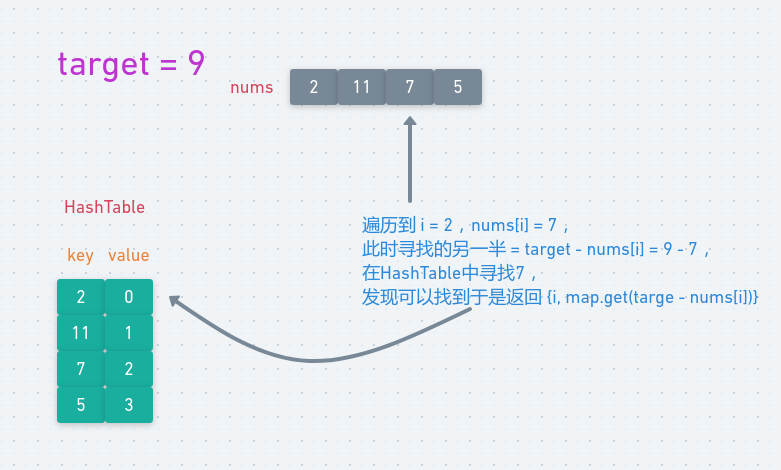

# LeetCode - 1. Two Sum(Hash)

#### [题目链接](https://leetcode.com/problems/two-sum/)

> https://leetcode.com/problems/two-sum/

#### 题目


暴力方法就不说了。这题用Hash。

## 一、方法一

时间复杂度`2 * O(N)`。

* 先遍历一边数组，使用`HashMap`存储每个数的**下标**；
* 然后再遍历一遍数组，寻找`target - nums[i]`在`map`中存不存在，如果存在且**对应的值不等于当前的下标`i`**(即目标元素不能是`nums[i]`本身)，就说明存在解，返回两个下标即可；

图: 

<div align="center"></div><br>

```java
class Solution {
    public int[] twoSum(int[] nums, int target) {
        HashMap<Integer, Integer> map = new HashMap<>();
        for(int i = 0; i < nums.length; i++) map.put(nums[i], i); 
        for(int i = 0; i < nums.length; i++){
            int val = target - nums[i];
            if(map.containsKey(val) && map.get(val) != i)
                return new int[]{i, map.get(val)};
        }
        throw new RuntimeException("No such soultion!");
    }
}
```
***
## 二、方法二

时间复杂度`O(N)`。

在检查完当前元素`num[i]`之后(检查`target - nums[i]`)。

再顺便将`{nums[i], i}`放入哈希表，因为当前放入的元素**后面还会回过头来检查这个元素是否是目标元素**。

```java
class Solution {
    public int[] twoSum(int[] nums, int target) {
        HashMap<Integer, Integer> map = new HashMap<>();
        for(int i = 0; i < nums.length; i++){
            int val = target - nums[i];
            if(map.containsKey(val)) // 肯定不会map.get(val) == i 
                return new int[]{i, map.get(val)};
            map.put(nums[i], i);
        }
        throw new RuntimeException("No such soultion!");
    }
}
```

> **还可以使用`Hash`表解决类似的[进阶问题](https://blog.csdn.net/zxzxzx0119/article/details/81604489)**<font>