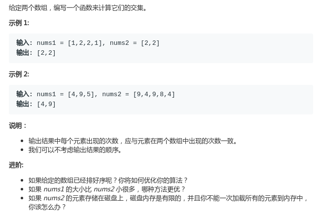
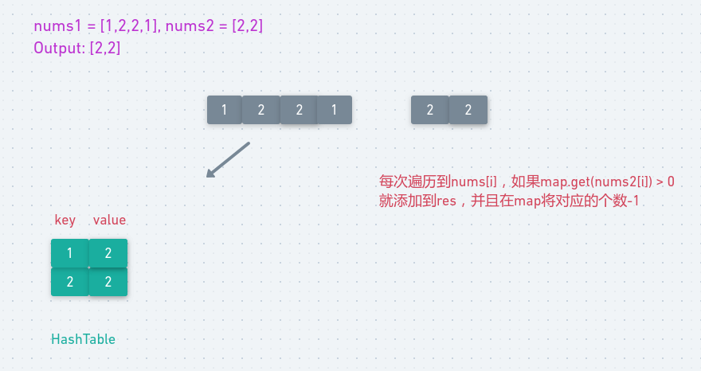

# LeetCode - 350. Intersection of Two Arrays II

#### [题目链接](https://leetcode.com/problems/intersection-of-two-arrays-ii/)

> https://leetcode.com/problems/intersection-of-two-arrays-ii/

#### 题目



## 解析

和上个题目类似，不过这个题目需要统计重复的元素，所以我们要从`set`变成`map`，来统计`nums1`中的元素出现的次数，然后每次在`nums2`中查询的时候，每找到一个就要`--`。

图:



代码:

```java
class Solution {
    public int[] intersect(int[] nums1, int[] nums2) {
        HashMap<Integer, Integer> map = new HashMap<>();
        for (int n : nums1) map.put(n, map.getOrDefault(n, 0) + 1);
        int k = 0;
        for (int n : nums2) {
            if (map.containsKey(n) && map.get(n) > 0)
                nums1[k++] = n;
            map.put(n, map.getOrDefault(n, 0) - 1);
        }
        return Arrays.copyOfRange(nums1, 0, k);//取数组的[0, k)
    }
}
```

同样也可以用排序的方法，然后双指针来做:

```java
public class Solution {
    public int[] intersect(int[] nums1, int[] nums2) {
        Arrays.sort(nums1);
        Arrays.sort(nums2);
        int k = 0;
        for (int i = 0, j = 0; i < nums1.length && j < nums2.length; ) {
            if (nums1[i] == nums2[j]) {
                nums1[k++] = nums1[i];
                i++;
                j++;
            } else if (nums1[i] < nums2[j])
                i++;
            else
                j++;
        }
        return Arrays.copyOfRange(nums1, 0, k);
    }
}
```

