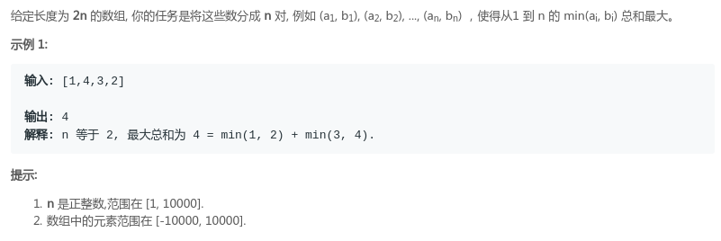

## LeetCode - 561. Array Partition I(数组拆分 I)(贪心和Hash思想)

 - 贪心解法
 - hash思想解法

***
#### [题目链接](https://leetcode.com/problems/array-partition-i/description/)

> https://leetcode.com/problems/array-partition-i/description/

#### 题目

### 贪心解法
贪心的解法就是对数组进行排序，因为我们要对数组进行划分，每次选取两个，并且选出最小的那个，所以我们不能浪费那些大的数，所以每次不能浪费更大的数，所以选取相邻的数作为一对。

```java
class Solution {

    public int arrayPairSum(int[] nums) {
        Arrays.sort(nums);
        int res = 0;
        for (int i = 0; i < nums.length; i += 2) 
            res += nums[i];
        return res;
    }
}
```

### hash思想解法
**思想也是对数组进行排序，主要是题目中说数的范围在`[-10000,10000]`之间，所以我们可以开一个`20000`大小的数组，足以保存下这些数，然后统计每个元素出现的次数，遍历一遍`hash`数组即可，最多循环`20000`次。**
```java
class Solution {

    public int arrayPairSum(int[] nums) {
        int[] hash = new int[20001];
        for (int i = 0; i < nums.length; i++) 
            hash[nums[i] + 10000]++;
        int res = 0;
        boolean odd = true;
        for (int i = 0; i < hash.length; ) {
            if (hash[i] != 0) {    //原数组中存在
                if (odd) {
                    res += (i - 10000);
                    odd = false;
                } else {
                    odd = true;
                }
                if (--hash[i] == 0) i++; //有可能有重复元素
            } else i++;
        }
        return res;
    }
}
```
**更加优化的解法:** 
```java
class Solution {

    public int arrayPairSum(int[] nums) {
        int[] hash = new int[20001];
        for (int i = 0; i < nums.length; i++) 
            hash[nums[i] + 10000]++;
        int res = 0;
        boolean odd = true;
        for (int i = 0; i < hash.length; i++) {
            while (hash[i] != 0) {
                if (odd) {
                    res += (i - 10000);
                }
                odd = !odd;
                --hash[i];
            }
        }
        return res;
    }
}
```
