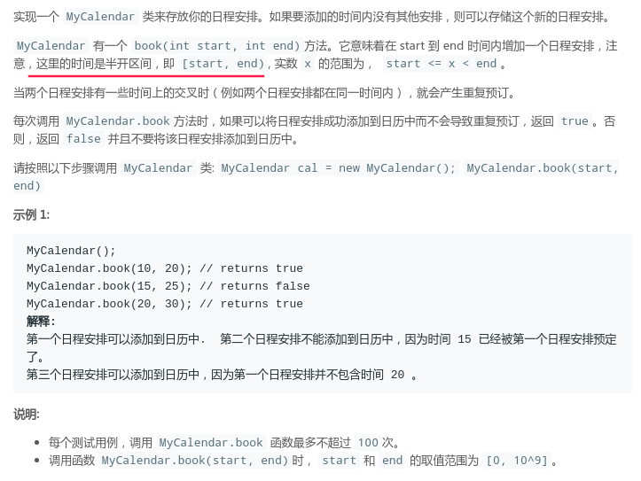
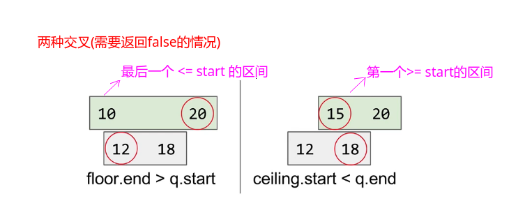
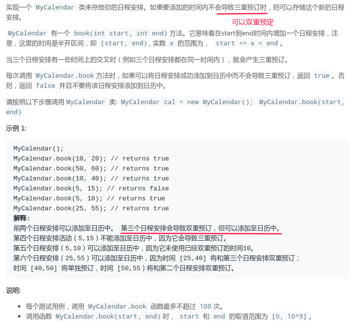
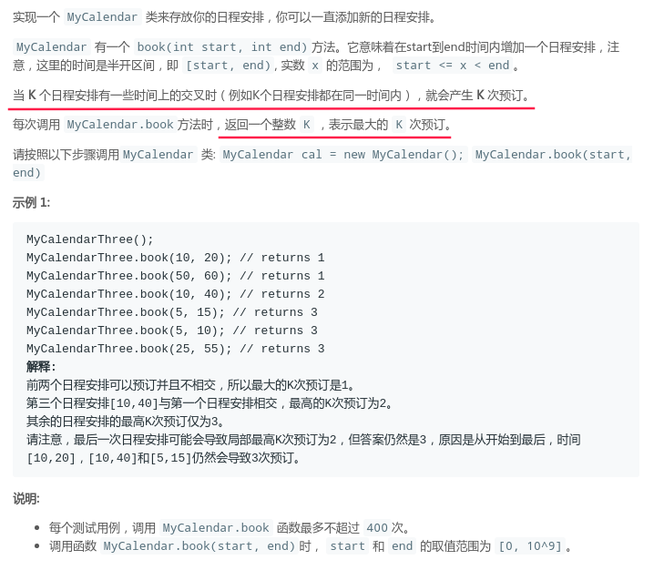

## LeetCode - 729. My Calendar(区间)

* [一、LeetCode - 729. My Calendar I](#一leetcode---729-my-calendar-i)
* [二、LeetCode - 731. My Calendar II](#二leetcode---731.-my-calendar-ii)
* [三、LeetCode - 732. My Calendar III](#三leetcode---732.-my-calendar-iii)

### 一、LeetCode - 729. My Calendar I

#### [题目链接](https://leetcode.com/problems/my-calendar-i/)
> https://leetcode.com/problems/my-calendar-i/

#### 题目



#### 解析

第一种暴力法，去判断前面已经添加的和当前的有没有冲突即可。

```java
class MyCalendar {

    private int[] L;
    private int[] R;
    private int n;

    public MyCalendar() {
        L = new int[1001];
        R = new int[1001];
        n = 0;
    }

    public boolean book(int start, int end) {
        for (int i = 0; i < n; i++)
//                if (Math.max(L[i], R[i]) < Math.min(start, end))// 相交的四种情况
            if(!ok(L[i], R[i], start, end))
                return false;
        L[n] = start;
        R[n++] = end;
        return true;
    }

    private boolean ok(int l1, int r1, int l2, int r2){
        return l2 >= r1 || l1 >= r2;//不相交的情况
    }
}
```

第二种利用`TreeMap`(即二叉搜索树)的性质，可以在`logN`内完成查找。

因为`TreeMap`会按照`key`在内部排序，然后我们就可以快速的找到最后一个`<= e` (floorKey)和第一个`>=e`(ceilingKey)的元素。

因为区间是有序的，所以我们只要找到这两个区间，然后判断和当前加入区间是否有重叠即可。



代码:

```java
class MyCalendar {

    private TreeMap<Integer, Integer> treeMap;

    public MyCalendar() {
        treeMap = new TreeMap<>();
    }

    public boolean book(int start, int end) {
        Integer lastSmall = treeMap.floorKey(start);// 最后一个 <= start的
        if(lastSmall != null && treeMap.get(lastSmall) > start) return false;
        Integer firstBig = treeMap.ceilingKey(start);//第一个 >= start 的
        if(firstBig != null && end > firstBig) return false;
        treeMap.put(start, end);
        return true;
    }
}
```

### 二、LeetCode - 731. My Calendar II

#### [题目链接](https://leetcode.com/problems/my-calendar-ii/)
> https://leetcode.com/problems/my-calendar-ii/

#### 题目



#### 解析

### 三、LeetCode - 732. My Calendar III

#### [题目链接](https://leetcode.com/problems/my-calendar-iii/)
> https://leetcode.com/problems/my-calendar-iii/

#### 题目



#### 解析
