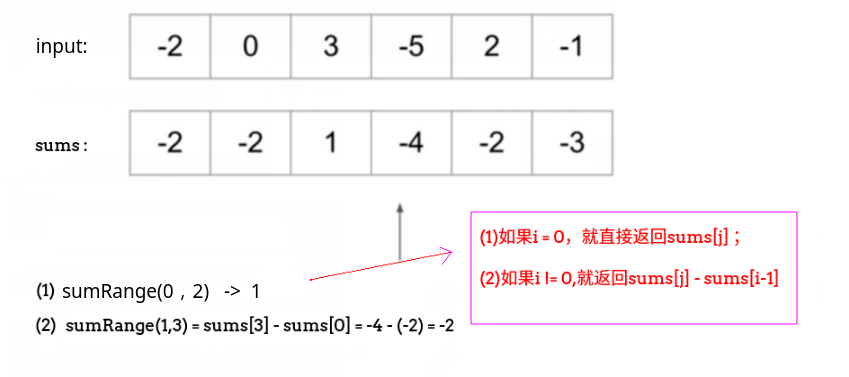

## LeetCode - 303. Range Sum Query - Immutable(简单dp或者线段树)

 - dp
 - 线段树

#### [题目链接](https://leetcode.com/problems/range-sum-query-immutable/description/)

> https://leetcode.com/problems/range-sum-query-immutable/description/

#### 题目

### 解析
#### dp
一维的动态规划，直接从左到右记录`0～每个位置`的和，然后递归`sums[i] = sums[i-1] + nums[i]`，求出所有的
`sums`，然后要求某个区间的和，就直接返回`sums[j] - sums[i-1]`即可，如果`i = 0`,就直接返回`sums[j]`。



代码:

```java
public class NumArray {

    public int[] sums;

    public NumArray(int[] nums) {    
        if (nums == null || nums.length == 0) 
            return;
        sums = new int[nums.length];
        sums[0] = nums[0];
        for (int i = 1; i < nums.length; i++) sums[i] = sums[i - 1] + nums[i]; // dp
    }

    public int sumRange(int i, int j) {
        if (i == 0) return sums[j];
        return sums[j] - sums[i - 1];
    }
}

```
***
### 线段树
线段树解析看[这篇博客](https://github.com/ZXZxin/ZXBlog/blob/master/%E6%95%B0%E6%8D%AE%E7%BB%93%E6%9E%84%E7%AE%97%E6%B3%95/Data%20Structure/SegmentTree/%E7%BA%BF%E6%AE%B5%E6%A0%91%E6%80%BB%E7%BB%93%E4%BB%A5%E5%8F%8ALeetCode%20-%20307.%20Range%20Sum%20Query%20-%20Mutable.md#%E7%BA%BF%E6%AE%B5%E6%A0%91%E6%9F%A5%E8%AF%A2)。

```java
public class NumArray {

    private interface Merger<E> {
        E merge(E a, E b);
    }

    private class SegmentTree<E> {

        private E[] tree;
        private E[] data;
        private Merger<E> merger;

        public SegmentTree(E[] arr, Merger merger) {
            this.merger = merger;

            data = (E[]) new Object[arr.length];
            for (int i = 0; i < arr.length; i++) data[i] = arr[i];
            tree = (E[]) new Object[4 * arr.length];   //最多需要4 * n
            buildSegmentTree(0, 0, arr.length - 1);
        }

        public void buildSegmentTree(int treeIndex, int L, int R) {
            if (L == R) {
                tree[treeIndex] = data[L];
                return;
            }
            int treeL = treeIndex * 2 + 1;
            int treeR = treeIndex * 2 + 2;
            int m = L + (R - L) / 2;

            buildSegmentTree(treeL, L, m);
            buildSegmentTree(treeR, m + 1, R);

            tree[treeIndex] = merger.merge(tree[treeL], tree[treeR]);
        }


        public E query(int qL, int qR) {
            if (qL < 0 || qL >= data.length || qR < 0 || qR >= data.length || qL > qR) return null;
            return query(0, 0, data.length - 1, qL, qR);
        }

        private E query(int treeIndex, int L, int R, int qL, int qR) {
            if (L == qL && R == qR) {
                return tree[treeIndex];
            }
            int m = L + (R - L) / 2;

            int treeL = treeIndex * 2 + 1;
            int treeR = treeIndex * 2 + 2;

            if (qR <= m) { //和右区间没关系 ,直接去左边查找 [0,4]  qR <= 2 [0,2]之间查找
                return query(treeL, L, m, qL, qR);
            } else if (qL > m) {//和左区间没有关系，直接去右边查找 [0,4] qL > 2  --> [3,4]
                return query(treeR, m + 1, R, qL, qR);
            } else { //在两边都有，查询的结果  合并
                return merger.merge(query(treeL, L, m, qL, m), //注意是查询 [qL,m]
                        query(treeR, m + 1, R, m + 1, qR));   //查询[m+1,qR]
            }
        }

    }

    private SegmentTree<Integer> segTree;

    public NumArray(int[] nums) {
        if (nums == null || nums.length == 0) return;
        Integer[] arr = new Integer[nums.length];
        for (int i = 0; i < nums.length; i++) arr[i] = nums[i];
        segTree = new SegmentTree<Integer>(arr, new Merger<Integer>() {
            @Override
            public Integer merge(Integer a, Integer b) {
                return a + b;
            }
        });
    }

    public int sumRange(int i, int j) {
        return segTree.query(i, j);
    }
}
```

