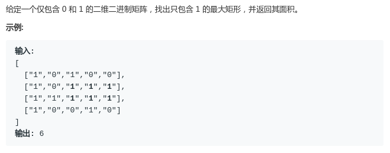

# LeetCode - 85. Maximal Rectangle

#### [题目链接]()

#### 题目



## 解析

这个题目就是[**LeetCode - 84. 直方图最大矩形覆盖**](https://blog.csdn.net/zxzxzx0119/article/details/81630814)的一个变式: 
我们只需要求出以**每一行作为底最大的矩形是多少**，每一行都有一个`height`数组，把每个数组都调用上个题目的方法就可以求出，以每一行作为底(直方图最下面)时最大矩形面积，然后记录最大值即可。
**关键就是每次更新`height`数组，`height`数组代表的是这一列上面有多少个连续的**`1`


例如: 
```c
map = 1  0  1  1
      1  1  1  1 
      1  1  1  0
```

以第一行做切割后，`height = {1, 0, 1, 1}`，`height[j]`表示目前的底上(第`1`行)，`j`位置往上(包括`j`位置)有多少连续的`1`；

以第`2`行做切割后，`height = {2,  1, 2, 2}`，注意到从第一行到第二行，`height`数组的更新是十分方便的，即`height[j] = map[i][j] == 0 ? 0 : height[j] + 1`；(这里有点dp的意思)

第`3`行做切割后，`height = {3, 2, 3, 0}`；

最后的结果: 对于每一次切割，都利用更新后的`height`数组来求出以每一行为底的情况下，最大的矩形是多大（然后记录最大值即可）。