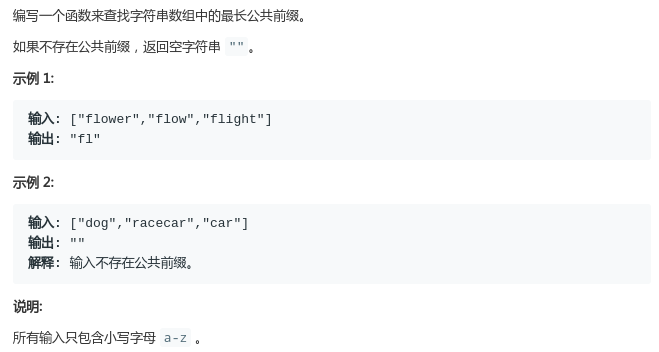
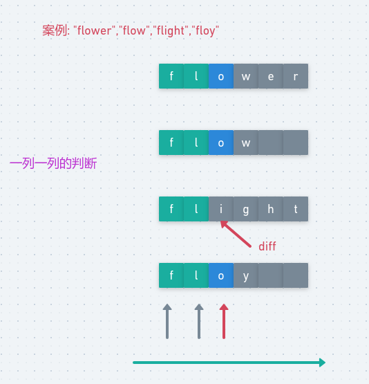
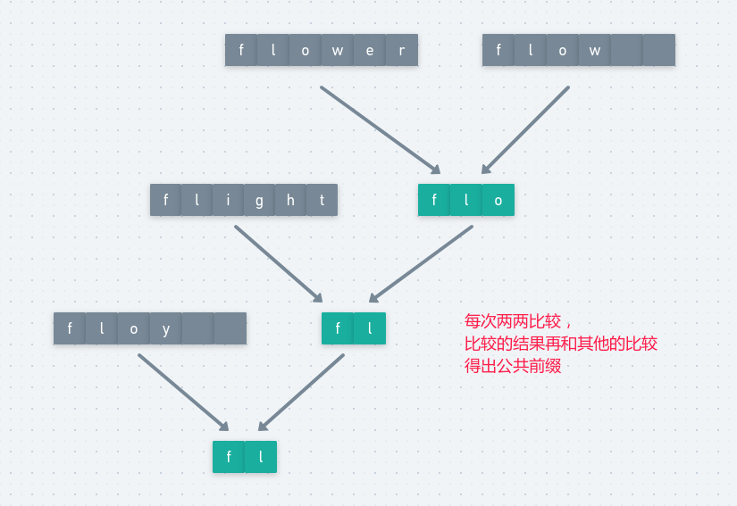
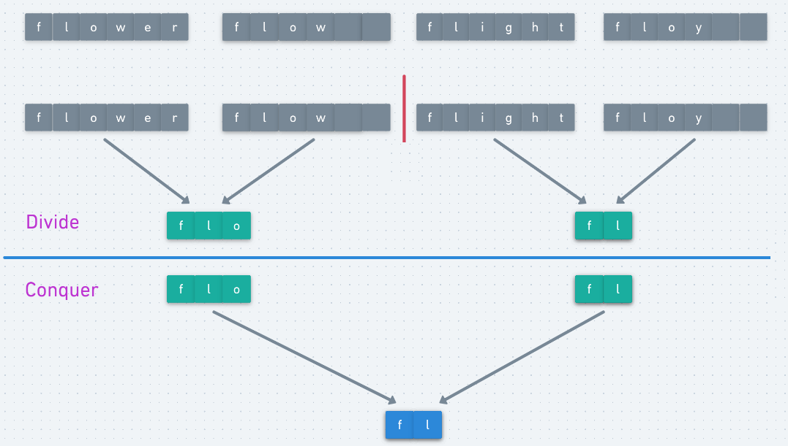

# LeetCode - 14. Longest Common Prefix

#### [题目链接](https://leetcode.com/problems/longest-common-prefix/)

> https://leetcode.com/problems/longest-common-prefix/

#### 题目



## 解析

这题解法有挺多种，LeetCode官方题解也给的挺多。我这里也给出几种。


### 1、按照列比较

第一种比较直观的做法。按照**列**来比较，看图就懂。

<div align="center"></div><br>

代码:

```java
class Solution {

    public String longestCommonPrefix(String[] strs) {
        if(strs == null || strs.length == 0) return "";
        int minLen = Integer.MAX_VALUE;
        for (int i = 0; i < strs.length; i++) minLen = Math.min(minLen, strs[i].length());
        StringBuilder sb = new StringBuilder();
        for (int len = 0; len < minLen; len++) {
            char c = strs[0].charAt(len);
            boolean ok = true;
            for (int i = 1; i < strs.length; i++) if(c != strs[i].charAt(len)){
                ok = false;
                break;
            }
            if(ok)
                sb.append(c);
            else
                break;
        }
        return sb.toString();
    }
}
```

### 2、水平的两两之间做比较

这个方法就是每两个之间进行比较，得到每两个的最长公共前缀。

<div align="center"></div><br>

但是这个过程我们要用到**查找和剪裁**的做法，例如我们比较两个字符串之间的公共前缀的做法是:

* 我们不断的在`B`中查找`A`(使用`indexOf()`方法)；
* 如果目前不存在，就将`A`减掉一位，继续在`B`中查找`A`；

代码: 

```java
class Solution {

    public String longestCommonPrefix(String[] strs) {
        if (strs.length == 0) return "";
        String prefix = strs[0]; // 前缀不断的更新,就是图中绿色部分
        for (int i = 1; i < strs.length; i++)
            while (strs[i].indexOf(prefix) != 0) { // 一定要是0，因为是前缀，如果达到了0，说明找到了一个前缀
                prefix = prefix.substring(0, prefix.length() - 1); //如果不满足，就在prefix的后面去掉一位
                if (prefix.isEmpty()) return "";
            }
        return prefix;
    }
}
```


### 3、分治

这个方法很有创意:

* 整体思路是将这`n`个字符串不断的划分，按照中间位置分开后，左边和右边先求出`LCP`；
* 此时只有两个字符串，我们可以利用列或者行比较这两个字符串的`LCP`返回即可；

图(这里只有四个字符串，可以画更多):

<div align="center"></div><br>

代码:

```java
class Solution {

    public String longestCommonPrefix(String[] strs) {
        if (strs == null || strs.length == 0) return "";
        return dc(strs, 0 , strs.length - 1);
    }

    private String dc(String[] strs, int L, int R){
        if(L == R) return strs[L];
        int mid = L + (R - L) / 2;
        String lcpL = dc(strs, L, mid);
        String lcpR = dc(strs, mid + 1, R);
        return findPrefixInTwo(lcpL, lcpR);
    }

    private String findPrefixInTwo(String a, String b){
        StringBuilder sb = new StringBuilder();
        for(int i = 0; i < Math.min(a.length(), b.length()); i++){
            char c1 = a.charAt(i), c2 = b.charAt(i);
            if(c1 == c2)
                sb.append(c1);
            else
                break;
        }
        return sb.toString();
    }
}
```

### 4、二分

