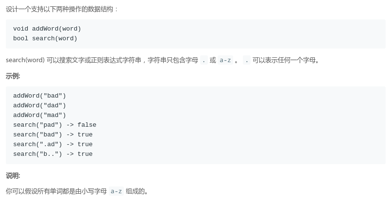

## LeetCode - 211. Add and Search Word - Data structure design(字典树和递归)
#### [题目链接](https://leetcode.com/problems/add-and-search-word-data-structure-design/description/)

> https://leetcode.com/problems/add-and-search-word-data-structure-design/description/

#### 题目

#### 解析
首先知道[字典树的基本操作](shttps://github.com/ZXZxin/ZXBlog/blob/master/%E6%95%B0%E6%8D%AE%E7%BB%93%E6%9E%84%E7%AE%97%E6%B3%95/Data%20Structure/Trie/LeetCode%20-%20208.%20Implement%20Trie%20(Prefix%20Tree)%E4%BB%A5%E5%8F%8A%E5%AE%9E%E7%8E%B0%E5%AD%97%E5%85%B8%E6%A0%91(%E5%89%8D%E7%BC%80%E6%A0%91).md)。

对于这个题目：　

 - `addWord()`操作没什么好说的，就是向字典树添加元素，记得维护结点的`end`值；
 - **匹配的过程是一个递归的过程，从根结点开始，递归终止条件是`node.end > 0`(返回(也就是是否有))**;
 - **对于匹配操作要分两种情况，如果不是`'.'`，就定位到该匹配的子树，继续递归匹配**；
 - **如果是`'.'`，就要遍历该结点的所有`next[i]`，去搜索匹配，这些`next[i]`中只要有一个匹配成功就返回true，否则返回`false`**；

图:


代码:

```java
class WordDictionary {
    
    private class Node {
        public int end;
        public Node[] next;//使用整数表示字符　c - 'a'

        public Node() {
            end = 0;
            next = new Node[26];
        }
    }

    private Node root;

    public WordDictionary() {
        root = new Node();
    }

    public void addWord(String word) {
        if (word == null)
            return;
        Node cur = root;
        int index;
        for (int i = 0; i < word.length(); i++) {
            index = word.charAt(i) - 'a';
            if (cur.next[index] == null)
                cur.next[index] = new Node();
            cur = cur.next[index];
        }
        cur.end++;
    }

    public boolean search(String word) {
        return process(root, word, 0);
    }

    public boolean process(Node node, String word, int index) {
        if (node == null)
            return false;
        if (index == word.length())
            return node.end > 0;
        char c = word.charAt(index);
        if (c != '.') {
            int idx = c - 'a';
            if (node.next[idx] == null)
                return false;
            else {
                return process(node.next[idx], word, index + 1);
            }
        } else {  // c == '.' search all the subTree
            for (Node cur : node.next) {
                if (process(cur, word, index + 1))
                    return true;
            }
            return false;
        }
    }
}

```
