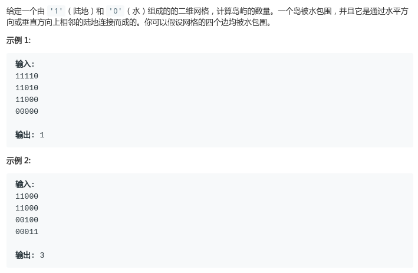
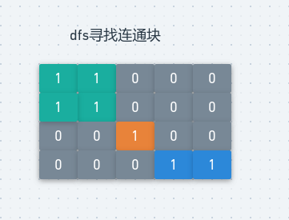

# LeetCode - 200. Number of Islands

#### [题目链接](https://leetcode-cn.com/problems/number-of-islands/)

> https://leetcode-cn.com/problems/number-of-islands/

#### 题目



## 解析

dfs写法，很简单的寻找连通块的问题。

<div align="center"></div><br>代码:

```java
class Solution {
    public int numIslands(char[][] grid) {
        int res = 0;
        for (int i = 0; i < grid.length; i++) {
            for (int j = 0; j < grid[0].length; j++) {
                if (grid[i][j] == '1') {
                    dfs(grid, i, j);
                    res++;
                }
            }
        }
        return res;
    }

    private void dfs(char[][] grid, int i, int j) {
        if (i < 0 || i >= grid.length || j < 0 || j >= grid[0].length) return;
        if (grid[i][j] == '0') return;
        grid[i][j] = '0';
        dfs(grid, i, j - 1);
        dfs(grid, i - 1, j);
        dfs(grid, i + 1, j);
        dfs(grid, i, j + 1);
    }
}
```

并查集写法。

也是按照上面的思路，只不过将四周可以合并的点合并到同一个集合中，一开始并查集数目为 `count = n * m`，以后每次合并两个元素，`count--`，最后就是连通块的数目。

```java
class Solution {

    class UF {
        int count = 0; // 统计集合的数目
        int[] parent, rank;

        UF(int n, int count) {
            parent = new int[n];
            rank = new int[n];
            for (int i = 0; i < n; i++) {
                parent[i] = i;
                rank[i] = 1;
            }
            this.count = count;

        }

        int find(int p) {
            while (p != parent[p]) {
                parent[p] = parent[parent[p]];
                p = parent[p];
            }
            return p;
        }

        void union(int a, int b) {
            int aR = find(a);
            int bR = find(b);
            if (aR == bR)
                return;
            count--; // 每次合并一个就减掉一个
            if(aR < bR){
                parent[aR] = bR;
            }else if(aR > bR){
                parent[bR] = aR;
            }else {
                parent[aR] = bR;
                rank[bR]++;
            }
        }
    }

    public int numIslands(char[][] grid) {
        if (grid == null || grid.length == 0 || grid[0].length == 0) return 0;
        int n = grid.length;
        int m = grid[0].length;
        int count = 0;
        for (int i = 0; i < n; i++) {
            for (int j = 0; j < m; j++) {
                if (grid[i][j] == '1')
                    count++;
            }
        }
        UF uf = new UF(n * m, count);
        for (int i = 0; i < n; i++) {
            for (int j = 0; j < m; j++) {
                if (grid[i][j] == '0') continue;
                if (i > 0 && grid[i - 1][j] == '1')     uf.union(i * m + j, (i - 1) * m + j);
                if (i < n - 1 && grid[i + 1][j] == '1') uf.union(i * m + j, (i + 1) * m + j);
                if (j > 0 && grid[i][j - 1] == '1')     uf.union(i * m + j, i * m + j - 1);
                if (j < m - 1 && grid[i][j + 1] == '1') uf.union(i * m + j, i * m + j + 1);
            }
        }
        return uf.count;
    }
}
```

