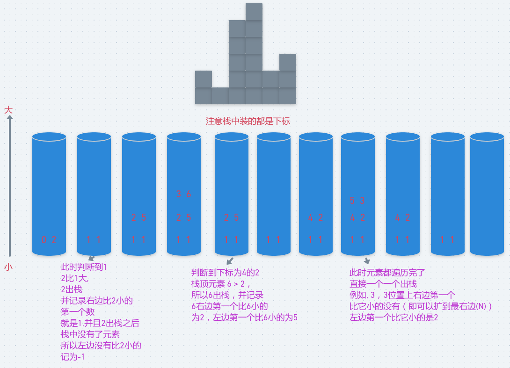

# LeetCode - 84. Largest Rectangle in Histogram(单调栈)

#### [题目链接](https://leetcode.com/problems/largest-rectangle-in-histogram/)

> https://leetcode.com/problems/largest-rectangle-in-histogram/

#### 题目


## 解析

给出两种解法，一种`O(N^2)`，一种单调栈的`O(N)`。

第一种方法:

* 先从做往右扫描，每次找到第一个当前位置不比后一个位置小的位置；
* 然后从这个位置开始往前面扫描，计算出以这个位置结尾的最大矩形；
* 然后我们更新全局最大值即可；

图:


代码:

```java
class Solution {
    public int largestRectangleArea(int[] heights) {
        if(heights == null || heights.length == 0) return 0;
        int maxArea = 0;
        for(int cur = 0; cur < heights.length; cur++){
            if(cur != heights.length - 1 && heights[cur] <= heights[cur+1]) continue;
            int minHeight = Integer.MAX_VALUE;
            for(int i = cur; i >= 0; i--){
                if(heights[i] < minHeight) minHeight = heights[i];
                maxArea = Math.max(maxArea, minHeight * (cur - i + 1));
            }
        }
        return maxArea;
    }
}
```

单调栈的解法。

单调栈的知识看[**这篇博客**](https://github.com/ZXZxin/ZXBlog/blob/master/%E5%88%B7%E9%A2%98/InterviewAlgorithm.md#%E5%8D%81%E5%85%AB%E5%8D%95%E8%B0%83%E6%A0%88)，注意这个栈是 **从栈底到栈顶依次是从小到大的**:

- 如果栈中的数比当前的数大(或者等于)就要处理栈顶的(记录左右两边的比它小的第一个数)；
- 然后如果遍历完之后，单独处理栈，此时所有元素右边都不存在比它小的；
- 这样我们就可以求得以每个位置的最大矩形，然后我们取一个最大值即可；

看下图(上面的例子)栈的变化过程:  (**栈的左侧是索引，右侧是值，但是实际中栈只存索引**)



代码:

```java
class Solution {
    public int largestRectangleArea(int[] heights) {
        if(heights == null || heights.length == 0) return 0;
        Stack<Integer> s = new Stack<>();
        int maxArea = 0;
        for(int i = 0; i < heights.length; i++) {
            while (!s.isEmpty() && heights[i] <= heights[s.peek()]){
                int top = s.pop();
                int L = s.isEmpty() ? -1 : s.peek(); //如果左边没有比height[top]小的就是-1
                maxArea = Math.max(maxArea, heights[top] * (i - L - 1));
            }
            s.push(i); //注意是下标入栈
        }
        while(!s.isEmpty()){
            int top = s.pop();
            int L = s.isEmpty() ? -1 : s.peek();
            maxArea = Math.max(maxArea, heights[top] * (heights.length - L - 1)); // 右边没有比height[top]大的,就是右边界height.length
        }
        return maxArea;
    }
}
```

也可以写成这样，是一样的:

```java
class Solution {
    public int largestRectangleArea(int[] heights) {
        if(heights == null || heights.length == 0) return 0;
        Stack<Integer> s = new Stack<>();
        int maxArea = 0;
        for(int i = 0; i < heights.length; i++) {
            while (!s.isEmpty() && heights[i] <= heights[s.peek()]){
                int top = s.pop();
                maxArea = Math.max(maxArea, heights[top] * (i - (s.isEmpty() ? 0 : s.peek() + 1)));
            }
            s.push(i); //注意是下标入栈
        }
        while(!s.isEmpty()){
            int top = s.pop();
            // 右边没有比height[top]大的,就是右边界height.length
            maxArea = Math.max(maxArea, heights[top] * (heights.length - (s.isEmpty() ? 0 : s.peek() + 1)));
        }
        return maxArea;
    }
}
```

