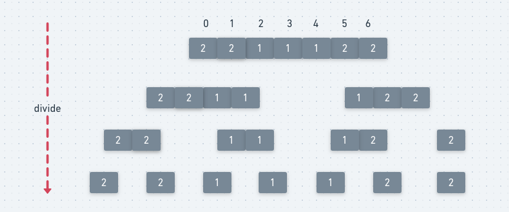

## LeetCode - 169. Majority Element (计数 + 位运算 + Partition + 分治)

* [直接排序](#直接排序)
* [hashmap计数](#hashmap计数)
* [利用二进制位运算](#利用二进制位运算)
* [维护更新方法](#维护更新方法)
* [利用快排的Partition](#利用快排的partition)
* [分治方法](#分治方法)
***
#### [题目链接](https://leetcode.com/problems/majority-element/)

>  https://leetcode.com/problems/majority-element/

#### 题目


## 1、直接排序
方法一: 直接排序，取中间的数，最简单的方法。

```java
class Solution{
    public int majorityElement(int[] nums) {
        Arrays.sort(nums);
        return nums[nums.length/2];
    }
}
```
## 2、`HashMap`计数
方法二: `HashMap`计数，然后检查`value(次数) >  n/2`即可。
```java
class Solution {
    // HashMap count
    public int majorityElement(int[] nums) {
        HashMap<Integer, Integer> counts = new HashMap<>();
        for(int num : nums){
            counts.put(num, counts.getOrDefault(num, 0) + 1);
            if(counts.get(num) > nums.length/2)
                return num;
        }
        return -1;
    }
}
```
## 3、利用二进制位运算
方法三: 利用二进制位运算，检查每一个二进制位是否为`1`，如果是就累加`count`， 如果`>n/2`就置为`1`。


代码:

```java
class Solution {
    // bit
    public int majorityElement(int[] nums) {
        int major = 0;
        for(int i = 0; i < 32; i++){ 
            int count = 0;
            for(int num : nums) if( (num & (1 << i)) != 0)
                count++;
            if(count > nums.length/2) major |= (1 << i);
        }
        return major;
    }
}
```
## 4、维护更新方法
方法四: 很巧妙的方法: 

* 维护一个`count`值和当前最多`major`，然后如果当前值 `==major`，则累加`count`；
* 如果不是，就`--count`，最后的答案就是`major`，这是最好的方法，时间复杂度`O(N)`，空间`O(1)`；

代码:

```java
class Solution{
    // O(1) count  --> best Solution
    public int majorityElement(int[] nums) {
        int count = 0;
        int major = nums[0];
        for(int num : nums){ 
            if(num == major) count += 1;
            else if(--count == 0){ 
                count = 1;
                major = num;
            }
        }
        return major;
    }
}
```
## 5、利用快排的Partition
方法五: 利用快排的[**双路快速排序**](https://blog.csdn.net/zxzxzx0119/article/details/79826380#t8)，也就是按照`key`将数组划分成，左边都`<=`key，右边都`>=`key的数组，然后看返回的这个划分索引是不是等于`n/2`即可，如果不是，就按照类似二分的思想继续查找。

代码:

```java
class Solution {
    // use partition 
    public int majorityElement(int[] nums) {
        int mid = nums.length >> 1;
        int L = 0;
        int R = nums.length - 1;
        int p = partition(nums, L, R);
        while(p != mid){       
            if(p > mid)
                R = p - 1;
            else 
                L = p + 1;
            p = partition(nums, L, R);
        }
        return nums[mid];
    }
    
    // 双路快排 : 左边部分 <= key, 右边部分 >= key
    private int partition(int[] arr, int L, int R){
        int key = arr[L];
        int less = L + 1;
        int more = R;
        while(true){
            while(less < R && arr[less] < key) less++; // 找到第一个>=key的
            while(more > L && arr[more] > key) more--; // 找打第一个<=key的
            if(less >= more) 
                break;
            swap(arr, less++, more--);
        }
        swap(arr, L, more); // 最后将key放在中间
        return more;
    }

    private void swap(int[] arr, int a, int b){ 
        int tmp = arr[a];
        arr[a] = arr[b];
        arr[b] = tmp;
    }
}
```

## 6、分治方法

方法六: 分治解法

* 递归求出左边的值`LS`和右边的值`RS`，如果左右相等，则直接返回；
* 否则，统计当前`[L, R]`区间中`LS`和`RS`哪一个更多，哪个多就返回哪个；



代码:

```java
class Solution {
    // divide and conquer
    public int majorityElement(int[] nums) {
        return divc(nums, 0, nums.length - 1); 
    }
    private int divc(int[] nums, int L, int R){ 
        if(L == R) // 只有一个元素, 直接返回
            return nums[L];
        int mid = L + (R - L)/2;
        int LS = divc(nums, L, mid);
        int RS = divc(nums, mid+1, R);
        if(LS == RS) // 两边的众数相同，直接返回即可
            return LS;
        int c1 = 0, c2 = 0;
        for(int i = L; i <= R; i++){ 
            if(nums[i] == LS) c1++;
            if(nums[i] == RS) c2++;
        }
        return c1 > c2 ? LS : RS;
    }
}

```

