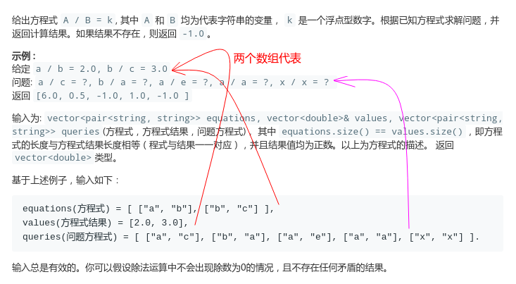
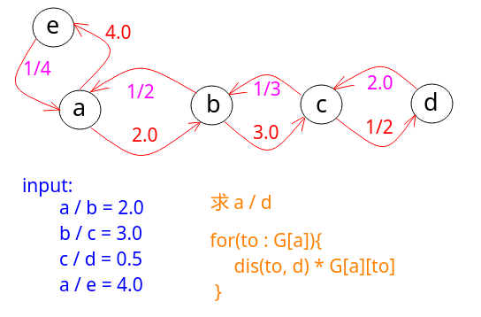

## LeetCode - 399. Evaluate Division(除法求值)

#### [题目链接](https://leetcode-cn.com/problems/evaluate-division/)

> https://leetcode-cn.com/problems/evaluate-division/

#### 题目



### 解析

将这个过程看做一个图:

例如下图求`a / d`，只需要将`a -> d`，路径上的值相乘即可。



**DFS**解法:

```java
import java.util.*;

class Solution {

    private HashMap<String, HashMap<String, Double>> G; // construct the Graph
    private HashSet<String> vis;

    public double[] calcEquation(String[][] equations, double[] values, String[][] queries) {
        G = new HashMap<>();
        for (int i = 0; i < equations.length; i++) {
            String from = equations[i][0];
            String to = equations[i][1];
//            G.putIfAbsent(from, new HashMap<>());
//            G.putIfAbsent(to, new HashMap<>());
//            G.get(from).put(to, values[i]);
//            G.get(to).put(from, 1.0 / values[i]);
            // 上面四行写成下面两行
            G.computeIfAbsent(from, m -> new HashMap<>()).put(to, values[i]);
            G.computeIfAbsent(to, m -> new HashMap<>()).put(from, 1.0 / values[i]);
        }
        double[] res = new double[queries.length];
        for (int i = 0; i < queries.length; i++) {
            String q1 = queries[i][0];
            String q2 = queries[i][1];
            if (!G.containsKey(q1) || !G.containsKey(q2)) {
                res[i] = -1;
                continue;
            }
            vis = new HashSet<>();
            res[i] = dfs(q1, q2);
        }
        return res;
    }

    private double dfs(String A, String B) {
        if(A.equals(B)) return 1.0;
        vis.add(A);
        for(Map.Entry<String, Double> mp : G.get(A).entrySet()){
            String to = mp.getKey();
            Double value = mp.getValue();
            if(vis.contains(to)) continue;
            double d = dfs(to, B); // to / B
            // A/B = A/to * to/B
            if(d > 0) return value * d;
        }
        return -1;
    }
}
```

`C++`代码:

```cpp
class Solution {
public:
    vector<double> calcEquation(vector<pair<string, string>> equations, vector<double>& values, vector<pair<string, string>> queries) {
        unordered_map<string, unordered_map<string, double>> g;        
        for (int i = 0; i < equations.size(); ++i) {
            const string& A = equations[i].first;
            const string& B = equations[i].second;
            g[A][B] = values[i];
            g[B][A] = 1.0 / values[i];
        }
        
        vector<double> res;
        for (const auto& pair : queries) {
            const string& q1 = pair.first;
            const string& q2 = pair.second;
            if (!g.count(q1) || !g.count(q2)) {
                res.push_back(-1.0);
                continue;
            }
            unordered_set<string> vis;            
            res.push_back(dfs(q1, q2, g, vis));
        }
        return res;
    }
private:
    // get result of A / B
    double dfs(const string& A, const string& B, 
                  unordered_map<string, unordered_map<string, double>>& g,
                  unordered_set<string>& vis) {        
        if (A == B) return 1.0;
        vis.insert(A);
        for (const auto& pair : g[A]) {
            const string& to = pair.first;
            if (vis.count(to)) continue;
            double d = dfs(to, B, g, vis); // d = to / B
            // A / B = to / B *  A / to
            if (d > 0) return d * g[A][to];
        }        
        return -1.0;
    }
};

```

这题还可以用**并查集**来写，不过需要记录父亲(`parent : String`)和比值`ratio : Double`，比较麻烦，这里先放着，下次写。

给一个并查集参考代码，　[代码1](https://leetcode.com/problems/evaluate-division/discuss/180282/Java-Union-Find-solution-beats-100)。[代码2](https://leetcode.com/problems/evaluate-division/discuss/183185/Java-UnionFind-VS-DFS-andand-Time-Complexity-Analysis)。