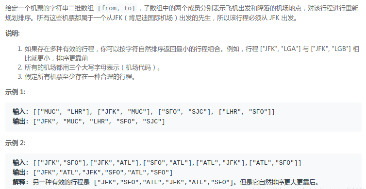
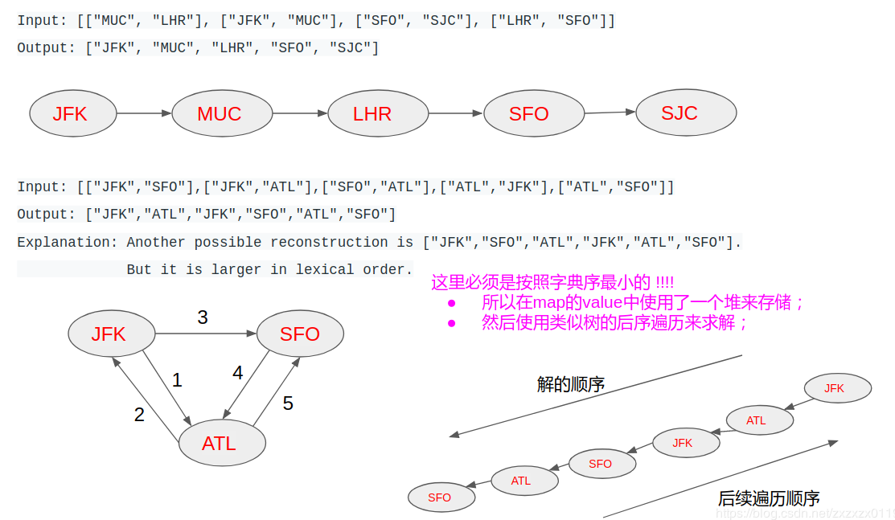

### LeetCode332 - Reconstruct Itinerary(重新安排行程 图转树  后序遍历)
#### [题目链接](https://leetcode.com/problems/reconstruct-itinerary/)

> https://leetcode.com/problems/reconstruct-itinerary/

#### 题目


#### 解析


* 由于必须要按照字典序最小的来访问某个结点的孩子，所以在查找节点的孩子的`map`中使用一个<font color=  red>优先队列</font>存放，每次取出来的是字典序最小的；
* 然后按照类似后序遍历的顺序遍历这个图(先访问自己孩子，然后访问自己)，然后在反转过来，这样可以得到正确的答案；

* 也可以理解为`dfs`的时候，是先访问自己的孩子，然后访问自己，最后将访问的顺序翻转过来即可，需要注意的时候一定要使用后序的方式，不然会在选择的时候出错(或者说不能正确访问所有的结点)；


```java
class Solution {
    
    private HashMap<String, PriorityQueue<String>> map;
    private List<String>res;
    
    public List<String> findItinerary(String[][] tickets) {
        res = new LinkedList<>();
        map = new HashMap<>();
        for (String[] s : tickets) {
            if (map.get(s[0]) == null) {
                PriorityQueue<String>pq = new PriorityQueue<>();
                pq.add(s[1]);
                map.put(s[0], pq);
            }else {
                map.get(s[0]).add(s[1]);
            }
        }
        visit("JFK");
        return res;
    }

    public void visit(String cur) {
        while(map.containsKey(cur) && !map.get(cur).isEmpty())
            visit(map.get(cur).poll()); // 访问孩子(最小的孩子)并删除这条边
        res.add(0, cur); // 在头部添加 (双向队列)
    }
}
```
非递归写法: 
```java
class Solution {
    
    private HashMap<String, PriorityQueue<String>> map;
    private List<String>res;
    
    public List<String> findItinerary(String[][] tickets) {
        res = new LinkedList<>();
        map = new HashMap<>();
        for (String[] s : tickets) {
            if (map.get(s[0]) == null) {
                PriorityQueue<String>pq = new PriorityQueue<>();
                pq.add(s[1]);
                map.put(s[0], pq);
            }else {
                map.get(s[0]).add(s[1]);
            }
        }
        Stack<String>stack = new Stack<>();
        stack.push("JFK");
        while(!stack.isEmpty()){
            while(map.containsKey(stack.peek()) && !map.get(stack.peek()).isEmpty())
                stack.push(map.get(stack.peek()).poll());
            res.add(0, stack.pop());
        }
        return res;
    }
}
```

`C++`:

```java
class Solution {
public:
    vector<string> findItinerary(vector<pair<string, string>> tickets) {
        for(const auto & pair : tickets)
            map[pair.first].insert(pair.second);
        visit("JFK");
        return vector<string>(res.rbegin(), res.rend());
    }
private:
    unordered_map<string, multiset<string>>map;
    vector<string>res;
    
    void visit(string cur){
        while(map[cur].size()){
            string next = *map[cur].begin();
            map[cur].erase(map[cur].begin());
            visit(next);
        }
        res.push_back(cur);
    }
};
```

