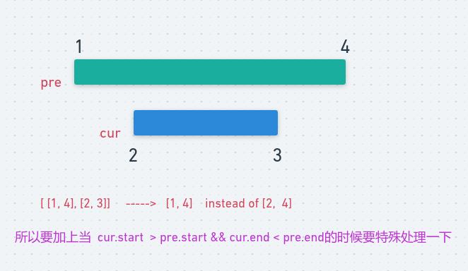

# LeetCode - 56. Merge Intervals

#### [题目链接](https://leetcode.com/problems/merge-intervals/)

> https://leetcode.com/problems/merge-intervals/

#### 题目

## 解析

这题一看就是贪心的题目: 


* **对这些区间按照`start`升序排列(不同于活动安排问题(按照结束时间排序))，然后`start`相同的按照`end`排序**；
* 然后检查前一个的`end`和当前的`start`之间的关系，如果`cur.start <= pre.end`说明有交集，然后合并即可。但是一定要注意当`pre`包含`cur`区间的时候要特殊处理；

图: 

<div align="center"></div><br>

代码: 

```java
class Solution {

    public List<Interval> merge(List<Interval> intervals) {
        List<Interval> res = new ArrayList<>();
        if (intervals == null || intervals.size() == 0)
            return res;
        Collections.sort(intervals, (o1, o2) -> {
            if (o1.start == o2.start)
                return o1.end - o2.end;
            return o1.start - o2.start;
        });
        Interval pre = intervals.get(0);
        res.add(pre);
        for (int i = 1; i < intervals.size(); i++) {
            Interval cur = intervals.get(i);
            if (pre.end >= cur.start) {
                res.remove(res.size() - 1);
                // should consider this special situation, such as [1, 4], [2, 3]
                if (cur.start > pre.start && cur.end < pre.end)
                    res.add(pre);
                else
                    res.add(new Interval(pre.start, intervals.get(i).end));
            } else {  // directly add cur
                res.add(cur);
            }
            pre = res.get(res.size() - 1);
        }
        return res;
    }
}
```
可以将上面的过程写的更加的简洁，每次更新一下`pre`的`end`即可，每次`res`都是添加`pre`。
```java
class Solution {
    public List<Interval> merge(List<Interval> intervals) {
        List<Interval> res = new ArrayList<>();
        if (intervals == null || intervals.size() == 0)
            return res;
        Collections.sort(intervals, (o1, o2) -> {
            if (o1.start == o2.start)
                return o1.end - o2.end;
            return o1.start - o2.start;
        });
        Interval pre = intervals.get(0);
        for (Interval cur : intervals) {
            if (pre.end >= cur.start)
                pre.end = Math.max(pre.end, cur.end); // the same as above special situation, [1, 4]、[2, 3]
            else {  // no interval 
                res.add(pre);
                pre = cur;
            }
        }
        res.add(pre);
        return res;
    }
}
```


