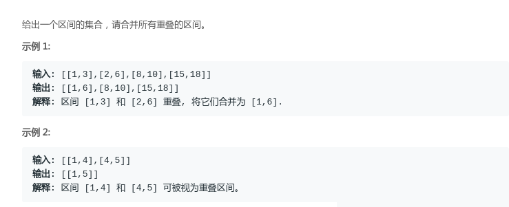

## LeetCode - 56.Merge Intervals & LeetCode - 57.Insert Interval (贪心、插入排序)

* [LeetCode - 56.Merge Intervals](#1)
* [LeetCode - 57.Insert Interval](#leetcode---57insert-interval)

***
### <font color = red id = "1">LeetCode - 56.Merge Intervals

#### [题目链接](https://leetcode.com/problems/merge-intervals/)

> https://leetcode.com/problems/merge-intervals/

#### 题目

#### 解析

这题一看就是<font color = red>贪心</font>的题目: 


* 对这些区间按照`start`升序排列(不同于活动安排问题(按照结束时间排序))，然后`start`相同的按照`end`排序；
* 然后检查前一个的`end`和当前的`start`之间的关系，如果`cur.start <= pre.end`说明有交集，然后合并即可。<font color = red>但是一定要注意当`pre`包含`cur`区间的时候要特殊处理；


```java
import java.io.*;
import java.util.*;

class Interval {
    int start;
    int end;
    Interval() { start = 0; end = 0; }
    Interval(int s, int e) { start = s; end = e; }

    @Override
    public String toString() {
        return "[" + start +
                ", " + end +
                ']';
    }
}

class Solution {

    // greedy algorithm
    public List<Interval> merge(List<Interval> intervals) {
        List<Interval> res = new ArrayList<>();
        if(intervals == null || intervals.size() == 0)
            return res;
        Collections.sort(intervals, (o1, o2) -> {
            if(o1.start == o2.start)
                return o1.end - o2.end;
            return o1.start - o2.start;
        });
        Interval pre = intervals.get(0);
        res.add(pre);
        for (int i = 1; i < intervals.size(); i++) {
            Interval cur = intervals.get(i);
            if (pre.end >= cur.start) {
                res.remove(res.size() - 1);
                // should consider this special situation, such as [1, 4], [2, 3]
                if(cur.start > pre.start && cur.end < pre.end) 
                    res.add(pre);
                else 
                    res.add(new Interval(pre.start, intervals.get(i).end));
            } else{  // directly add cur
                res.add(cur);
            }
            pre = res.get(res.size() - 1);
        }
        return res;
    }

    public static void main(String[] args){
        PrintStream out = System.out;
        List<Interval>intervals = Arrays.asList( new Interval(1,4),
                                                 new Interval(2,3));
        out.println(new Solution().
                merge(intervals)
        );
    }
}
```
可以将上面的过程写的更加的简洁，每次更新一下`pre`的`end`即可，每次`res`都是添加`pre`
```java
import java.io.*;
import java.util.*;

class Interval {
    int start;
    int end;
    Interval() { start = 0; end = 0; }
    Interval(int s, int e) { start = s; end = e; }

    @Override
    public String toString() {
        return "[" + start +
                ", " + end +
                ']';
    }
}

class Solution {

     // greedy algorithm
    public List<Interval> merge(List<Interval> intervals) {
        List<Interval> res = new ArrayList<>();
        if(intervals == null || intervals.size() == 0)
            return res;
        Collections.sort(intervals, (o1, o2) -> {
            if(o1.start == o2.start)
                return o1.end - o2.end;
            return o1.start - o2.start;
        });
        Interval pre = intervals.get(0);
        for(Interval cur : intervals){ 
            if(pre.end >= cur.start) 
                pre.end = Math.max(pre.end, cur.end); // the same as above special situation, [1, 4]、[2, 3]
            else {  // no interval 
                res.add(pre);
                pre = cur;
            } 
        }
        res.add(pre);
        return res;
    }

    public static void main(String[] args){
        PrintStream out = System.out;
        List<Interval>intervals = Arrays.asList( new Interval(1,4),
                                                 new Interval(2,3));
        out.println(new Solution().
                merge(intervals)
        );
    }
}
```

***

### <font color = red id = "2">LeetCode - 57.Insert Interval

#### [题目链接](https://leetcode.com/problems/insert-interval/)

> https://leetcode.com/problems/insert-interval/

#### 题目

#### 解析
因为已经对所有的区间排过序了，所以只需要在上一题的基础上，<font color =red>先找到`newInterval`的合适插入位置</font>， 然后调用上一题的`merge`过程即可。

```java
class Solution {
     // greedy algorithm
    public List<Interval> insert(List<Interval> intervals, Interval newInterval) {
        List<Interval> res = new ArrayList<>();
        if(intervals == null) // 注意这里不能加上 intervals.size() == 0
            return res;
        // find the suitable position that the new interval should insert
        int p = 0;
        for(p = 0; p < intervals.size() && intervals.get(p).start < newInterval.start; ) 
            p++;
        intervals.add(p, newInterval);
        
        // just like leetcode - 56. Merge Intervals
        Interval pre = intervals.get(0);
        for(Interval cur : intervals){
            if(pre.end >= cur.start)
                pre.end = Math.max(pre.end, cur.end); // the same as above special situation, [1, 4]、[2, 3]
            else {  // no interval
                res.add(pre);
                pre = cur;
            }
        }
        res.add(pre);
        return res;
    }
}
```

第二种方法:

* 就是遍历一遍`intervals`，然后如果当前遍历的`cur`，如果和`newInterval`没有交集的话，就分别各自加到`left、right`(都是`List`集合)中；
* 如果有交集的话就需要一直维护一个最左端点`newStart`和最右端点`newEnd`的区间，具体看下面(题目的样例)；


```java
import java.io.*;
import java.util.*;

class Interval {
    int start;
    int end;
    Interval() { start = 0; end = 0; }
    Interval(int s, int e) { start = s; end = e; }

    @Override
    public String toString() {
        return "[" + start +
                ", " + end +
                ']';
    }
}

class Solution {

    // greedy algorithm
    public List<Interval> insert(List<Interval> intervals, Interval newInterval) {
        List<Interval> res = new ArrayList<>();
        if(intervals == null)
            return res;
        int newStart = newInterval.start, newEnd = newInterval.end;
        List<Interval> left = new ArrayList<>();
        List<Interval> right = new ArrayList<>();
        for(Interval cur : intervals){ 
            if(cur.end < newStart) // cur small than newInterval
                left.add(cur);
            else if(cur.start > newEnd)// cur bigger than newInterval
                right.add(cur);
            else {  // have overlaps(intersect)  --> get the final newInterval's left and right position
                newStart = Math.min(newStart, cur.start);  // the smallest
                newEnd = Math.max(newEnd, cur.end);        // the biggest 
            }
        }
        res.addAll(left);
        res.add(new Interval(newStart, newEnd));
        res.addAll(right);
        return res;
    }

    public static void main(String[] args){
        PrintStream out = System.out;
        List<Interval>intervals = Arrays.asList( new Interval(1, 2), new Interval(3, 5),
                new Interval(6, 7), new Interval(8, 10), new Interval(12, 16));
        Interval newInterval = new Interval(4, 8);
        out.println(new Solution().
                insert(intervals, newInterval)
        );
    }
}
```

