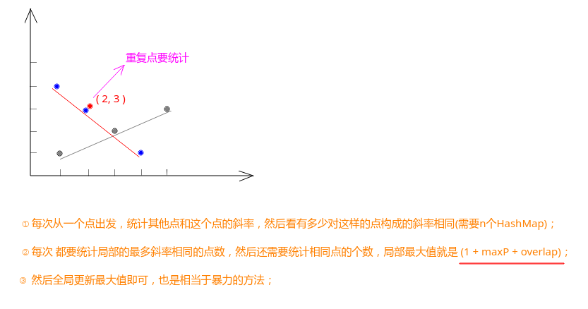

## LeetCode - 149. Max Points on a Line(哈希表 、数学)

#### [题目链接](https://leetcode.com/problems/max-points-on-a-line/)
> https://leetcode.com/problems/max-points-on-a-line/

#### 题目


#### 解析
此题的做法其实就是暴力统计(`O(N^2)`)： 

* 每次枚举一个点，看其他点和这个点构成的斜率(`(y2 - y1) / (x2 - x1) `)有多少个是相同的，如果有`k`个相同的斜率，则有`k+1`个这样的点；
* 但是这一题还需要额外处理<font color = purple>可能有相同的点</font>(使用`overlap`变量统计即可)；




这题比较精华的地方在于: 

* 我们不能简单的将斜率存到`HashMap`的`Key`中，因为这样会产生精度问题，想法就是直接存`y2 - y1`和`x2 - x1`的键值对(代码中用一个结构`Pair`表示)。这种想法避免了`double`产生的问题；
* 但是又由于数据可能很大，所以我们对`y2 - y1`和`x2 - x1`进行约分处理(`gcd`)；

* 这里还有一点代码实现上的问题，如果我们的`HashMap<斜率，出现次数>`中的斜率是我们自定义的`Pair`，此时需要重写`Pair`的`equals`和`hashCode`方法；


```java
import java.io.*;
import java.util.*;

// 放在 HashMap中的自定义的对象一定要记得重写equals 和 hashCode()
// 博客讲解: https://blog.csdn.net/u014590757/article/details/79501332
class Pair{
    int dx;
    int dy;

    Pair(int dx, int dy){
        this.dx = dx;
        this.dy = dy;
    }

    @Override
    public boolean equals(Object o) {
        Pair pair = (Pair) o;
        return dx == pair.dx && dy == pair.dy;
    }

    @Override
    public int hashCode() {
        return 31 * dx + dy;
    }
}

class Solution {

    public int maxPoints(Point[] points) {
        if(points == null || points.length == 0)
            return 0;
        int n = points.length;
        int res = 0;
        for(int i = 0; i < n; i++){ // 从每个点开始的最长直线
            HashMap<Pair, Integer>counts = new HashMap<>(); // 必须写在循环内
            int overlap = 0; // duplicated points
            int maxP = 0;
            for(int j = i + 1; j < n; j++){
                if(points[i].x == points[j].x && points[i].y == points[j].y)
                    overlap++;
                else {
                    Pair pSlope = getSlope(points[i], points[j]);
                    counts.put(pSlope, 1 + counts.getOrDefault(pSlope, 0));
                    maxP = Math.max(maxP, counts.get(pSlope));
                }
            }
            res = Math.max(res, maxP + 1 + overlap);
        }
        return res;
    }

    private Pair getSlope(Point p1, Point p2){
        int dx = p2.x - p1.x;
        int dy = p2.y - p1.y;
        if(dy == 0) // horizontal line
            return new Pair(0, p1.y);
        if(dx == 0) // vertical line
            return new Pair(p1.x, 0);
        int divisor = gcd(dx, dy);
        return new Pair(dx / divisor, dy / divisor);
    }

    private int gcd(int a, int b){
        // return b == 0 ? a : gcd(b, a % b);   
        int r = 0;
        while(b != 0){ 
            r = a % b;
            a = b;
            b = r;
        }
        return a;
    }

    public static void main(String[] args){
        PrintStream out = System.out;
        Point[] points = {
                new Point(1, 1),
                new Point(3, 2),
                new Point(5, 3),
                new Point(4, 1),
                new Point(2, 3),
                new Point(1, 4)
        };
        out.println(new Solution().
                maxPoints(points)
        );
    }
}
```


`C++`代码: 


```java
class Solution{ 
public:
    int maxPoints(vector<Point>& points){ 
        int n = points.size();
        int res = 0;
        for(int i = 0; i < n; i++){ 
            std::map<std::pair<int, int>, int> counts;
            int overlap = 0;
            int maxP = 0;
            for(int j = i + 1; j < n; j++){ 
                if(points[i].x == points[j].x && points[i].y == points[j].y)
                    overlap++;
                else 
                    maxP = std::max(maxP, ++counts[getSlope(points[i], points[j])]);
            }
            res = std::max(res, 1 + maxP + overlap);
        }
        return res;
    }
private:
    std::pair<int, int>getSlope(const Point& p1, const Point& p2){ 
        int dx = p2.x - p1.x;
        int dy = p2.y - p1.y;
        if(dy == 0) return {0, p1.y};
        if(dx == 0) return {p1.x, 0};
        int divisor = gcd(dx, dy);
        return { dx / divisor, dy / divisor };
    }

    int gcd(int a, int b){ 
        int r = 0;
        while(b != 0){ 
            r = a % b;
            a = b;
            b = r;
        }
        return a;
    }
};
```
