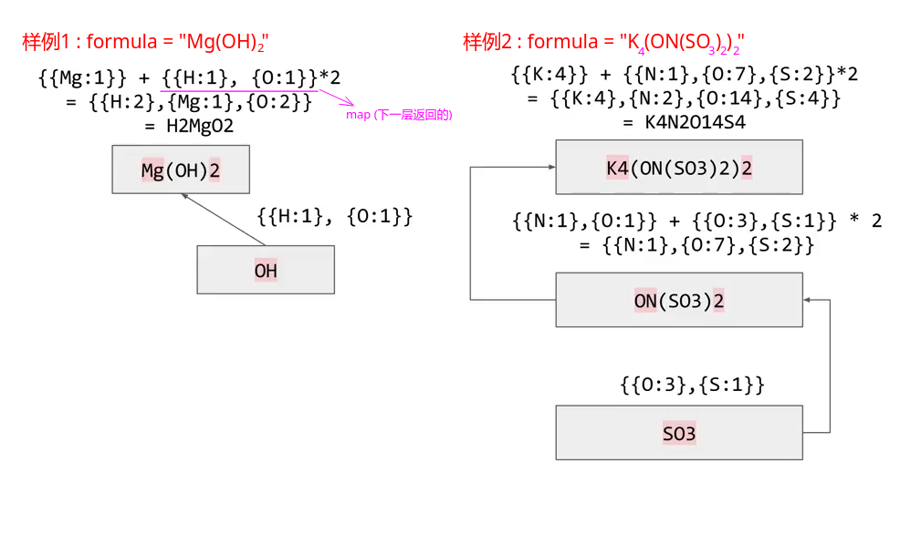

## LeetCode - 726. Number of Atoms(TreeMap + 递归)

#### [题目链接](https://leetcode.com/pr23oblems/number-of-atoms/)

#### 题目


> 注意:
>
> - 所有原子的第一个字母为大写，剩余字母都是小写。
> - `formula`的长度在`[1, 1000]`之间。
> - `formula`只包含字母、数字和圆括号，并且题目中给定的是合法的化学式。

#### 解析

这题是一个比较有意思的递归求解的题目: 

* 当没有括号的时候，直接计算，先得到原子的字符串(第一个字母大写，后面的小写)，然后得到后面的个数(如果是`1`就忽略，否则要计算数目)；(`getCount()和getName()`函数)
* 如果遇到`(`，就去递归求解，返回的是一个`Map`(这里用`TreeMap`，因为要按照字典序)，`Map`的`key`就是原子，`value`对应的就是原子的数量；然后返回的`Map`的每一项会和右边的`)`外面的那个数字相乘；
* 否则就不是`(`和`)`，就是正常的原子，就计算`getName`和`getCount`(普通原子的数量)；




代码: 

```java
import java.io.*;
import java.util.*;

class Solution {

    private int pos;
    private char[] chs;

    public String countOfAtoms(String formula) {
        if (formula == null || formula.length() == 0)
            return "";
        chs = formula.toCharArray();
        pos = 0;
        StringBuilder res = new StringBuilder();
        rec().forEach((k, v) -> {
            res.append(k);
            if (v > 1) res.append(String.valueOf(v));
        });
        return res.toString();
    }

    private TreeMap<String, Integer> rec() {
        TreeMap<String, Integer> res = new TreeMap<>();
        while (pos != chs.length) {
            if (chs[pos] == '(') { // 递归
                pos++;
                TreeMap<String, Integer> tmpRes = rec();
                int count = getCount();
                for (Map.Entry<String, Integer> entry : tmpRes.entrySet())
                    res.put(entry.getKey(), res.getOrDefault(entry.getKey(), 0) + entry.getValue() * count);
            } else if (chs[pos] == ')') { //返回这一层
                pos++;
                return res;
            } else {
                String name = getName();
                res.put(name, res.getOrDefault(name, 0) + getCount());
            }
        }
        return res;
    }

    private String getName() {
        StringBuilder res = new StringBuilder();
        res.append(chs[pos++]);
        while (pos < chs.length && Character.isLowerCase(chs[pos]))
            res.append(chs[pos++]);
        return res.toString();
    }

    private int getCount() {
        int count = 0;
        while (pos < chs.length && '0' <= chs[pos] && chs[pos] <= '9')
            count = count * 10 + (chs[pos++] - '0');
        return count == 0 ? 1 : count;
//        String res = "";
//        while(Character.isDigit(chs[pos]))
//            res += chs[pos++];
//        return res.isEmpty() ? 1 : Integer.parseInt(res); // 没有数字就是1(省略)
    }

    public static void main(String[] args) {
        Scanner cin = new Scanner(new BufferedInputStream(System.in));
        PrintStream out = System.out;
        String formual = "K4(ON(SO3)2)2";
        System.out.println(new Solution().countOfAtoms(formual));
    }
}

```

