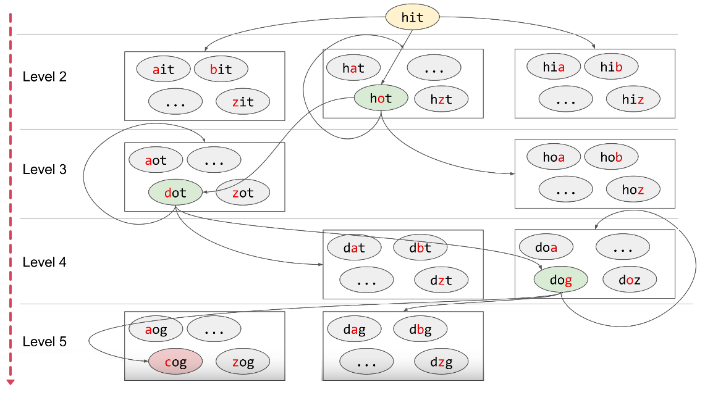
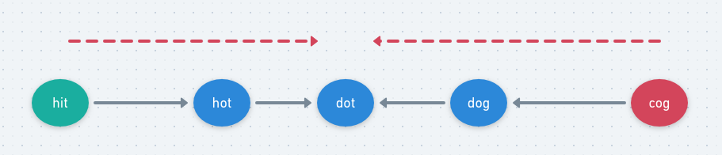

# LeetCode - 127. Word Ladder


#### [题目链接](https://leetcode.com/problems/word-ladder/)

> https://leetcode.com/problems/word-ladder/

#### 题目

## 1、单向BFS

两种解法: 单向`BFS`和双向`BFS`(`Bidrectional BFS`)。

单向BFS:

* 首先将`wordDict`转换成`Set`集合(记为`dict`)，这样查找更快，不然会`TLE`；
* 每次尝试更改一个字符(`a ~ z`)，然后去判断是否这个在`dict`中，如果可以，加入队列；

图:



第一版: 

```java
class Solution {
    
    private class State {
        public String word;
        public int step;

        public State(String word, int step) {
            this.word = word;
            this.step = step;
        }
    }

    public int ladderLength(String beginWord, String endWord, List<String> wordList) {
        HashSet<String> dict = new HashSet<>(wordList); // 将wordList转换成HashSet查找更快
        return bfs(new State(beginWord, 0), new State(endWord, 0), dict) + 1;
    }

    private int bfs(State begin, State end, Set<String> dict) {
        Queue<State> queue = new LinkedList<>();
        queue.add(begin);
        HashMap<String, Boolean> visMap = new HashMap<>();
        visMap.put(begin.word, true);
        while (!queue.isEmpty()) {
            State cur = queue.poll();
            if (cur.word.equals(end.word))
                return cur.step;
            for (int i = 0; i < cur.word.length(); i++) {
                StringBuilder sb = new StringBuilder(cur.word);
                for (char c = 'a'; c <= 'z'; c++) {
                    if (cur.word.charAt(i) == c)
                        continue;
                    sb.setCharAt(i, c);
                    if (visMap.get(sb.toString()) == null && dict.contains(sb.toString())) {
                        visMap.put(sb.toString(), true);
                        queue.add(new State(sb.toString(), cur.step + 1));
                    }
                }
            }
        }
        return -1;
    }
}
```
第二版: 没有使用`visMap`，而是当一个字符串(节点)，已经被访问过了之后，就从`dict`中移除即可。

```java
class Solution {
    
    private class State {
        public String word;
        public int step;

        public State(String word, int step) {
            this.word = word;
            this.step = step;
        }
    }

    public int ladderLength(String beginWord, String endWord, List<String> wordList) {
        HashSet<String> dict = new HashSet<>(wordList); // 将wordList转换成HashSet查找
        return bfs(new State(beginWord, 0), new State(endWord, 0), dict) + 1;
    }

    private int bfs(State begin, State end, Set<String> dict) {
        Queue<State> queue = new LinkedList<>();
        queue.add(begin);
        while (!queue.isEmpty()) {
            State cur = queue.poll();
            if (cur.word.equals(end.word))
                return cur.step;
            for (int i = 0; i < cur.word.length(); i++) {
                StringBuilder sb = new StringBuilder(cur.word);
                for (char c = 'a'; c <= 'z'; c++) {
                    if (cur.word.charAt(i) == c)
                        continue;
                    sb.setCharAt(i, c);
                    if (dict.contains(sb.toString())) {
                        queue.add(new State(sb.toString(), cur.step + 1));
                        dict.remove(sb.toString()); // 直接移除这个就好，不需要使用一个HashMap
                    }
                }
            }
        }
        return -1;
    }
}
```
第三版:  将结构体去掉。
```java
class Solution {
    public int ladderLength(String beginWord, String endWord, List<String> wordList) {
        HashSet<String> dict = new HashSet<>(wordList);
        // start bfs
        Queue<String> queue = new LinkedList<>();
        queue.add(beginWord);
        int level = 0;// 层数
        while (!queue.isEmpty()) {
            level++;
            int qsize = queue.size(); // 一定要定义一个变量，不能在下面的循环中直接写queue.size(),因为会变化
            for(int size = 0; size < qsize; size++){ //当前这一层的节点的数目
                String cur = queue.poll();
                for (int i = 0; i < cur.length(); i++) {
                    StringBuilder sb = new StringBuilder(cur);
                    for (char c = 'a'; c <= 'z'; c++) {
                        if (cur.charAt(i) == c)
                            continue;
                        sb.setCharAt(i, c);
                        if (dict.contains(sb.toString())) {
                            if(sb.toString().equals(endWord))
                                return level + 1;
                            queue.add(sb.toString());
                            dict.remove(sb.toString());
                        }
                    }
                }
            }
        }
        return 0;
    }
}
```

## 2、双向BFS

思路:


* 用两个集合`Set`，分别从两边开始搜索(代码上是从一边，但是交换两个集合)；
* 这样的话，返回的条件就是当前扩展的节点如果在`endSet`中有就返回；

注意` dict.removeAll(beginSet);`这一样，是将`beginSet`原来的单词从`dict`中移除掉，而不能在循环中`dict.remove(next); `，因为可能会移除掉对面`endSet`中的元素，导致失败。

图:



代码:

```java
class Solution{
    public int ladderLength(String beginWord, String endWord, List<String> wordList) {
        HashSet<String> dict = new HashSet<>(wordList);
        if (!dict.contains(endWord))
            return 0;
        HashSet<String> beginSet = new HashSet<>();
        HashSet<String> endSet = new HashSet<>();

        beginSet.add(beginWord);
        endSet.add(endWord);
        int step = 0;
        while (!beginSet.isEmpty() && !endSet.isEmpty()) {
            ++step;
            if (beginSet.size() > endSet.size()) {
                HashSet<String> hs = beginSet;
                beginSet = endSet;
                endSet = hs;
            }
            HashSet<String> nextSet = new HashSet<>();
            for (String cur : beginSet)  {
                char[] chs = cur.toCharArray();
                for (int i = 0; i < chs.length; i++) {
                    char old = chs[i];
                    for (char c = 'a'; c <= 'z'; c++) {
                        chs[i] = c;
                        String next = String.valueOf(chs);
                        if (dict.contains(next)) {
                            if (endSet.contains(next))
                                return step + 1;
                            nextSet.add(next);
                           // dict.remove(next); //不能这样
                        }
                    }
                    chs[i] = old;
                }
            }
            dict.removeAll(beginSet);
            beginSet = nextSet;
        }
        return 0;
    }
}
```
也可以将上面的方法改成递归:

```java
class Solution {
    public int ladderLength(String beginWord, String endWord, List<String> wordList) {
        Set<String> beginSet = new HashSet<>();
        Set<String> endSet = new HashSet<>();
        beginSet.add(beginWord);
        endSet.add(endWord);
        Set<String> dict = new HashSet<>(wordList);
        if(!dict.contains(endWord)) 
            return 0;
        return bfs(beginSet, endSet, dict, 0);
    }
    
    private int bfs(Set<String> beginSet, Set<String> endSet, Set<String> dict, int step){
        if(beginSet.isEmpty() || endSet.isEmpty()) 
            return 0;
        step++;
        dict.removeAll(beginSet);
        Set<String> nextSet = new HashSet<>();
        for(String str : beginSet){
            char[] chs = str.toCharArray();
            for(int i = 0; i < chs.length; i++){
                char old = chs[i];
                for(char c = 'a'; c <= 'z'; c++){
                    chs[i] = c;
                    String next = new String(chs);
                    if(!dict.contains(next)) continue;
                    if(endSet.contains(next)) return step + 1;
                    nextSet.add(next);
                }
                chs[i] = old;
            }
        }
        return nextSet.size() > endSet.size() ? bfs(endSet, nextSet, dict, step) : bfs(nextSet, endSet, dict, step);
    }
}
```

