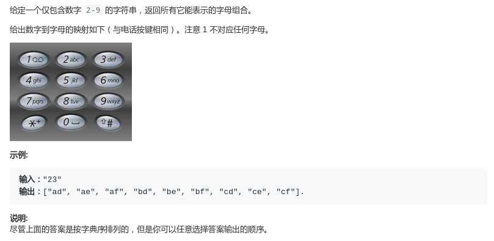
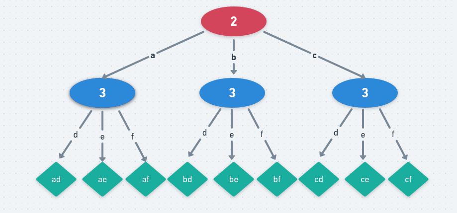

# LeetCode - 17. Letter Combination of a Phone Number

#### [题目链接](https://leetcode.com/problems/letter-combinations-of-a-phone-number/)

> https://leetcode.com/problems/letter-combinations-of-a-phone-number/

#### 题目



## 解析

比较明显的搜索题目。可以用dfs和bfs。

DFS的思路：

* 递归函数需要一个当前状态的字符串的值，记为`curr`；
* 还需要一个当前字符串的长度，我们搜索到`l == dights.length`就可以了；
* 然后记得在搜索完之后要回溯，删除当前`append`的字符；

图:



dfs代码:

```java
class Solution {
    
    private List<String> res;
    private String[] ds = {"", "", "abc", "def", "ghi", "jkl", "mno", "pqrs", "tuv", "wxyz"};

    public List<String> letterCombinations(String digits) {
        res = new ArrayList<>();
        if (digits == null || digits.length() == 0) return res;
        dfs(0, digits.toCharArray(), new StringBuilder());
        return res;
    }

    private void dfs(int p, char[] digits, StringBuilder curr) {
        if(p == digits.length){
            res.add(curr.toString());
            return;
        }
        for(char c : ds[digits[p] - '0'].toCharArray()){
            curr.append(c);
            dfs(p + 1, digits, curr);
            curr.deleteCharAt(curr.length() - 1);
        }
    }
}
```

bfs代码:

就是在前一个状态`res`的基础上`append`当前字符串的所有字符，就得到下一个状态。

```java
class Solution {

    public List<String> letterCombinations(String digits) {
        List<String> res = new ArrayList<>();
        if (digits == null || digits.length() == 0) return res;
        String[] ds = {"", "", "abc", "def", "ghi", "jkl", "mno", "pqrs", "tuv", "wxyz"};
        res.add("");
        for (char c : digits.toCharArray()) {
            List<String> tmp = new ArrayList<>();
            for (String s : res) { //在原有的基础上 + 当前ds[c - '0']的所有字符
                for (char c2 : ds[c - '0'].toCharArray())
                    tmp.add(s + c2);
            }
            res = tmp;
        }
        return res;
    }
}

```

