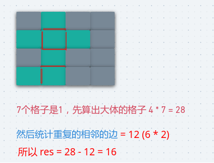

## LeetCode - 463. Island Perimeter(岛屿的周长)(规律/DFS/BFS)
* 找规律
* BFS
* DFS

***
#### [题目链接](https://leetcode.com/problems/island-perimeter/)

> https://leetcode.com/problems/island-perimeter/

#### 题目

### 找规律
这个方法的思路就是: 

* 首先看如果没有相邻的方格的话，就是`4 * (grid[i][j] == 1)`的数量 ，记为`island`；
* 如果有相邻的，我们只需要遍历每一个，上下左右`4`个方向，有相邻的统计即可，最后用`island - 这个数量`即可；

图:

<div align="center"></div><br>

代码:

```java
class Solution {
    public int islandPerimeter(int[][] grid) {
        if (grid == null || grid.length == 0)
            return 0;
        int[][] dir = {{-1, 0}, {0, 1}, {1, 0}, {0, -1}};
        int island = 0, neighbor = 0;
        for (int i = 0; i < grid.length; i++) {
            for (int j = 0; j < grid[0].length; j++) {
                if (grid[i][j] == 1) {
                    island++;
                    for (int k = 0; k < 4; k++) {
                        if (judge(grid, i + dir[k][0], j + dir[k][1]))
                            neighbor++;
                    }
                }
            }
        }
        return 4 * island - neighbor;
    }

    private boolean judge(int[][] grid, int i, int j) {
        if (i < 0 || i >= grid.length || j < 0 || j >= grid[0].length)
            return false;
        return grid[i][j] == 1;
    }
}
```
这种写法一点小小的改进就是，只判断四个方向中的两个，这样就可以少判断一个岛屿，但是`neighbor`就要`*2` 

```java
class Solution {
    public int islandPerimeter(int[][] grid) {
        if (grid == null || grid.length == 0)
            return 0;
        int island = 0, neighbor = 0;
        for (int i = 0; i < grid.length; i++) {
            for (int j = 0; j < grid[0].length; j++) {
                if (grid[i][j] == 1) {
                    island++;
                    if (i - 1 >= 0 && grid[i - 1][j] == 1)//检查上
                        neighbor++;
                    if (j + 1 < grid[0].length && grid[i][j + 1] == 1)
                        neighbor++;
                }
            }
        }
        return 4 * island - neighbor * 2; //注意这里是 * 2
    }
}
```
***
### BFS
这题也可以使用`BFS`，但是这里要注意:

* **在判断`check`函数中，没有加入`vis[i][j]`的判断，因为这会影响`neighbor`的统计**；
* **因为`neighbor`的统计不依赖于 是否访问过这个方格，而是只看这个方格是否有相邻的方格**；

代码:

```java
class Solution {

    private class Coordinate {
        public int x;
        public int y;

        public Coordinate(int x, int y) {
            this.x = x;
            this.y = y;
        }
    }

    public int islandPerimeter(int[][] grid) {
        if (grid == null || grid.length == 0)
            return 0;
        int[] x = {-1, 0, 1, 0};
        int[] y = {0, 1, 0, -1};
        Queue<Coordinate> queue = new LinkedList<>();
        boolean[][] vis = new boolean[grid.length][grid[0].length];
        int res = 0;
        Coordinate cur = null, next = new Coordinate(-1, -1);
        for (int i = 0; i < grid.length; i++) {
            for (int j = 0; j < grid[0].length; j++) {
                if (grid[i][j] == 0 || vis[i][j])
                    continue;
                queue.add(new Coordinate(i, j));  // add the start
                vis[i][j] = true;
                // begin the BFS
                while (!queue.isEmpty()) {
                    cur = queue.poll();
                    res += 4;
                    int neighbor = 0;
                    for (int k = 0; k < 4; k++) {
                        next.x = cur.x + x[k];
                        next.y = cur.y + y[k];
                        if (check(grid, next.x, next.y, vis)) {
                            if (!vis[next.x][next.y]) {
                                vis[next.x][next.y] = true;
                                queue.add(new Coordinate(next.x, next.y));
                            }
                            neighbor++;//无论是否 vis 都要++
                        }
                    }
                    res -= neighbor;
                }
            }
        }
        return res;
    }

    //注意这里　没有判断 !vis[i][j] 因为那样不能正确统计　count
    private boolean check(int[][] grid, int i, int j, boolean[][] vis) {
        return i >= 0 && i < grid.length && j >= 0 &&
                j < grid[0].length && grid[i][j] == 1;
    }
}
```
***
### DFS
但是也要和`BFS`一样，注意: 

* 虽然访问过了，但是还是要减去`1`的情况，也就是`else if`中的；
* 没访问过，是`１`，当然也要减去`1`；

代码:


```java
class Solution {

    int[] dirx = {-1, 0, 1, 0};
    int[] diry = {0, 1, 0, -1};
    boolean[][] vis;

    public int islandPerimeter(int[][] grid) {
        if (grid == null || grid.length == 0 || grid[0].length == 0)
            return 0;
        int res = 0;
        vis = new boolean[grid.length][grid[0].length];
        for (int i = 0; i < grid.length; i++) {
            for (int j = 0; j < grid[0].length; j++) {
                if (grid[i][j] == 1 && !vis[i][j])
                    res += dfs(grid, i, j);
            }
        }
        return res;
    }

    private int dfs(int[][] grid, int x, int y) {
        vis[x][y] = true;
        int edges = 4;
        for (int i = 0; i < 4; i++) {
            int nx = x + dirx[i];
            int ny = y + diry[i];
            if (check(grid, nx, ny)) {
                if (grid[nx][ny] == 1 && !vis[nx][ny]) {
                    edges += dfs(grid, nx, ny);
                    edges--;           // 因为有1也是相邻，所以要 -1 注意不是-2，因为只负责一边
                } else if (vis[nx][ny]) { // grid[nx][ny] == 1 && vis[nx][ny]   --> 这个也要,不要忘了
                    edges--;
                }
            }
        }
        return edges;
    }

    private boolean check(int[][] grid, int i, int j) {
        return i >= 0 && i < grid.length && j >= 0 && j < grid[0].length;
    }
}
```
改一下`check`函数，改写一下，和`BFS`更像，也阔以:

```java
class Solution {

    int[] dirx = {-1, 0, 1, 0};
    int[] diry = {0, 1, 0, -1};
    boolean[][] vis;

    public int islandPerimeter(int[][] grid) {
        if (grid == null || grid.length == 0 || grid[0].length == 0)
            return 0;
        int res = 0;
        vis = new boolean[grid.length][grid[0].length];
        for (int i = 0; i < grid.length; i++) {
            for (int j = 0; j < grid[0].length; j++) {
                if (grid[i][j] == 1 && !vis[i][j])
                    res += dfs(grid, i, j);
            }
        }
        return res;
    }

    private int dfs(int[][] grid, int x, int y) {
        vis[x][y] = true;
        int edges = 4;
        for (int i = 0; i < 4; i++) {
            int nx = x + dirx[i];
            int ny = y + diry[i];
            if (check(grid, nx, ny)) {
                if (!vis[nx][ny]) {
                    edges += dfs(grid, nx, ny);
                }
                edges--;   //无论是否访问过都要 减去 1,  -1 注意不是-2，因为只负责一边
            }
        }
        return edges;
    }

    //这里改了
    private boolean check(int[][] grid, int i, int j) {
        return i >= 0 && i < grid.length && j >= 0 && j < grid[0].length && grid[i][j] == 1;
    }
}
```

