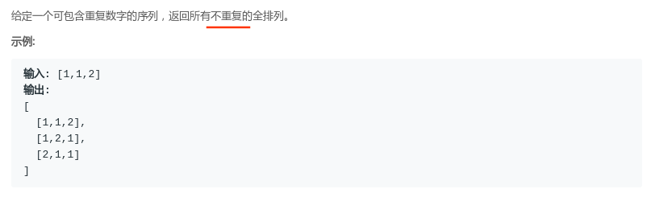

## LeetCode - 47. Permutations II(不重复全排列)(四种方式实现)

 - 方法一: 使用普通全排列并使用`List`判断去重
 - 方法二: 使用排序和判断去重
 - 方法三: 使用`HashSet`判断去重
 - 方法四: 使用`dfs` + 排序去重

***

**做这个题目之前，先做[LeetCode46-Permutations](https://blog.csdn.net/zxzxzx0119/article/details/81452269)**
#### [题目链接](https://leetcode.com/problems/permutations-ii/description/)

> https://leetcode.com/problems/permutations-ii/description/

#### 题目



### 方法一: 使用普通全排列并使用`List`判断去重
 这种方式很简单，就是在将中间结果集添加到最终结果集之前，判断一下中间集在结果集中之前是否出现过即可。

```java
class Solution {
    /**
     * 方法一  直接判断是否存在(最慢)
     */
    public List<List<Integer>> permuteUnique(int[] nums) {
        List<List<Integer>> res = new ArrayList<>();
        if (nums == null || nums.length == 0) return res;
        dfs(res, nums, new ArrayList<>(), 0);
        return res;
    }

    private void dfs(List<List<Integer>> res, int[] nums, List<Integer> temp, int cur) {
        if (cur == nums.length) {
            for (int i = 0; i < nums.length; i++) 
                temp.add(nums[i]); 
            if (!res.contains(temp))
                res.add(new ArrayList<>(temp)); //去重
            temp.clear();
        } else for (int i = cur; i < nums.length; i++) {
            swap(nums, cur, i);
            dfs(res, nums, temp, cur + 1); 
            swap(nums, cur, i);
        }
    }

    private void swap(int[] nums, int a, int b) {
        int temp = nums[a];
        nums[a] = nums[b];
        nums[b] = temp;
    }
}
```

***
### 方法二: 使用排序和判断去重

这个方法比较玄乎: 
* 使用的是<font color =red>先要排序</font>，而且在调用`dfs`函数的时候，我们要进行行数组的拷贝(`Arrays.copyof()`)，不能使用原来的数组(`C++`中传递的就是数组的拷贝)；
* <font color = red>而且使用数组的复制品还不能交换回来</font>，这样还可以得到整个序列的字典序，去重的时候使用` if(cur != i && newNums[i] == newNums[cur])continue; `去重</font>。

```java
 class Solution {
    public List<List<Integer>> permuteUnique(int[] nums) {
        List<List<Integer>> res = new ArrayList<>();
        if (nums == null || nums.length == 0) return res;
        Arrays.sort(nums); //必须要排序，不然也不能去重 ,为了让重复的元素相邻
        dfs(res, nums, 0);
        return res;
    }

    public void dfs(List<List<Integer>> res, int[] nums, int cur) {
        int[] newNums = new int[nums.length]; //因为Java中的数组是引用，不像C++中一样是数组的拷贝，所以
        for (int i = 0; i < nums.length; i++) newNums[i] = nums[i]; //或者用Arrays.copyof

        if (cur == newNums.length) {
            List<Integer> temp = new ArrayList<>(); 
            for (Integer item : newNums) temp.add(item);
            res.add(temp); //这里不需要再次判断重复
        } else for (int i = cur; i < newNums.length; i++) {
            if (cur != i && newNums[i] == newNums[cur]) continue; //去重
            swap(newNums, cur, i);
            dfs(res, newNums, cur + 1);
//            swap(newNums,cur,i); //不能交换 不然也不能去重
        }
    }
    
    private void swap(int[] nums, int a, int b) {
        int temp = nums[a];
        nums[a] = nums[b];
        nums[b] = temp;
    }
}
```
***
### 使用`HashSet`判断去重
 另一种方法就是每次递归的时候使用一个`HashSet`来判断去重。

```java
class Solution {
    public List<List<Integer>> permuteUnique(int[] nums) {
        List<List<Integer>> res = new ArrayList<>();
        if (nums == null || nums.length == 0) 
            return res;
        dfs(res, nums, 0);
        return res;
    }

    private void dfs(List<List<Integer>> res, int[] nums, int cur) {
        if (cur == nums.length) { 
            List<Integer> temp = new ArrayList<>();
            for (Integer item : nums) temp.add(item);
            res.add(temp);
        } else {
            Set<Integer> set = new HashSet<>();
            for (int i = cur; i < nums.length; i++) {
                if (!set.contains(nums[i])) {
                    set.add(nums[i]);
                    swap(nums, cur, i);
                    dfs(res, nums, cur + 1);
                    swap(nums, cur, i);
                }
            }
        }
    }

    private void swap(int[] nums, int a, int b) {
        int temp = nums[a];
        nums[a] = nums[b];
        nums[b] = temp;
    }
}
```
***
### 使用`dfs` + 排序去重
 这个方法和`LeetCode - 46`那个`dfs`也差不多: 
 * 主要是如何判断重复，方法就是对与重复的元素循环时跳过递归的调用只对第一个未被使用的进行递归，那么这一次的结果将会唯一出现在结果集中，而后重复的元素将会被略过；
 * 如果第一个重复元素还没在当前结果中，那么我们就不需要进行递归。

```java
class Solution {
    public List<List<Integer>> permuteUnique(int[] nums) {
        List<List<Integer>> res = new ArrayList<>();
        if (nums == null || nums.length == 0) return res;
        Arrays.sort(nums); //先排序，必须保证相邻的元素在一块
        dfs(res, new ArrayList<>(), nums, new boolean[nums.length]);
        return res;
    }

    private void dfs(List<List<Integer>> res, ArrayList<Integer> temp, int[] nums, boolean[] used) {
        if (temp.size() == nums.length) {
            res.add(new ArrayList<>(temp));
            return;
        }
        for (int i = 0; i < nums.length; i++) {
            if (used[i] || (i > 0 && !used[i - 1] && nums[i] == nums[i - 1]))
                continue;
            used[i] = true;
            temp.add(nums[i]);
            dfs(res, temp, nums, used);
            temp.remove(temp.size() - 1);
            used[i] = false;
        }
    }
}
```
