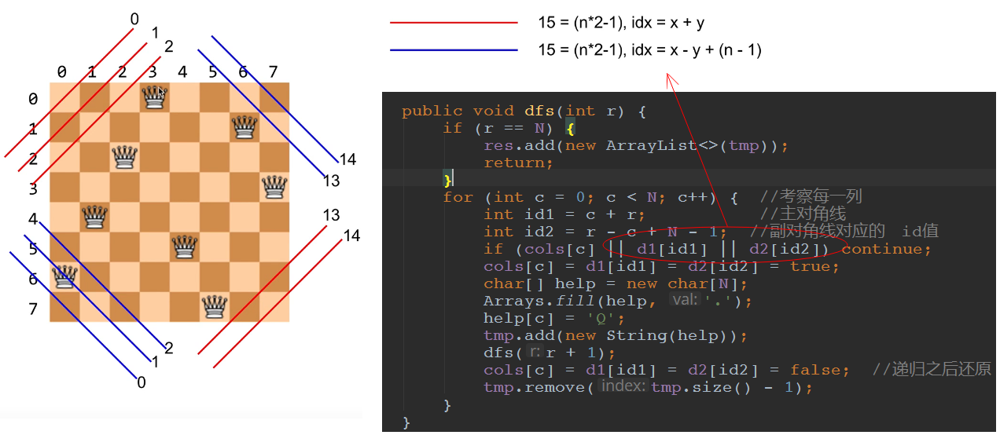

## LeetCode - 51. N-Queens(N皇后问题)

 - 数组标记法
 - 下标判断法

***
#### [题目链接](https://leetcode.com/problems/n-queens/)

> https://leetcode.com/problems/n-queens/

#### 题目


### 数组标记法

 - 这里使用三个数组分别标记那些不能访问的列，主对角线，和副对角线。注意`cols[c] = true`表示`c`列已经有了皇后；
 - **而`d1[]`表示的是副对角线，拿`8`皇后来说，我们把`n`正方形划分成`14`根对角线，每个对角线上有一个值，就是这根对角线上任意一个点的`x + y`的值(从右上角到左下角)；**
 - **而`d2[]`表示的是主对角线，对于`8`皇后来说，也是划分成`14`根，不过对应关系是 `id2 =  x - y + (n-1)`(从左下角到右上角)；**
 - 通过上面的对应关系，我们就可以用一个数组来存这个下标，看这个点通过`(x + y)`或者`(x-y+(n-1))`求出的下标上面是不是`true`，如果是，说明这根对角线上有皇后，所以不能放，否则可以放；



```java
class Solution {
    public List<List<String>> solveNQueens(int n) {
        List<List<String>> res = new ArrayList<>();
        if (n == 0)
            return res;
        dfs(0, n, new boolean[n], new boolean[n * 2 - 1], new boolean[n * 2 - 1], res, new ArrayList<>());
        return res;
    }
 
    public void dfs(int r, int n, boolean[] cols, boolean[] d1, boolean[] d2, List<List<String>> res, List<String> temp) {
        if (r == n) {
            res.add(new ArrayList<>(temp));
            return;
        }
        for (int c = 0; c < n; c++) {  //考察每一列
            int id1 = c + r;//福对角线  对应的　id值
            int id2 = r - c + n - 1;
            if (cols[c] || d1[id1] || d2[id2]) continue;

            cols[c] = d1[id1] = d2[id2] = true;

            //每一个temp是一个解　　而每一个temp中又有n行String
            char[] help = new char[n];
            Arrays.fill(help, '.');
            help[c] = 'Q';
            temp.add(new String(help));

            dfs(r + 1, n, cols, d1, d2, res, temp);

            cols[c] = d1[id1] = d2[id2] = false;  //递归之后还原
            temp.remove(temp.size() - 1); // 不要选择c这一行
        }
    }
}
```
或者改装一下，使用一个二维字符数组存储: 
```java
class Solution {
    public List<List<String>> solveNQueens(int n) {
        List<List<String>> res = new ArrayList<>();
        if (n == 0)
            return res;

        char[][] board = new char[n][n];
        for (char[] row : board) {
            Arrays.fill(row, '.');
        } 

        dfs(0, n, new boolean[n], new boolean[n * 2 - 1], new boolean[n * 2 - 1], res, board);
        return res;
    }

    public void dfs(int r, int n, boolean[] cols, boolean[] d1, boolean[] d2, List<List<String>> res, char[][] board) {
        if (r == n) {
            res.add(convert(board));
            return;
        }
        for (int c = 0; c < n; c++) {  //考察每一列
            int id1 = c + r;//福对角线  对应的　id值
            int id2 = r - c + n - 1;
            if (cols[c] || d1[id1] || d2[id2]) continue;


            cols[c] = d1[id1] = d2[id2] = true;
            board[r][c] = 'Q';

            dfs(r + 1, n, cols, d1, d2, res, board);

            cols[c] = d1[id1] = d2[id2] = false;
            board[r][c] = '.';
        }
    }

    private List<String> convert(char[][] board) {
        List<String> res = new ArrayList<>();
        for (char[] row : board) {
            res.add(new String(row));
        }
        return res;
    }
}
```
***
### 下标判断法
这个就是通过下标对应关系: 

 - `cols`表示的意义和上面的不同，`cols[i] = j`，表示的是`[i,j]`上面放了一个皇后；
 - **重点是判断我这一行和之前已经放置的所有行`(0....r-1)`的主副对角线充不冲突；**
 - 而判断这个的方式就是看看主对角线和父对角线之间的下标对应关系；
 -  <font color  = red>主对角线方向满足，行之差等于列之差：`i-j　==　cols[i] - cols[j]`；
 -  <font color=  red>副对角线方向满足， 行之差等于列之差的相反数：`i-j　== cols[j]-cols[i]`；


```java
class Solution {
    public List<List<String>> solveNQueens(int n) {
        List<List<String>> res = new ArrayList<>();
        if (n == 0)
            return res;
        dfs(0, n, new int[n], res); 
        return res;
    }

    public void dfs(int r, int n, int[] cols, List<List<String>> res) {
        if (r == n) {
            List<String> temp = new ArrayList<>();
            for (int i = 0; i < cols.length; i++) {
                char[] help = new char[n];
                Arrays.fill(help, '.');
                help[cols[i]] = 'Q';
                temp.add(new String(help));
            }
            res.add(temp);
            return;
        }
        for (int c = 0; c < n; c++) {  //考察每一列
            if (!isValid(cols, r, c))
                continue;
            cols[r] = c;  //第r行放在c列
            dfs(r + 1, n, cols, res);
        }
    }

    private boolean isValid(int[] cols, int r, int c) {
        for (int i = 0; i < r; i++)
            if (c == cols[i] || r - i == c - cols[i] || r - i == cols[i] - c) return false;
        return true;
    }
}
```

最后再附上一个求方法数的不同的写法: 

```java
import java.io.*;
import java.util.*;

public class Main{

    public int getNum(int n) {
        if(n < 1)return 0;
        int[] cols = new int[n];
        return dfs(0, n, cols);
    }

    public int dfs(int r, int n, int[] cols) {
        if(r == n)
            return 1;
        int res = 0;
        for(int c = 0; c < n; c++){
            if(!isValid(cols, r, c))continue;
            cols[r] = c;
            res += dfs(r+1, n, cols);
        }
        return res;
    }

    private boolean isValid(int[] cols, int r, int c){
        for(int i = 0; i < r; i++)
            if(c == cols[i] || r - i == c - cols[i] || r - i == cols[i] - c)
                return false;
        return true;
    }
    public static void main(String[] args) {
        Scanner cin = new Scanner(new BufferedInputStream(System.in));
        PrintStream out = System.out;
        int n = cin.nextInt();
        out.println(new Main().
            getNum(n)
        );

    }
}
```
