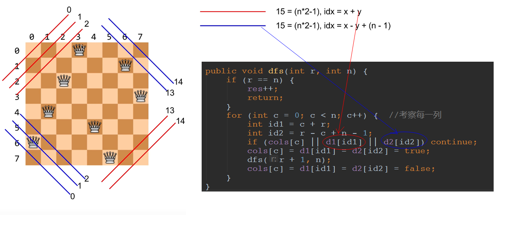
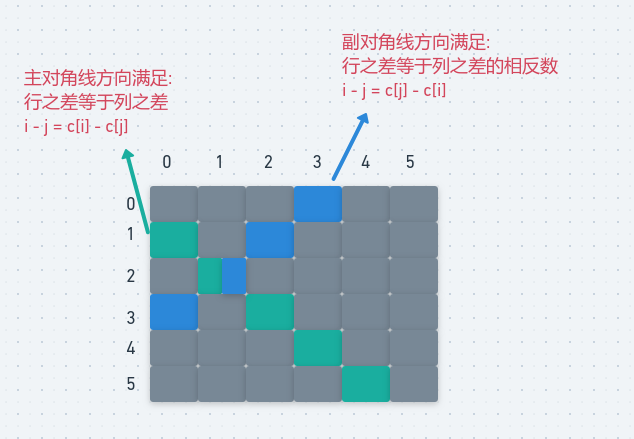

# LeetCode - 52. N-Queens

#### [题目链接]()

#### 题目

## 解析

比上一题还要简单，只要你求方法数。。具体看上一题`LeetCode - 51`的解析吧，递归到`N`层的时候，累加结果就行了。



代码: 

```java
class Solution {

    private int res;
    private boolean[] cols, d1, d2;

    public int totalNQueens(int n) {
        if (n == 0)
            return res;
        cols = new boolean[n];
        d1 = new boolean[n * 2 - 1];
        d2 = new boolean[n * 2 - 1];
        dfs(0, n);
        return res;
    }

    public void dfs(int r, int n) {
        if (r == n) {
            res++;
            return;
        }
        for (int c = 0; c < n; c++) {  //考察每一列
            int id1 = c + r;
            int id2 = r - c + n - 1;
            if (cols[c] || d1[id1] || d2[id2]) continue;
            cols[c] = d1[id1] = d2[id2] = true;
            dfs(r + 1, n);
            cols[c] = d1[id1] = d2[id2] = false;
        }
    }
}
```

也是第二种方法统计数目就可以了。

<div align="center"></div><br>
代码:

```java
public class Solution {

    private int[] cols;

    public int totalNQueens(int n) {
        if (n < 1) return 0;
        cols = new int[n];
        return dfs(0, n);
    }

    public int dfs(int r, int n) {
        if (r == n)
            return 1;
        int res = 0;
        for (int c = 0; c < n; c++) {
            if (!isValid(r, c)) continue;
            cols[r] = c;
            res += dfs(r + 1, n);
        }
        return res;
    }

    private boolean isValid(int r, int c) {
        for (int i = 0; i < r; i++)
            if (c == cols[i] || r - i == c - cols[i] || r - i == cols[i] - c)
                return false;
        return true;
    }
}
```

