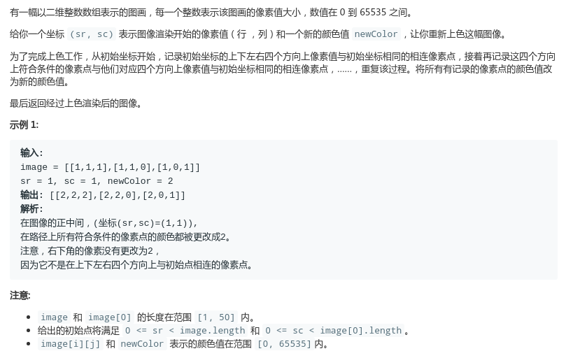

# LeetCode - 733. Flood Fill

#### [题目链接](https://leetcode.com/problems/flood-fill/)

> https://leetcode.com/problems/flood-fill/

#### 题目



## 解析

入门DFS题目。

```java
import java.util.Arrays;

public class Solution {

    final int[][] dir = {{-1, 0}, {0, 1}, {1, 0}, {0, -1}};

    private int startColor;

    public int[][] floodFill(int[][] image, int sr, int sc, int newColor) {
        startColor = image[sr][sc];
        dfs(image, sr, sc, newColor);
        return image;
    }

    private void dfs(int[][] image, int x, int y, int newColor) {
        if (image[x][y] == newColor) return;
        image[x][y] = newColor;
        for (int i = 0; i < 4; i++) {
            int nx = x + dir[i][0];
            int ny = y + dir[i][1];
            if (nx >= 0 && nx < image.length && ny >= 0 && ny < image[0].length && image[nx][ny] == startColor)
                dfs(image, nx, ny, newColor);
        }

    }

    public static void main(String[] args) {
        int[][] arr = {{1, 1, 1}, {1, 1, 0}, {1, 0, 1}};
        System.out.println(Arrays.deepToString(new Solution().floodFill(arr, 1, 1, 2)));
    }
}
```

