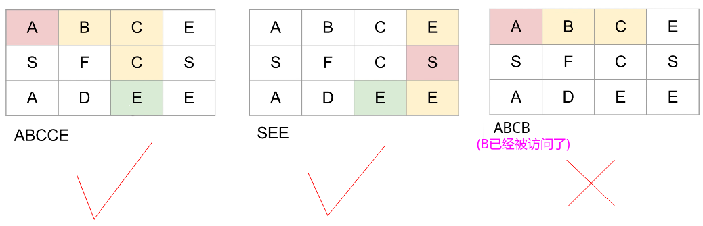

# LeetCode - 79. Word Search(DFS)

#### [题目链接](https://leetcode.com/problems/word-search/)

> https://leetcode.com/problems/word-search/

#### 题目


## 解析
这个题目很明显是使用搜索来做，这里使用`DFS`来做会比较方便: 


* 递归函数要记录一个`dist`变量，表示当前搜索的深度，或者已经找到的字符串的长度，当`dist == word.length -1 `的时候，说明已经找到了这个字符串，就可以返回`true`；
* 四个方向只需要一个即可，遍历每一个位置，从每个位置开始`DFS`即可，注意边界的判断；
* 这里在递归的时候使用`board[i][j] = '#'`，然后递归，就标识了已经访问了，就省去了一个`vis`数组，当然也可以使用`vis`数组；
* 时间复杂度O(n * m * 4<sup>`word.length()`</sup>)；其中`n = board.length`，`m = board[0].length`；

图: 



代码: 

```java
class Solution {
    public boolean exist(char[][] board, String word) {
        if(board == null || board.length == 0 || board[0].length == 0)
            return false;
        for(int i = 0; i < board.length; i++){
            for(int j = 0; j < board[0].length; j++){
                if(search(board, i, j, 0, word))
                    return true;
            }
        }
        return false;
    }
    
    private boolean search(char[][] board, int i, int j, int dist, String word){
        if(!checkBoundary(board, i, j) || board[i][j] != word.charAt(dist))
            return false;
        if(dist == word.length() - 1)  // already find the last
            return true;
        
        char tmp = board[i][j];
        board[i][j] = '#'; //  set it to be a specific symbol that can't reach
        boolean success = search(board, i+1, j, dist+1, word)
                       ||search(board, i, j+1, dist+1, word)
                       ||search(board, i, j-1, dist+1, word)
                       ||search(board, i-1, j, dist+1, word);
        board[i][j] = tmp; // backTrack,  restore it
        return success;
            
    }
    
    private boolean checkBoundary(char[][] board, int i, int j){
        return i >= 0 && i < board.length && j >=0 && j < board[0].length;
    }
}
```

使用`vis`数组: 
```java
class Solution {
    public boolean exist(char[][] board, String word) {
        if(board == null || board.length == 0 || board[0].length == 0)
            return false;
        
        boolean[][] vis = new boolean[board.length][board[0].length];
        
        for(int i = 0; i < board.length; i++){
            for(int j = 0; j < board[0].length; j++){
                if(search(board, i, j, 0, word, vis))
                    return true;
            }
        }
        return false;
    }
    
    private boolean search(char[][] board, int i, int j, int dist, String word, boolean[][] vis){
        if(!checkBoundary(board, i, j) || board[i][j] != word.charAt(dist))
            return false;
        if(vis[i][j])
            return false;
        if(dist == word.length() - 1)  // already find the last
            return true;
        
        vis[i][j] = true;
        boolean success = search(board, i+1, j, dist+1, word, vis)
                       ||search(board, i, j+1, dist+1, word, vis)
                       ||search(board, i, j-1, dist+1, word, vis)
                       ||search(board, i-1, j, dist+1, word, vis);
        vis[i][j] = false;
        return success;
    }
    
    private boolean checkBoundary(char[][] board, int i, int j){
        return i >= 0 && i < board.length && j >=0 && j < board[0].length;
    }
}
```

***

其他代码: 

`C++`代码： 

```cpp
class Solution {
public:
    bool exist(vector<vector<char>>& board, string word) {
        if(board.size() == 0)
            return false;
        
        for(int i = 0; i < board.size(); i++){
            for(int j = 0; j < board[0].size(); j++){
                if(search(board, word, i, j, 0))
                    return true;
            }
        }
        return false;
    }
private:
    bool search(vector<vector<char>>& board, const string& word, int i, int j, int dist){
        if(i < 0 || i >= board.size() || j < 0 || j >= board[0].size() || board[i][j] != word[dist])
            return false;
        if(dist == word.length() - 1)
            return true;
        
        char tmp = board[i][j];
        board[i][j] = '#';
        bool success = search(board, word, i+1, j, dist + 1)
                     ||search(board, word, i, j+1, dist + 1)
                     ||search(board, word, i-1, j, dist + 1)
                     ||search(board, word, i, j-1, dist + 1);
        board[i][j] = tmp;
        return success;
    }
};
```


`Python`: 

```python
class Solution:
    def exist(self, board, word):
        if len(board) == 0:
            return False
        for i in range(len(board)):
            for j in range(len(board[0])):
                if self.search(board, word, i, j, 0):
                    return True
        return False

    def search(self, board, word, i, j, dist):
        if i < 0 or i >= len(board) or j < 0 or j >= len(board[0]) or board[i][j] != word[dist]:
            return False
        if dist == len(word)-1:
            return True
        tmp = board[i][j]
        board[i][j] = '#'
        if self.search(board, word, i+1, j, dist+1)\
                or self.search(board, word, i, j+1, dist+1)\
                or self.search(board, word, i-1, j, dist+1)\
                or self.search(board, word, i, j-1, dist+1):
            return True
        board[i][j] = tmp
        return False
```

>  给出一个`Python`的BFS[链接](https://leetcode.com/problems/word-search/discuss/195834/Two-python-solutions)。