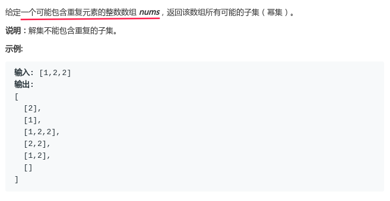
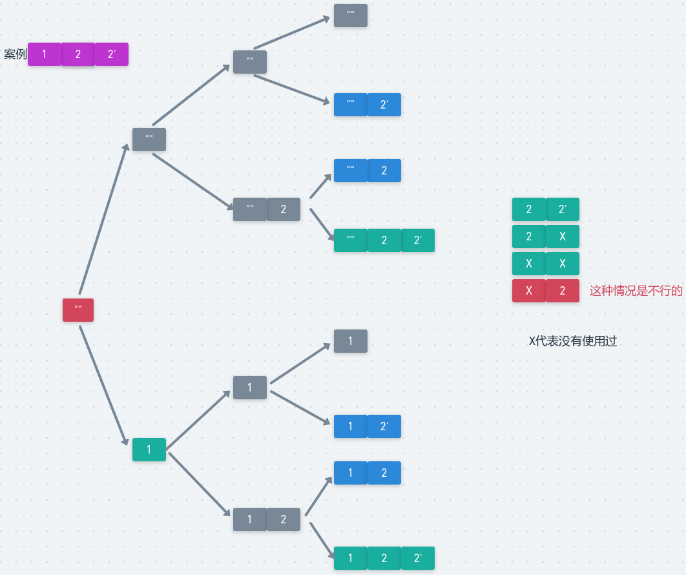

# LeetCode - 90. Subsets II

#### [题目链接]()

#### 题目



## 解析

在[LeetCode - 78. Subsets](LeetCode - 78. Subsets.md)的基础上加上去重就好了。

方法: 

* 首先要对数组排序，因为我们要对相邻的重复元素进行去重；
* 然后我们去重的条件是`if(i > 0 && !used[i-1] && arr[i] == arr[i-1]) continue;`，也是就说当我们当前元素的前一个元素没有被用过，而且当前元素`==`前一个元素的时候，就不要考虑当前元素了。

案例`[1, 2, 2]`，注意在下图中，第二个`2`我用的是`2‘`表示。

可以看到下面的蓝色部分就是重复的解。



这里提供两种写法，一种是[LeetCode - 78. Subsets](LeetCode - 78. Subsets.md)的第三种增量写法，然后还要标记每一个元素是否被使用了。

```java
class Solution {

    private List<List<Integer>> res;

    private boolean[] used;

    public List<List<Integer>> subsetsWithDup(int[] nums) {
        res = new ArrayList<>();
        used = new boolean[nums.length];
        Arrays.sort(nums);
        dfs(0,  nums, new ArrayList<>());
        return res;
    }

    private void dfs(int cur, int[] arr, ArrayList<Integer> curr) {
        res.add(new ArrayList<>(curr));
        for(int i = cur; i < arr.length; i++) {
            if(i > 0 && !used[i-1] && arr[i] == arr[i-1]) continue;
            curr.add(arr[i]);
            used[i] = true;
            dfs(i + 1,  arr, curr);
            used[i] = false;
            curr.remove(curr.size() - 1);
        }
    }

    public static void main(String[] args){
        System.out.println(new Solution().subsetsWithDup(new int[]{1, 2, 3}));
    }
}
```

然后就是改进[LeetCode - 78. Subsets](LeetCode - 78. Subsets.md)的第一种写法，我们这里可以省略一个`used`数组，直接使用一个`preTaken`变量表示前一个有没有使用过即可。

```java
class Solution {

    private List<List<Integer>> res;

    public List<List<Integer>> subsetsWithDup(int[] nums) {
        res = new ArrayList<>();
        Arrays.sort(nums);
        dfs(0, false, nums, new ArrayList<>());
        return res;
    }

    public void dfs(int cur, boolean preTaken, int[] arr, ArrayList<Integer> curr) {
        if(cur == arr.length){
            res.add(new ArrayList<>(curr));
            return;
        }
        dfs(cur+1, false, arr, curr); // 前面的
        if(cur > 0 && !preTaken && arr[cur] == arr[cur-1]) return;
        curr.add(arr[cur]);
        dfs(cur+1, true, arr, curr);
        curr.remove(curr.size() - 1);
    }


    public static void main(String[] args){
        System.out.println(new Solution().subsetsWithDup(new int[]{1, 2, 2}));
    }
}
```

