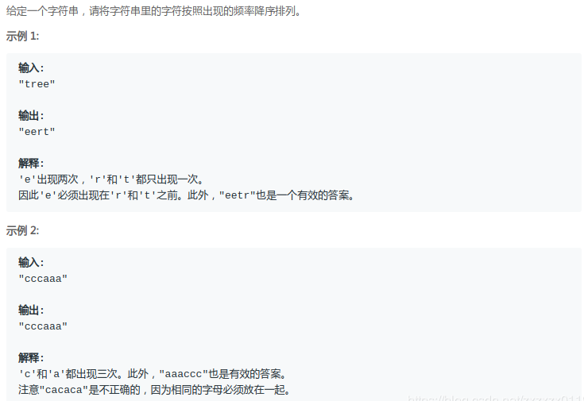

### LeetCode - 451. Sort Characters By Frequency(按照字符出现次数排序(简单题))
#### [题目链接](https://leetcode.com/problems/sort-characters-by-frequency/)

> https://leetcode.com/problems/sort-characters-by-frequency/

#### 题目

#### 解析
很简单的题目，直接按照出现次数排序即可，这里只是为了熟练`Java8`的写法以及代码的优化。上面代码是自己写的(比较冗余)，下面的是参考别人的。

```java
class Solution {
    
    private class Pair implements Comparable<Pair>{
        public char c;
        public int count;

        public Pair(char c, int count){
            this.c = c;
            this.count = count;
        }
        @Override
        public int compareTo(Pair o) {
            return -(count - o.count);
        }
    }

    public String frequencySort(String s) {

        List<Pair>pairs = new ArrayList<>();
        HashMap<Character, Integer>map = new HashMap<>();
        for(int i = 0; i < s.length(); i++){
            char c = s.charAt(i);
            if(map.containsKey(c)){
                map.put(c, map.get(c) + 1);
            }else {
                map.put(c, 1);
            }
        }

        for(Map.Entry<Character, Integer>entry : map.entrySet()){
            pairs.add(new Pair(entry.getKey(), entry.getValue()));
        }
        Collections.sort(pairs);

        StringBuilder sb = new StringBuilder();
        for(Pair pair : pairs){
            for(int i = 0; i < pair.count; i++)
                sb.append(pair.c);
        }
        return sb.toString();
    }
}

```

这个是简化后的代码: 
```java
class Solution{
    public String frequencySort(String s) {
        HashMap<Character, Integer>map = new HashMap<>(); // < char, count>
        for(char c : s.toCharArray())
            map.put(c, 1 + map.getOrDefault( c, 0 ) );
        List<Character> list = new ArrayList( map.keySet() );
        list.sort( (c1, c2) -> map.get(c2) - map.get(c1));
    
        StringBuilder sb = new StringBuilder();
        for(char c : list)
            for(int i = 0; i < map.get(c); i++)
                sb.append(c);
        return sb.toString();
    }        
}
```

