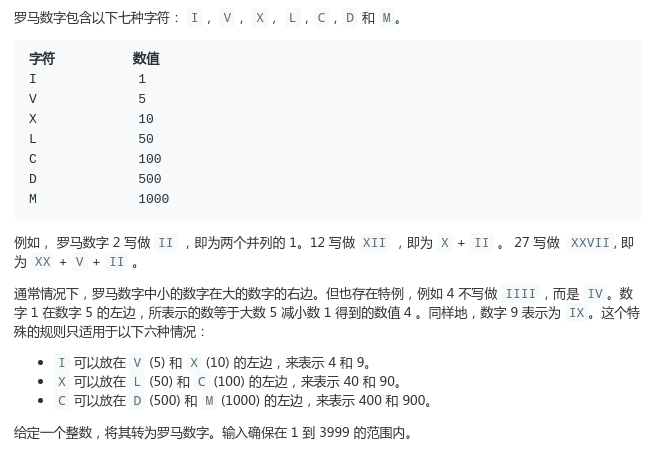
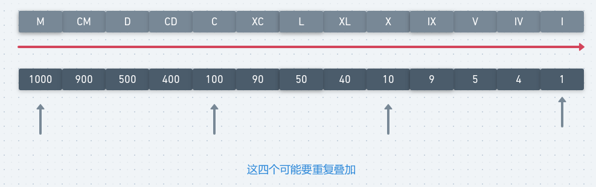

# LeetCode - 12. Integer to Roman

#### [题目链接](https://leetcode-cn.com/problems/integer-to-roman/)

> https://leetcode-cn.com/problems/integer-to-roman/

#### 题目



输入输出示例

```java
示例 1:

输入: 3
输出: "III"
示例 2:

输入: 4
输出: "IV"
示例 3:

输入: 9
输出: "IX"
示例 4:

输入: 58
输出: "LVIII"
解释: L = 50, V = 5, III = 3.
示例 5:

输入: 1994
输出: "MCMXCIV"
解释: M = 1000, CM = 900, XC = 90, IV = 4.
```

## 解析

这题不难，每个人按照自己的想法写就可以了。这里给出一个代码比较**简洁**的写法。


先将可能需要用的所有组合先打表到两个数组中，**一个数组是对应的罗马字符串，一个是对应的基础数字**。

然后就从大的数到小的数累加即可。

<div align="center"></div><br>

代码: 

```java
class Solution {
    public String intToRoman(int num) {
        String[] roman = {"M", "CM", "D", "CD", "C", "XC", "L", "XL", "X", "IX", "V", "IV", "I"};
        int[] values = {1000, 900, 500, 400, 100, 90, 50, 40, 10, 9, 5, 4, 1};
        StringBuilder sb = new StringBuilder();
        for (int i = 0; i < values.length; i++) {
            while (num >= values[i]) {
                num -= values[i];
                sb.append(roman[i]);
            }
            if (num <= 0) return sb.toString();
        }
        return sb.toString();
    }
}
```


