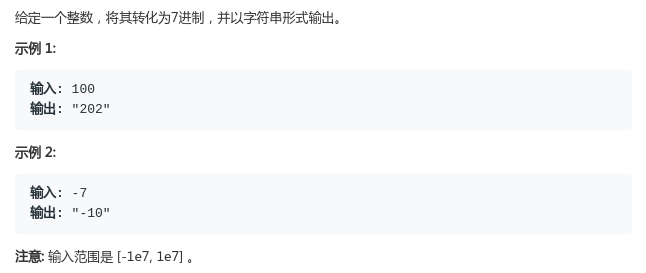

# LeetCode - 504. Base 7

#### [题目链接](https://leetcode.com/problems/base-7/)

> https://leetcode.com/problems/base-7/

#### 题目



## 解析

比较简单的题目，既然知道十进制转二进制是每次除2取余，**所以转成`7`进制就是每次除`7`取余**。

处理的话我们可以用一个字符串存结果，最后翻转即可。注意符号。

代码:

```java
class Solution {

    public String convertToBase7(int num) {
        if(num == 0) return "0";
        boolean isNegative = num < 0;
        num = isNegative ? -num : num;
        StringBuilder sb = new StringBuilder();
        while(num > 0){
            sb = sb.append((num % 7));
            num /= 7;
        }
        if(isNegative) sb = sb.append("-");
        return sb.reverse().toString();
    }
}
```

字符串也可以从前面累加。

```java
class Solution {
    public String convertToBase7(int num) {
        if (num == 0) return "0";
        boolean isNegative = num < 0;
        num = isNegative ? -num : num;
        String str = "";
        while (num > 0) {
            str = (num % 7) + str;
            num /= 7;
        }
        if (isNegative) str = "-" + str;
        return str;
    }
}
```

讨论区看到有人用递归。很好的思路。

递归三行代码:

```java
class Solution {
    public String convertToBase7(int num) {
        if (num < 0) return "-" + convertToBase7(-num);
        if (num < 7) return String.valueOf(num);
        return convertToBase7(num / 7) + String.valueOf(num % 7); //前面的先求出结果加上当前位的
    }
}
```

