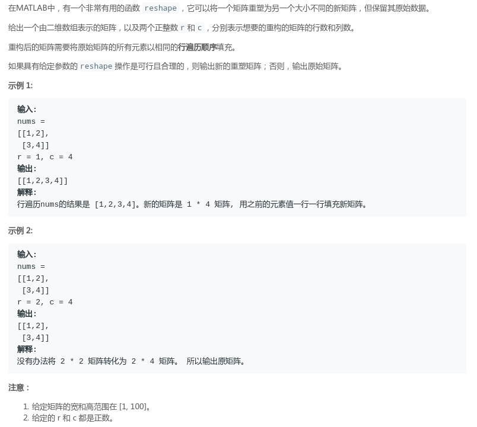

# LeetCode - 566. Reshape the Matrix(重塑矩阵)(简单题)

 - 直接填充
 - 坐标对应

***
#### [题目链接](https://leetcode.com/problems/reshape-the-matrix/description/)
> https://leetcode.com/problems/reshape-the-matrix/description/

#### 题目



比较简单的题目。

## 1、直接填充
这个方法很简单，遍历`nums`中的元素，一个一个填充到新数组即可。
```java
class Solution {

    public int[][] matrixReshape(int[][] nums, int r, int c) {
        if (nums.length == 0 || nums[0].length == 0)
            return nums;
        int n = nums.length;
        int m = nums[0].length;
        if (n * m != r * c) return nums;

        int[][] res = new int[r][c];
        int p = 0, q = 0;
        for (int i = 0; i < n; i++) {
            for (int j = 0; j < m; j++) {
                res[p][q] = nums[i][j];
                if (++q == c) {
                    ++p;
                    q = 0;
                }
            }
        }
        return res;
    }
}
```
## 2、坐标对应
这个是考虑一重循环，找坐标的对应的关系，在矩阵中，一维遍历的`nums[i]`在二维中横坐标为`i/c`，纵坐标为`i % c`，所以可以用一个一重循环遍历。

```java
class Solution {

    public int[][] matrixReshape(int[][] nums, int r, int c) {
        if (nums.length == 0 || nums[0].length == 0)
            return nums;
        int n = nums.length;
        int m = nums[0].length;
        if (n * m != r * c)
            return nums;
        int[][] res = new int[r][c];
        for (int i = 0; i < n * m; i++)
            res[i / c][i % c] = nums[i / m][i % m];
        return res;
    }
}

```
