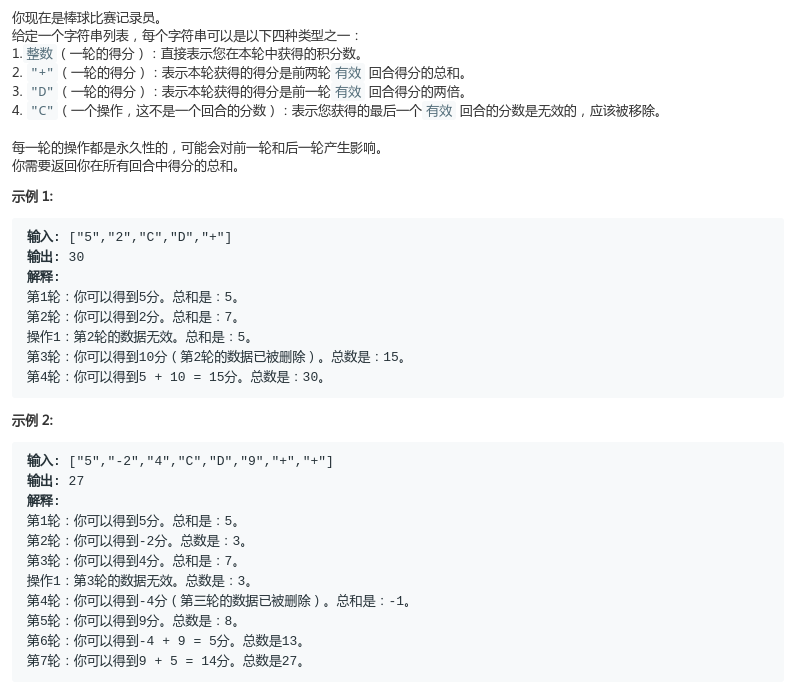

# LeetCode - 682. Baseball Game

#### [题目链接](https://leetcode.com/problems/baseball-game/)

> https://leetcode.com/problems/baseball-game/

#### 题目



## 解析

纯模拟题。按照思路写就可以了。

用一个栈保存数据即可。

```java
import java.util.*;

class Solution {
    public int calPoints(String[] ops) {
        if (ops == null || ops.length == 0) return 0;
        Stack<Integer> stack = new Stack<>();
        int res = 0;
        for (int i = 0; i < ops.length; i++) {
            if (ops[i].equals("+")) {
                int pre = stack.pop();
                int prepre = stack.peek();
                res += pre + prepre;
                stack.push(pre);
                stack.push(pre + prepre);
            } else if (ops[i].equals("D")) {
                int pre = stack.peek();
                res += 2 * pre;
                stack.push(2 * pre);
            } else if (ops[i].equals("C")) {
                res -= stack.pop();
            } else {
                res += Integer.valueOf(ops[i]);
                stack.push(Integer.valueOf(ops[i]));
            }
        }
        return res;
    }

}
```

