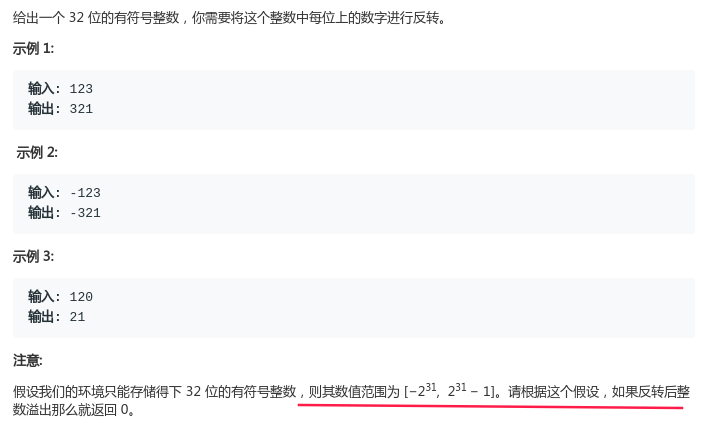

# LeetCode - 7. Reverse Integer

#### [题目链接](https://leetcode.com/problems/reverse-integer/)

> https://leetcode.com/problems/reverse-integer/

#### 题目



## 解析

这题很简单，我就不画图了。

注意负数取摸也是一样的，不需要特殊考虑，例如`-123 % 10 = -3`。

然后就是溢出的问题，如果`newRev = rev * 10 + x % 10`发生了溢出，那么`(newRev - x%10)/10`一定不会等于原来的`rev`。

> `2^31-1=2147483647,  -2^31=-2147483648`。

代码:

```java
class Solution {
    public int reverse(int x) {
        int rev = 0;
        while(x != 0){ // 不能写成>=0, 考虑负数
            int newRev = rev * 10 + x % 10;  
            if( (newRev-x%10)/10 != rev) return 0; //判断溢出
            rev = newRev;
            x /= 10;
        }
        return rev;
    }
}
```

