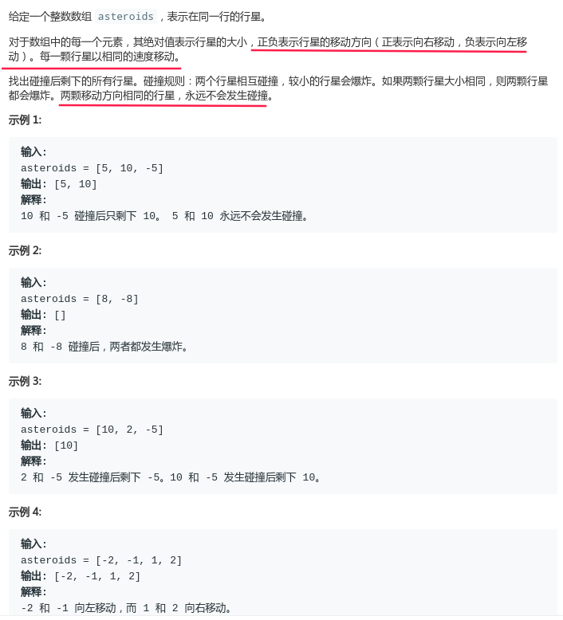

## LeetCode - 735. Asteroid Collision

#### [题目链接](https://leetcode.com/problems/asteroid-collision/)

> https://leetcode.com/problems/asteroid-collision/

#### 题目



### 解析

用栈模拟即可。注意只有一个向右一个向左才会碰撞。

```java
import java.util.*;

class Solution {

    public int[] asteroidCollision(int[] asteroids) {
        Stack<Integer> stack = new Stack<>();
        for (int n : asteroids) {
            if (stack.isEmpty()) {
                stack.push(n);
                continue;
            }
            boolean ok = false;
            while (!stack.isEmpty() && n < 0 && stack.peek() > 0) {
                if (Math.abs(n) > Math.abs(stack.peek())) {
                    stack.pop();
                } else if (Math.abs(n) == Math.abs(stack.peek())) {
                    stack.pop();
                    ok = true;
                    break;
                } else {  // n < stack.pop()
                    ok = true;
                    break;
                }
            }
            if (!ok) stack.push(n);
        }
        int[] res = new int[stack.size()];
        int p = stack.size() - 1;
        while (!stack.isEmpty()) res[p--] = stack.pop();
        return res;
    }
}
```

