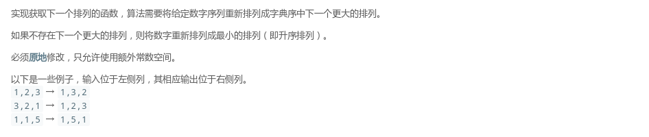

## LeetCode - 31. Next Permutation(下一个排列)
#### [题目链接](https://leetcode.com/problems/next-permutation/description/)

> https://leetcode.com/problems/next-permutation/description/

#### 题目



#### 解析

 可以分为三种情况 : 

 - 一开始就是升序的，此时我们只需要交换最后两个位置，就可以得到下一个排列；
 - 一开始就是降序的，我们只需要把整个数组反转就可以得到一个升序的排列，也就是下一个排列；
 - 普通的情况的做法就是，从数组的后面往前面开始找，直到找到<font color = red>第一个当前数不比前一个数小的位置</font>，然后再从当前位置开始往后找到<font color = red>第一个比当前数大的位置</font>，交换这个两个位置，然后将这个位置之后的数<font color = red>反转</font>一遍即可；


代码如下 : 

```java
class Solution {

    public void nextPermutation(int[] nums) {
        if (nums.length == 0 || nums == null)
            return;
        int index = nums.length - 1;
        for (; index - 1 >= 0 && nums[index - 1] >= nums[index]; index--) ;
        index--;
        if (index == -1) { //全部降序
            reverse(nums, 0, nums.length - 1);
            return;
        }
        int mini = nums.length - 1;
        for (int i = nums.length - 1; i > index; i--) {
            if (nums[i] > nums[index]) {
                mini = i;
                break;
            }
        }
        swap(nums, mini, index);
        reverse(nums, index + 1, nums.length - 1);
    }


    public void reverse(int[] arr, int start, int end) {
        if (start >= end) return;
        for (int i = start; i <= (start + end) / 2; i++) {
            swap(arr, i, (start + end - i));
        }
    }

    public void swap(int[] arr, int a, int b) {
        int temp = arr[a];
        arr[a] = arr[b];
        arr[b] = temp;
    }
}
```
