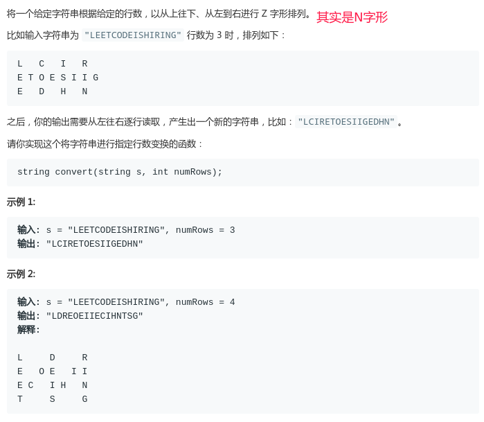
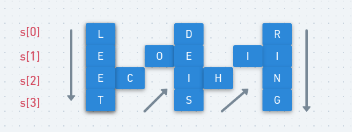
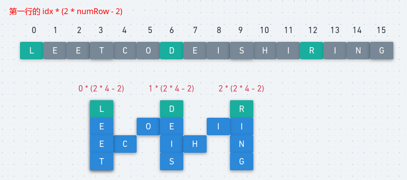
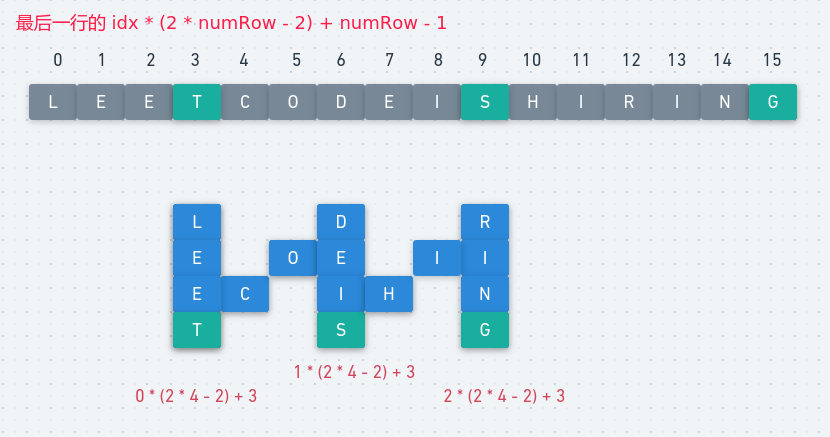
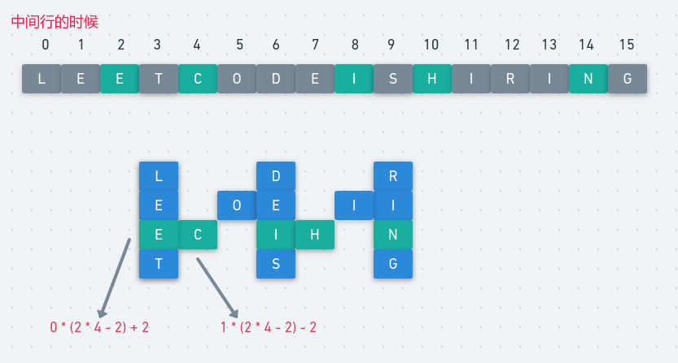

# LeetCode - 6. ZigZag Conversion(N字型打印字符)

#### [题目链接](https://leetcode.com/problems/zigzag-conversion/)

#### 题目



## 一、方法一

每一行生成一个`String`，所以我们要准备一个`String[]`数组。直接模拟先从上往上走，然后走到底了就往上走。

可以使用**当前行(`curRow`)和当前方向`down`**这两个变量对合适的行进行跟踪。

图:

<div align="center"></div><br>

代码：

```java
class Solution {
    public String convert(String s, int numRows) {
        if (numRows <= 1) return s;
        StringBuilder[] sb = new StringBuilder[numRows];
        for (int i = 0; i < numRows; i++) sb[i] = new StringBuilder();
        int curRow = 0;
        boolean down = false; // 注意一开始必须是false,因为等下会down = !down
        for (char c : s.toCharArray()) {
            sb[curRow].append(c);
            if (curRow == numRows - 1 || curRow == 0) down = !down;
            if (down)
                curRow += 1;
            else
                curRow -= 1;
        }
        StringBuilder res = new StringBuilder();
        for (StringBuilder row : sb) res.append(row);
        return res.toString();
    }
}
```

## 二、方法二


第二种方法是一行一行的去找每个一行的每一个位置在源字符串中对应的下标在哪。

分三种情况:

* 第一行的时候，某个字符位于`idx * (2 * numRow - 2)`。
* 最后一行的时候，某个字符位于`idx * (2 * numRow - 2) + numRow - 1`。
* 中间行的时候，每一次要搞定两个字符，位置分别是`idx * (2 * numRow - 2) + i`和`(idx+1) * (2 * numRow - 2) - i`。

每种情况的图:

<div align="center"></div><br>

最后一行的:

<div align="center"></div><br>

中间的时候:

<div align="center"></div><br>

代码

```java
class Solution {
    public String convert(String s, int numRows) {
        if (numRows <= 1) return s;
        int n = s.length();
        char[] chs = s.toCharArray();
        StringBuilder res = new StringBuilder();
        int cycle = 2 * numRows - 2;
 
        for (int i = 0; i < numRows; i++) {
            for (int j = 0; j + i < n; j += cycle) {
                res.append(chs[i + j]);
                if(i == 0 || i == numRows - 1) continue;
                // 不是第一行和最后行，每次要append两个
                if (j + cycle - i < n) res.append(chs[j + cycle - i]); //注意最后可能不足
            }
        }
        return res.toString();
    }
}
```

