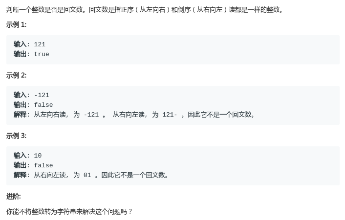
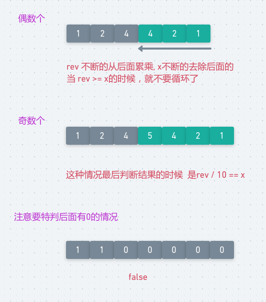

# LeetCode - 9. Palindrome Number

#### [题目链接](https://leetcode.com/problems/palindrome-number/)

> https://leetcode.com/problems/palindrome-number/

#### 题目



### 解析

直接处理成字符串就不说了。

一遍循环逆序过来也比较简单，**但是也要考虑溢出问题**。

`O( len(N) ) `

```java
class Solution {
    public boolean isPalindrome(int x) {
        if (x < 0) return false;
        int rev = 0;
        int tmp = x;
        while (tmp > 0) {
            int newRev = rev * 10 + tmp % 10;  
            if( (newRev-tmp%10)/10 != rev) return false; //判断溢出
            rev = newRev;
            tmp /= 10;
        }
        return x == rev;
    }
} 
```

更好的方法:

* **考虑只反转数字的一半**，如果该数字是回文，**其后半部分反转后应该与原始数字的前半部分相同**。
* 循环条件是剩余的`x`要大于`rev`(累乘的反转数)；(也就是一半的边界)
* 然后最后判断是否相同的条件要分奇偶，奇数的话将`rev/10`即可。因为奇数的话`rev`会比`x`多出来一位；

`O(len(N)/2)`

图:

<div align="center"></div><br>

代码: 

```java
class Solution {
    public boolean isPalindrome(int x) {
        if (x < 0) return false;
        if(x%10 == 0 && x != 0) return false;// must add this
        int rev = 0;
        while(x > rev){// 处理一半
            rev = rev * 10 + x % 10;
            x /= 10;
        }
        return x == rev || x == rev/10;// 1221, 12321,分别是奇数和偶数的情况
    }
} 
```

