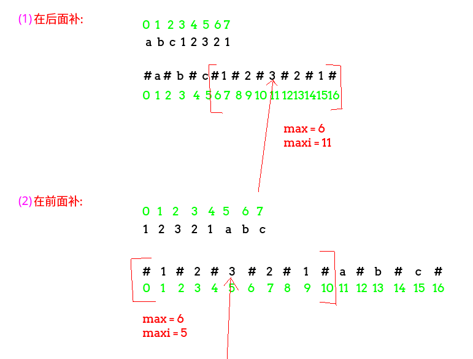

## LeetCode - 214. Shortest Palindrome(KMP和Manacher算法解决)

 - KMP算法解决
 - 使用Manacher解决以及扩展
 - 递归解决

***
#### [题目链接](https://leetcode.com/problems/shortest-palindrome/description/)

#### 题目


### KMP算法解决
**KMP基础可以先看一下[这篇文章](https://blog.csdn.net/zxzxzx0119/article/details/81430392)**。

* KMP解决算法就是我们**先在原始的串后面加上一个`'#'`，然后在加上原串的倒置串**；
* 然后对整个串求出它的`next`数组(`next[i]`代表的是<font color = red>在`0 ~ i-1` 中，必须以`str[i-1]`结尾的后缀子串(不能包含`str[0]`)与必须以`str[0]`开头的前缀子串(不能包含`str[i-1]`)的最大匹配长度</font>) ；
* 然后我们要的就是整个串的最长公共前缀和后缀，然后再进行字符串的处理即可，处理的方面看代码。  

 <font color = red> **注意下面画的图所有的例子都是  `12321cba` 这个字符串。**</font>


代码如下: 

```java
class Solution {
    public String shortestPalindrome(String s) {
        String temp = s + "#" + new StringBuilder(s).reverse().toString();
        int[] next = getNext(temp); //获得 每个位置  前面的最长公共前缀和最长公共后缀的长度
        return new StringBuilder(s.substring(next[next.length - 1])).reverse().toString() + s;
    }


    //获取next数组
    private int[] getNext(String str) {
        int[] next = new int[str.length() + 1];
        next[0] = -1;
        next[1] = 0;
        int cn = 0;
        for (int i = 2; i <= str.length(); ) { //注意没有i++
            if (str.charAt(i - 1) == str.charAt(cn)) {
                next[i++] = ++cn;
            } else {
                if (cn > 0) {
                    cn = next[cn];
                } else {
                    next[i++] = 0;
                }
            }
        }
        return next;
    }
}
```
***
### 使用Manacher解决
<font color = red>**`manacher`算法基础可以先看一下[这篇文章](https://blog.csdn.net/zxzxzx0119/article/details/81483564)**</font>。


* 如果能够<font color = red>使用`Manacher`算法求出以`str[0]`开头的最长回文半径</font>，如 ` 12321cba` ，如果我们可以求出`r[0]`的最大值(以`r[0]`开头的最长回文子串)，在`12321cba `这个字符串中就是`12321`；
* 那么我们的问题只需要把后面的`cba`反过来放到前面就就可以；
* 而这就是进行下标的变化得到结果(code的细节)。(下图的第二种情况)

这个问题变化问题，就是我们可以在后面添加最少字符使得变成回文串，这个是一样的(而且更简单)，看下图的第一种情况。





```java
class Solution {

    public String shortestPalindrome(String s) {
        if (s == null || s.length() < 2)
            return s;
        char[] chs = manacherString(s);
        int[] r = new int[chs.length];
        int R = -1, C = -1;
        int max = Integer.MIN_VALUE;
        for (int i = 0; i < chs.length; i++) {
            r[i] = R > i ? Math.min(r[2 * C - i], R - i) : 1;
            for (; i + r[i] < chs.length && i - r[i] >= 0 && chs[i - r[i]] == chs[i + r[i]]; ) r[i]++;
            if (i + r[i] > R) {
                R = i + r[i];
                C = i;
            }
            if (i + 1 - r[i] == 0) {  //起点是 s[0]的回文子串
                max = Math.max(max, r[i]);
            }
        }
        char[] res = new char[s.length() - max + 1];   //画一个例子试试
        for (int i = 0; i < res.length; i++) {
            res[res.length - 1 - i] = chs[chs.length - 1 - 2 * (res.length - 1 - i) - 1];//这个画一个图抠一下
        }
        return String.valueOf(res) + s;
    }

    public char[] manacherString(String str) {
        char[] res = new char[str.length() * 2 + 1];
        int index = 0;
        for (int i = 0; i < res.length; i++) {
            res[i] = ((i & 1) == 0) ? '#' : str.charAt(index++);
        }
        return res;
    }

}
```

上面第一种情况(在后面补)(问题的变式): 

```java
class Solution {
   
    /**
     * 在后面补
     * 算出以 s[0] 开头的最长回文 ，剩下的最补在 s[0]的前面
     */
    public String shortestPalindromeAfter(String s) {
        if (s == null || s.length() < 2) return s;
        char[] chs = manacherString(s);
        int[] r = new int[chs.length];
        int R = -1, C = -1;
        int max = Integer.MIN_VALUE;
        for (int i = 0; i < chs.length; i++) {
            r[i] = R > i ? Math.min(r[2 * C - i], R - i) : 1;
            for (; i + r[i] < chs.length && i - r[i] >= 0 && chs[i - r[i]] == chs[i + r[i]]; ) r[i]++;
            if (i + r[i] > R) {
                R = i + r[i];
                C = i;
            }
            if (R == chs.length) { //扩充到最后一个位置,注意 不是chs.lenght-1,因为每个r[i]包括了自己
                max = r[i];
                break;
            }
        }
        char[] res = new char[s.length() - max + 1];   //画一个例子试试
        for (int i = 0; i < res.length; i++) {
            res[res.length - 1 - i] = chs[2 * i + 1];
        }
        return s + String.valueOf(res);
    }

    public char[] manacherString(String str) {
        char[] res = new char[str.length() * 2 + 1];
        int index = 0;
        for (int i = 0; i < res.length; i++) {
            res[i] = ((i & 1) == 0) ? '#' : str.charAt(index++);
        }
        return res;
    }
}
```
***
### 递归解决
[**discuss**](https://leetcode.com/problems/shortest-palindrome/discuss/60098/My-7-lines-recursive-Java-solution)中看到的。

```java
class Solution {
    public String shortestPalindrome(String s) {
        if (s.length() <= 1) 
            return s; //递归条件
        int start = 0;
        StringBuilder sb = new StringBuilder();
        for (int i = s.length() - 1; i >= 0; i--) 
            if (s.charAt(start) == s.charAt(i)) start++;
        if (start == s.length()) return s;
        for (int i = s.length() - 1; i >= start; i--) 
            sb.append(s.charAt(i));
        return sb.toString() + shortestPalindrome(s.substring(0, start)) + s.substring(start);
    }
}
```
