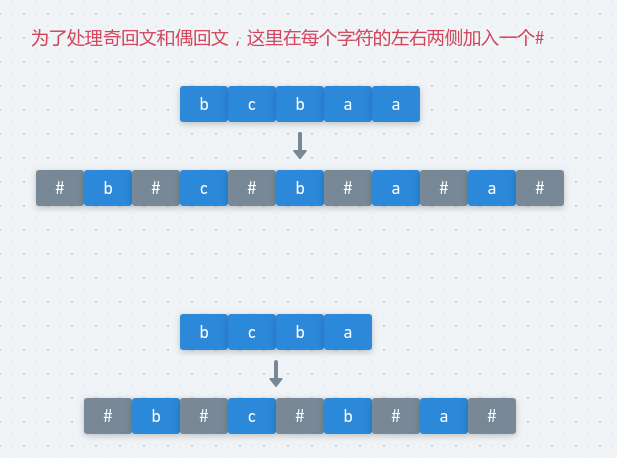

# LeetCode - 5. Longest Palindromic Substring(三种解法及Manacher算法详解)
 - 中心扩展(普通方法)
 - 动态规划`O(N^2)`
 - Manacher算法`O(N)`
***
#### [题目链接](https://leetcode.com/problems/longest-palindromic-substring/description/)

> https://leetcode.com/problems/longest-palindromic-substring/description/

#### 题目


### 一、中心扩展方法
这个方法也是最容易想到的： 

 - 从`i`位置开始，**每个位置都要往左右两边开始扩张**，相等就继续扩，不相等就停止，**并记录，注意这里的下标的变化，以及边界的处理**；
 - 这里要注意一个问题就是要**同时处理奇回文(如`cbabd`) 和偶回文(如`abbccd`)，只需要在扩展的时候扩展两次就可以了**。

图:

<div align="center"></div><br> 

代码: 

```java
class Solution {

    private int len = 0;    //记录最长回文的长度
    private int begin = 0; // 记录最长回文的起始位置

    public String longestPalindrome(String s) {
        if (s == null || s.length() < 2) return s;
        char[] chs = s.toCharArray();
        for (int i = 0; i < chs.length; i++) {
            expand(chs, i, i);        //奇回文  例如 cbabd
            expand(chs, i, i + 1); //偶数回文  例如abbccd
        }
        return s.substring(begin, begin + len);
    }

    private void expand(char[] chs, int L, int R) {
        while (L >= 0 && R < chs.length && chs[L] == chs[R]) { // 往两边扩展
            L--;
            R++;
        }
        // 为什么是r-l-1, 因为上面的判断条件中, l或者r超出了范围或者不满足条件
        // 比如   aabac, 此时L = 0, R = 4, 长度为 R - L - 1，也就是中间的3
        if (R - L - 1 > len) { 
            len = R - L - 1;
            begin = L + 1;
        }
    }
}
```
**至于为什么是`r - l - 1 `因为上面的判断条件中是判断当前的`chs[l] == chs[r]` 如果不等才退出`while`，所以包含了不等的，这个自己画一个例子就明白了**。


## 二、动态规划解决此题
**`dp[i][j]` 表示的是 ` i` 到 `j`这段是不是回文子串**。

能画出二维`dp`表，能搞清计算顺序就`ok`。

<div align="center"></dvi><br>

代码: 

```java
class Solution {

    public String longestPalindrome(String s) {
        if (s == null || s.length() < 2) return s;
        boolean[][] dp = new boolean[s.length()][s.length()];
        int begin = 0, end = 0;
        for (int i = s.length() - 2; i >= 0; i--) {
            for (int j = i + 1; j <= s.length() - 1; j++) {
                if (s.charAt(i) == s.charAt(j) && (j - i <= 2 || dp[i + 1][j - 1])) {
                    dp[i][j] = true;
                    if (j - i + 1 > end - begin + 1) {
                        begin = i;
                        end = j;
                    }
                }

            }
        }
        return s.substring(begin, end + 1);
    }
}
```

## 三、Manacher算法

Mancher解决的是求**最长回文子串的长度**的问题，这里有一个原题是[Hdu - 3068](http://acm.hdu.edu.cn/showproblem.php?pid=3068)。

这方法有点难度，可以选择性的看。

看下图(为了处理奇回文和偶回文，在原来的字符串基础上处理成中间和两边都要带上`#`的字符串)

<div align="center"></div><br>

首先给出四个概念:

 - **回文直径，以一个中心开始，向两边开始扩，能扩出来的范围，以及回文半径(回文直径的一半)**;
 - **回文半径数组`r[]` ，每个位置能扩出来的回文半径的长度**；
 - **`pR` : 所有回文半径中，最靠右的位置的下一个位置**，一开始最右边界`pR = -1`；
 - **`C` : 当前的回文右边界(最右的)的最早的中心在哪** ；

看一个简单的示例
<div align="center"></div><br>


 首先我们的目的就是要求出所有的`r[]`数组(每个位置的最长回文半径，然后取最大的即可)，Manacher算法分为大的两种情况

 - 第一种可能性: `i`不在回文右边界(`pR`, 也就是`i < pR`)里，直接暴力扩(向两边)；
 - 第二种可能性: `i`在回文右边界(`pR`)里，这种情况又可以**分为三种小情况**，看下面的三种情况的图；
    - `i`关于`C`对称的位置`i'`在`L,R`内，(`L`是`pR`关于`C`的对称点)；则`r[i] = r[i']`； (`r[i']`前面已经求解过)
    - `i`关于`C`对称的位置`i'`在`L,R`外，则`r[i] = R - i`；
    - `i`关于`C`对称的位置`i'`的回文半径左边界和`L`相等(压线)， 则从`pR`的右边开始暴力扩；

下面看**第二种可能性中**的三种情况(注意`i'`代表的就是`i`关于`C`对称的点)

第一种情况

<div align="center"></div><br>

第二种情况

<div align="center"></div><br>

第三种情况

<div align="center"></div><br>

上面的图片解释了三种情况下分别的做法，具体的做法看代码的注释。

注意其中第一种情况和第二种情况取最小值。

`Manacher`实现代码以及[Hdu - 3068](http://acm.hdu.edu.cn/showproblem.php?pid=3068)代码

```java
import java.io.BufferedInputStream;
import java.util.Scanner;

public class Main {

    /**
     * 获取指定格式的字符串(中间和两边都带有#) 这样可以处理偶回文
     * 例如 : 如果是abc -->#a#b#c#
     * 如果是abcd -->#a#b#c#d#
     */
    static char[] manacherString(String str) {
        char[] res = new char[str.length() * 2 + 1];
        int index = 0;
        for (int i = 0; i < res.length; i++)
            res[i] = ((i & 1) == 0) ? '#' : str.charAt(index++);
        return res;
    }

    static int manacher(String s) {
        if (s == null || s.length() == 0) return 0;
        char[] chs = manacherString(s);
        int[] r = new int[chs.length]; //记录每个位置的最长回文半径,注意是chs的长度
        int pR = -1, C = -1;  //分别代表目前的最长回文右边界，和它的中心
        int max = Integer.MIN_VALUE;   //记录结果
        for (int i = 0; i < chs.length; i++) {
            r[i] = pR > i ? Math.min(r[2 * C - i], pR - i) : 1; //这句代码包含三种情况 第一种大情况,和二种中的(1)(2)情况
            while (i + r[i] < chs.length && i - r[i] >= 0) { //不越界 //注意这包括了四种情况，都要扩一下，为了节省代码
                if (chs[i + r[i]] == chs[i - r[i]]) {
                    r[i]++;
                } else { //扩不动了
                    break;
                }
            }
            if (i + r[i] > pR) { //更新最右边界和它的中心
                pR = i + r[i];
                C = i;
            }
            max = Math.max(max, r[i]); //取最大的r[i] (r[i]记录的是每个位置的最长回文半径)
        }
        return max - 1; //求出来的是加了'#'的
    }

    public static void main(String[] args) {
        Scanner in = new Scanner(new BufferedInputStream(System.in));
        while (in.hasNext()) {
            String s = in.next();
            System.out.println(manacher(s));
        }
    }
}
```
**关于返回值`max-1`的例子解释**

计算出`r`数组之后，顺便记录了`r`数组的最大值，假设位置`i`的回文半径最大，即`r[i] = max`。

但`max`只是`chs`数组的最大回文半径，我们还要对应回原来的字符串。

比如原字符串为`121`，处理成`chs`之后为`#1#2#1#`，在`chs`中位置`3`的回文半径最大，最大值为`4`(即`r[3] = 4`)，对应原来的字符串的最大回文子串为`4 - 1 = 3`。


上面已经说了`Manacher`求得回文子串的长度，这里只需要记录一些求得**回文子串长度的下标**，就可以通过相应的关系还原出来。

有两种方式还原，至于下标怎么抠的，我也是写代码的时候自己画的例子，具体看代码。

```java
class Solution {
    /**
     * 方法三:  使用Manacher方法
     * 获取指定格式的字符串(中间和两边都带有#) 这样可以处理偶回文
     * 例如 : 如果是abc -->#a#b#c#
     * 如果是abcd -->#a#b#c#d#
     */
    public char[] manacherString(String str) {
        char[] res = new char[str.length() * 2 + 1];
        int index = 0;
        for (int i = 0; i < res.length; i++) {
            res[i] = ((i & 1) == 0) ? '#' : str.charAt(index++);
        }
        return res;
    }

    public String longestPalindrome(String s) {
        if (s == null || s.length() == 0) return "";
        char[] chs = manacherString(s);
        int[] r = new int[chs.length]; //记录每个位置的最长回文半径,注意是chs的长度
        int pR = -1, C = -1;  //分别代表目前的最长回文右边界，和它的中心
        int max = Integer.MIN_VALUE;   //记录结果
        int maxi = 0;
        for (int i = 0; i < chs.length; i++) {
            r[i] = pR > i ? Math.min(r[2 * C - i], pR - i) : 1;   //这句代码包含三种情况 第一种大情况,和二种中的(1)(2)情况
            //不越界 //注意这包括了四种情况，都要扩一下，为了节省代码
            while (i + r[i] < chs.length && i - r[i] >= 0 && chs[i + r[i]] == chs[i - r[i]]) r[i]++;
            if (i + r[i] > pR) { //更新最右边界和它的中心
                pR = i + r[i];
                C = i;
            }
            if (r[i] > max) {
                maxi = i;
                max = r[i];
            }
        }
        //如果使用下面注释的方法，从这一行开始都可以不要
        StringBuilder res = new StringBuilder();
        for (int i = maxi - (max - 1); i <= maxi + (max - 1); i++)
            if (chs[i] != '#') res.append(chs[i]);
        return res.toString();

        //这里要抠下标的话，自己画两个例子就知道了
//        return maxi % 2 == 0 ? s.substring(maxi / 2 - ((max) / 2), maxi / 2 + (max / 2))
//                : s.substring(maxi / 2 - ((max - 1) / 2), maxi / 2 + ((max - 1) / 2) + 1);
    }
}
```
