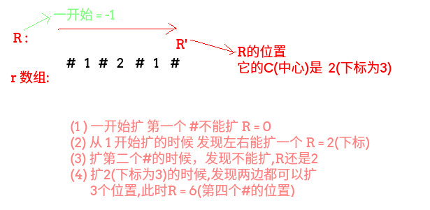
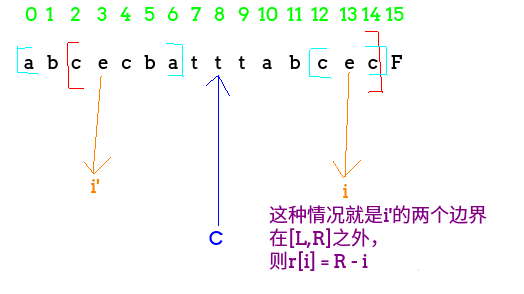
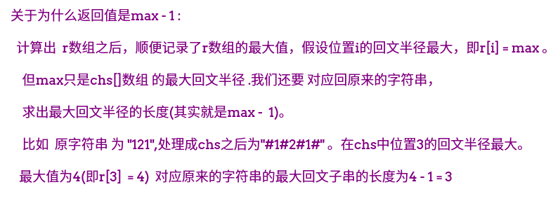

## LeetCode - 5. Longest Palindromic Substring(三种解法及Manacher算法详解)
 - Manacher总结
 - 普通方法解决此题
 - 动态规划解决此题
 - Manacher解决此题
***
#### [题目链接](https://leetcode.com/problems/longest-palindromic-substring/description/)

> https://leetcode.com/problems/longest-palindromic-substring/description/

#### 题目


### Manacher总结
<font color = red>Mancher解决的是求最长回文子串的长度的问题，这里有一个原题是[Hdu - 3068](http://acm.hdu.edu.cn/showproblem.php?pid=3068)</font>。

首先我们可以暴力的从每个位置开始扩展，比较是否相等，这样的时间复杂度是**O(n<sup>2</sup>**)(这个方法在下面有) ，`Manacher`算法就是在这个的基础上优化。
#### Manacher算法
首先给出四个概念:

 - **回文直径，以一个中心开始，向两边开始扩，能扩出来的范围，以及回文半径(回文直径的一半);**
 - **回文半径数组`r[]` ，每个位置能扩出来的回文半径的长度；**
 - **`R` : 所有回文半径中，最靠右的位置**一开始最右边界` =  -1`；
 - **`C` : 当前的回文右边界(最右的)的<font color = red>最早</font>的中心在哪** ;

看下图(为了处理奇回文和偶回文，在原来的字符串基础上处理成中间和两边都要带上`#`的字符串)




#### Manacher算法的流程
 首先我们的目的就是要求出所有的`r[]`数组(每个位置的最长回文半径)，Manacher算法分为大的两种情况

 - 第一种可能性: <font color = red>`i`不在回文右边界(`R`)里</font>，直接暴力扩(向两边)；
 - 第二种可能性: <font color = red>`i`在回文右边界(`R`)里</font>，这种情况又可以**分为三种小情况**，看下面的三种情况的图；


**下面看第二种可能性中的三种情况(注意`i'`代表的就是`i`关于`C`对称的点)**

第一种情况


第二种情况



第三种情况


上面的图片解释了三种情况下分别的做法，具体的做法看代码的注释，注意其中第一种情况和第二种情况取最小值。

`Manacher`实现代码以及[Hdu - 3068](http://acm.hdu.edu.cn/showproblem.php?pid=3068)代码

```java
import java.io.BufferedInputStream;
import java.util.Scanner;

public class Main {
    /**
     * 获取指定格式的字符串(中间和两边都带有#) 这样可以处理偶回文
     * 例如 : 如果是abc -->#a#b#c#
     *       如果是abcd -->#a#b#c#d#
     */
    static char[] manacherString(String str){
        char[] res = new char[str.length()*2+1];
        int index = 0;
        for(int i = 0; i < res.length; i++){
            res[i] = ((i&1) == 0) ? '#': str.charAt(index++);
        }
        return res;
    }

    static int manacher(String s) {
        if(s == null || s.length() == 0)return 0;
        char[] chs = manacherString(s);
        int[] r = new int[chs.length]; //记录每个位置的最长回文半径,注意是chs的长度
        int R = -1,C = -1;  //分别代表目前的最长回文右边界，和它的中心
        int max = Integer.MIN_VALUE;   //记录结果
        for(int i = 0; i < chs.length; i++){
            r[i] = R > i ? Math.min(r[2*C-i],R-i) : 1; //这句代码包含三种情况 第一种大情况,和二种中的(1)(2)情况
            while(i + r[i] < chs.length && i - r[i] >= 0){ //不越界 //注意这包括了四种情况，都要扩一下，为了节省代码
                if(chs[i+r[i]] == chs[i-r[i]]){
                    r[i]++;
                }else { //扩不动了
                    break;
                }
            }
            if(i + r[i] > R){ //更新最右边界和它的中心
                R = i + r[i];
                C = i;
            }
            max = Math.max(max,r[i]); //取最大的r[i] (r[i]记录的是每个位置的最长回文半径)
        }
        return max-1; //求出来的是加了'#'的
    }

    public static void main(String[] args) {
        Scanner cin = new Scanner(new BufferedInputStream(System.in));
        while(cin.hasNext()) {
            String s = cin.next();
            System.out.println(manacher(s));
        }
    }
}
```
**关于返回值`max-1`的例子解释**




***
### 普通方法解决此题
这个方法也是最容易想到的： 

 - 从`i`位置开始，每个位置都要往左右两边开始扩张，相等就继续扩，不相等就停止，**并记录，注意这里的下标的变化，以及边界的处理**
 - 这里要注意一个问题就是 要同时处理奇回文(如`cbabd`) 和偶回文(如`abbccd`)，只需要在扩展的时候扩展两次就可以啦。

```java
class Solution {
    /**
     * 方法一 每个位置都要暴力的扩
     */
    private int len = 0;
    private int begin = 0;

    public String longestPalindrome(String s) {
        if (s == null || s.length() < 2) return s;
        char[] chs = s.toCharArray();
        for (int i = 0; i < chs.length; i++) {
            expand(chs, i, i); //奇回文  例如 cbabd
            expand(chs, i, i + 1); //偶数回文  例如abbccd
        }
        return s.substring(begin, begin + len);
    }

    private void expand(char[] chs, int l, int r) {
        while (l >= 0 && r < chs.length && chs[l] == chs[r]) {
            l--;
            r++;
        }
        if (r - l - 1 > len) {  //注意这些长度的  " 抠 "  为什么是r-l-1因为上面的判断条件中超出了范围
            len = r - l - 1;
            begin = l + 1;
        }
    }
}
```
**至于为什么是`r - l - 1 `因为上面的判断条件中是判断当前的`chs[l] == chs[r]` 如果不等才退出`while`，所以包含了不等的，这个自己画一个例子就明白了。**

***
### 动态规划解决此题
**`dp[i][j]` 表示的是 ` i` 到 `j`这段是不是回文子串**，`dp`没什么好说的，能画出二维`dp`表，能搞清计算顺序就`ok`。


```java
class Solution {

    public String longestPalindrome(String s) {
        if (s == null || s.length() < 2) return s;
        boolean[][] dp = new boolean[s.length()][s.length()];
        int row = 0, col = 0;
        for (int i = s.length() - 2; i >= 0; i--) {
            for (int j = i + 1; j <= s.length() - 1; j++) {
                if (s.charAt(i) == s.charAt(j) && (j - i <= 2 || dp[i + 1][j - 1])) {
                    dp[i][j] = true;
                    if (j - i + 1 > col - row + 1) {
                        row = i;
                        col = j;
                    }
                }

            }
        }
        return s.substring(row, col + 1);
    }
}
```
***
### Manacher解决此题
上面已经说了`Manacher`求得回文子串的长度，这里只需要记录一些求得回文子串长度的下标，就可以通过相应的关系还原出来，有两种方式还原，至于下标怎么抠的，我也是写代码的时候自己画的例子，具体看代码。

```java
class Solution {
    /**
     * 方法三:  使用Manacher方法
     * 获取指定格式的字符串(中间和两边都带有#) 这样可以处理偶回文
     * 例如 : 如果是abc -->#a#b#c#
     * 如果是abcd -->#a#b#c#d#
     */
    public char[] manacherString(String str) {
        char[] res = new char[str.length() * 2 + 1];
        int index = 0;
        for (int i = 0; i < res.length; i++) {
            res[i] = ((i & 1) == 0) ? '#' : str.charAt(index++);
        }
        return res;
    }

    public String longestPalindrome(String s) {
        if (s == null || s.length() == 0) return "";
        char[] chs = manacherString(s);
        int[] r = new int[chs.length]; //记录每个位置的最长回文半径,注意是chs的长度
        int R = -1, C = -1;  //分别代表目前的最长回文右边界，和它的中心
        int max = Integer.MIN_VALUE;   //记录结果
        int maxi = 0;
        for (int i = 0; i < chs.length; i++) {
            r[i] = R > i ? Math.min(r[2 * C - i], R - i) : 1;   //这句代码包含三种情况 第一种大情况,和二种中的(1)(2)情况
            //不越界 //注意这包括了四种情况，都要扩一下，为了节省代码
            while (i + r[i] < chs.length && i - r[i] >= 0 && chs[i + r[i]] == chs[i - r[i]]) r[i]++;
            if (i + r[i] > R) { //更新最右边界和它的中心
                R = i + r[i];
                C = i;
            }
            if (r[i] > max) {
                maxi = i;
                max = r[i];
            }
        }
        StringBuilder res = new StringBuilder(); //如果使用下面注释的方法，从这一行开始都可以不要
        for (int i = maxi - (max - 1); i <= maxi + (max - 1); i++) {
            if (chs[i] != '#') res.append(chs[i]);
        }
        return res.toString();
        
//        if( maxi % 2 == 0){   这里要抠下标的话，自己画两个例子就知道了
//            return s.substring(maxi/2-((max)/2),maxi/2+(max/2));
//        }
//        else return s.substring(maxi/2-((max-1)/2),maxi/2+((max-1)/2) + 1);
    }
}
```
