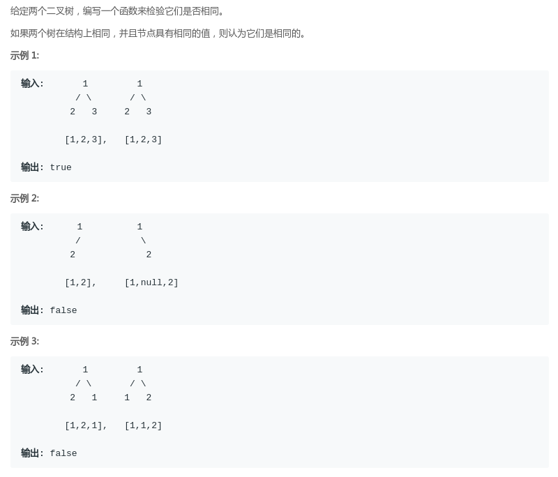
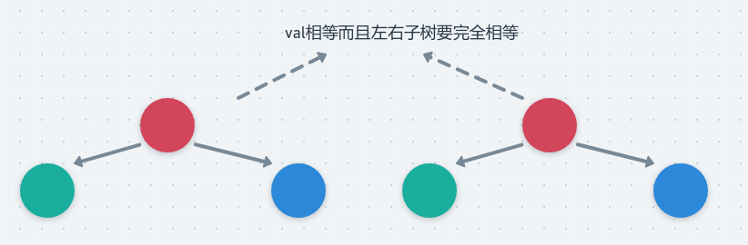

# LeetCode - 100. Same Tree(判断两棵树是否完全相同)(简单题)
* 递归
* 非递归

***
#### [题目链接](https://leetcode.com/problems/same-tree/)

> https://leetcode.com/problems/same-tree/

#### 题目

## 1、递归
这题比较简单。分为五种情况:

* `p、q`都为空，返回`true`；
* `p == null && q != null `返回`false`；
* `p != null && q == null`返回`false`；
* `p.val != q.val` 返回`false`；
* `p.val == q.val`  ---> 去判断他们的左右子树是否相等(递归)；

图: 

代码：

```java
class Solution {
    public boolean isSameTree(TreeNode p, TreeNode q) {
        if (p == null && q == null)
            return true;
        if (p == null || q == null)
            return false;
        return p.val == q.val && isSameTree(p.left, q.left) && isSameTree(p.right, q.right);
    }
}
```

## 2、非递归

这个也很简单:

* 栈中保存两棵树的节点即可(使用数组)，当然也可以使用两个栈；
* 然后利用前序非递归类似的方式非递归，判断条件还是和递归一样，只不过改成了非递归而已。
```java
class Solution {
    public boolean isSameTree(TreeNode p, TreeNode q) {
        if (p == null && q == null)
            return true;
        if (p == null || q == null)
            return false;
        Stack<TreeNode[]> stack = new Stack<>();
        stack.push(new TreeNode[]{p, q});
        while (!stack.isEmpty()) {
            TreeNode[] top = stack.pop();
            if (top[0] == null && top[1] == null)
                continue;
            if (top[0] == null || top[1] == null)
                return false;
            if (top[0].val != top[1].val)
                return false;
            stack.push(new TreeNode[]{top[0].left, top[1].left});
            stack.push(new TreeNode[]{top[0].right, top[1].right});
        }
        return true;
    }
}
```

