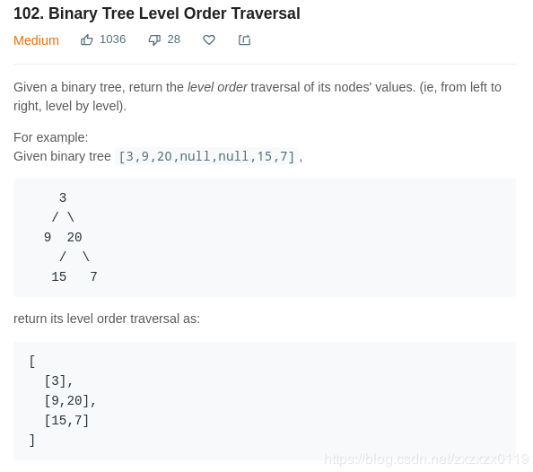

## LeetCode - 102. Binary Tree Level Order Traversal(层次遍历保存)
 - 非递归
 - 递归
***
#### [题目链接](https://leetcode.com/problems/binary-tree-level-order-traversal/description/)

> https://leetcode.com/problems/binary-tree-level-order-traversal/description/

#### 题目


这个题目和 [LeetCode - 637](https://blog.csdn.net/zxzxzx0119/article/details/81738741)基本一样，这个可以说更简单。

### 非递归(BFS)

```java
class Solution {
    public List<List<Integer>> levelOrder(TreeNode root) {
        List<List<Integer>> res = new ArrayList<>();
        if (root == null)
            return res;
        Queue<TreeNode> queue = new LinkedList<>();
        queue.add(root);
        while (!queue.isEmpty()) {
            int n = queue.size();
            List<Integer> temp = new ArrayList<>();
            for (int i = 0; i < n; i++) {
                TreeNode top = queue.poll();
                temp.add(top.val);
                if (top.left != null)
                    queue.add(top.left);
                if (top.right != null)
                    queue.add(top.right);
            }
            res.add(temp);
        }
        return res;
    }
}
```

### 递归(DFS)
先序: 
* 也是要注意分为两种情况，第一种是现在所处的高度`level`是`>=`当前结果集`res`的大小的，此时要临时开辟一个`List`中间集来存储；
* 第二种情况就是当前所处高度`<`当前结果集`res`的`size`，此时就不需要开辟，因为之前已经有了。

```java
class Solution {
    public List<List<Integer>> levelOrder(TreeNode root) {
        List<List<Integer>> res = new ArrayList<>();
        if (root == null)
            return res;
        pre(root, 0, res);
        return res;
    }

    // pre
    private void pre(TreeNode node, int level, List<List<Integer>> res) {
        if (node == null)
            return;
        if (level >= res.size()) { // 下面的新的高度
            List<Integer> temp = new ArrayList<>();
            temp.add(node.val);
            res.add(temp);
        } else { // 之前的
            res.get(level).add(node.val);
        }
        pre(node.left, level + 1, res);
        pre(node.right, level + 1, res);
    }
}
```

中序: 
```java
class Solution {
    public List<List<Integer>> levelOrder(TreeNode root) {
        
        List<List<Integer>> res = new ArrayList<>();
        if (root == null)
            return res;
        in(root, 0, res);
        return res;
    }

    private void in(TreeNode node, int level, List<List<Integer>> res) {
        if (node == null)
            return;
        if (level >= res.size()) //直接都建出中间集
            res.add(new ArrayList<>());
        in(node.left, level + 1, res);
        res.get(level).add(node.val);
        in(node.right, level + 1, res);
    }
}
```
后序:

```java
class Solution {
    public List<List<Integer>> levelOrder(TreeNode root) {
        List<List<Integer>> res = new ArrayList<>();
        if (root == null)
            return res;
        post(root, 0, res);
        return res;
    }

    private void post(TreeNode node, int level, List<List<Integer>> res) {
        if (node == null)
            return;
        if (level >= res.size())
            res.add(new ArrayList<>());
        post(node.left, level + 1, res);
        post(node.right, level + 1, res);
        res.get(level).add(node.val);
    }
}
```
