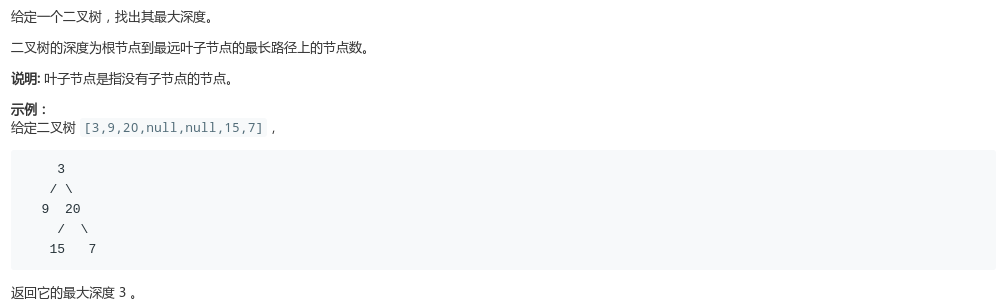
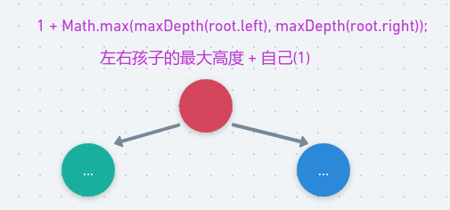
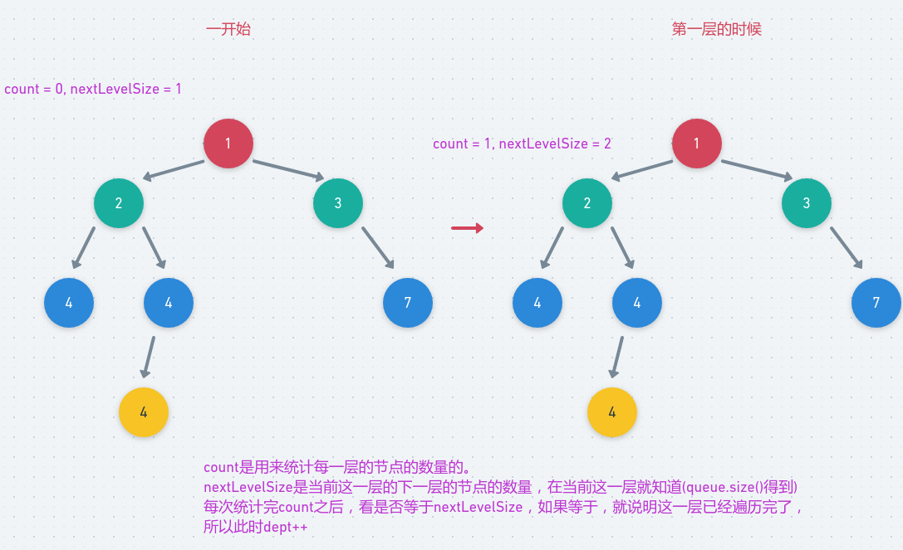

# LeetCode - 104. Maximum Depth of Binary Tree

#### [题目链接](https://leetcode.com/problems/maximum-depth-of-binary-tree/)

> https://leetcode.com/problems/maximum-depth-of-binary-tree/

#### 题目



## 解析

递归的思路很简单。当前结点为根的树的高度 = 左右子树中高的那个 + 1 (自己)。

<div align="center"></div><br>

代码:

```java
class Solution {
    public int maxDepth(TreeNode root) {
        if (root == null)
            return 0;
        return 1 + Math.max(maxDepth(root.left), maxDepth(root.right));
    }
}
```

方法二。

可以利用层次遍历。来求树的层数(高度)。

* 每一层的数量用一个变量`count`统计，总的层数用`depth`统计；
* 同时，我们在当前层的时候，可以得知下一层的节点的数量(通过`queue.size()`)；
* 然后在到了下一层的时候， 就判断统计的数量`count == nextLevelSize`，如果等于，就加一层`depth++`；

图:



代码:

```java
class Solution {
    public int maxDepth(TreeNode root) {
        if (root == null)
            return 0;
        Queue<TreeNode> queue = new LinkedList<>();
        queue.add(root);
        int count = 0, nextLevelSize = 1;
        int depth = 0;
        while (!queue.isEmpty()) {
            TreeNode cur = queue.poll();
            count++;
            if (cur.left != null) queue.add(cur.left);
            if (cur.right != null) queue.add(cur.right);
            if (count == nextLevelSize) {
                count = 0;
                depth++;
                nextLevelSize = queue.size(); //下一层的节点的个数
            }
        }
        return depth;
    }
}
```

