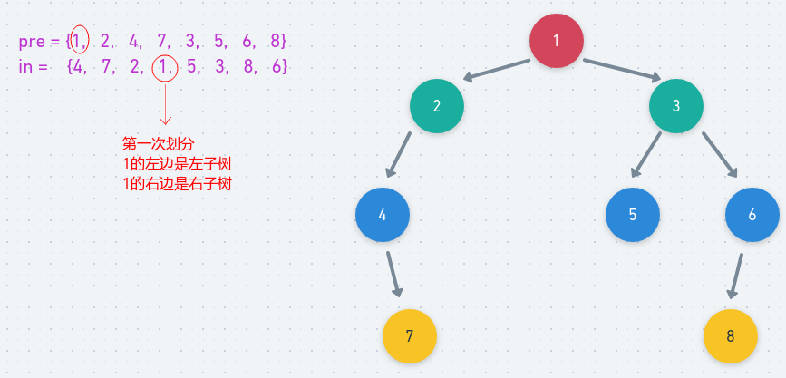

# LeetCode - 105. Construct Binary Tree from Preorder and Inorder Traversal

#### [题目链接](https://leetcode.com/problems/construct-binary-tree-from-preorder-and-inorder-traversal/)

> https://leetcode.com/problems/construct-binary-tree-from-preorder-and-inorder-traversal/

#### 题目

## 解析

思路:

 - 根据前序和中序建树时，**前序遍历的第一个结点就是根，在中序遍历中找到根所在的位置**，计算的左子树长度(左边孩子的个数`lLen`)(可以得出右子树的长度 = 总长度-左子树长度-1)；
 - 这样在中序遍历中就确定了根节点的位置，且在`pre`数组中`pre[pL+1, pL+lLen]`之间都是根节点的左孩子；在`in`数组中`in[iL, iL + lLen - 1]`位置也都是根节点的左孩子，利用这个重新递归构造根节点的左子树即可；
 - 同理，在`pre`数组中`pre[pL + lLen + 1 , pR]`都是当前根节点的右孩子，在`in`数组中`in[iL + lLen + 1 , iR]`也都是当前根节点的右孩子，利用这两段重新构造根节点的右子树即可；

> 注意根据**前序遍历和中序遍历，中序遍历和后续遍历都可以建立一颗二叉树**，**但是根据前序遍历和后续遍历不可以确定一颗二叉树**，前序和后序在本质上都只是**将子节点和父节点**分离，没有指明左右子树的能力。

图:

<div align="center"></div><br>

代码:

```java
class Solution {
    public TreeNode buildTree(int[] preorder, int[] inorder) {
        return rec(preorder, 0, preorder.length - 1, inorder, 0, inorder.length - 1);
    }

    public TreeNode rec(int[] pre, int pL, int pR, int[] in, int iL, int iR) {
        if (pL > pR || iL > iR)
            return null;
        TreeNode root = new TreeNode(pre[pL]); //根
        int lLen = 0; //左子树 数组长度 (在in数组中找到pre[pL](根))
        for (int i = iL; i <= iR && in[i] != pre[pL]; i++, lLen++) ;
        root.left = rec(pre, pL + 1, pL + lLen, in, iL, iL + lLen - 1); //pre[pL]和in[iL + iLen]是根
        root.right = rec(pre, pL + lLen + 1, pR, in, iL + lLen + 1, iR);
        return root;
    }
}
```

