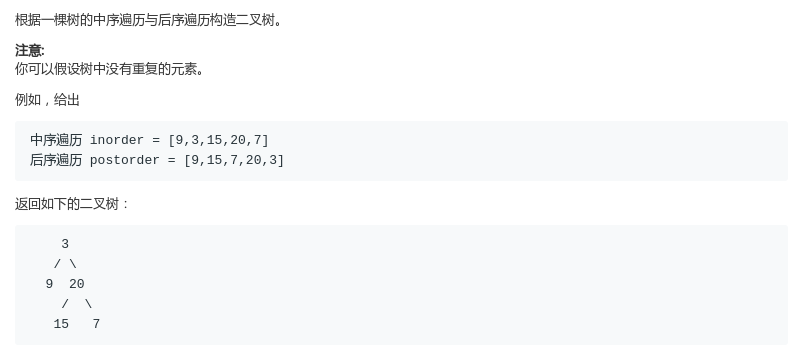
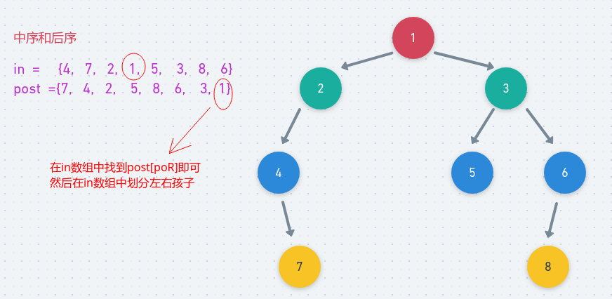

# LeetCode - 106. Construct Binary Tree from Inorder and Postorder Traversal

#### [题目链接](https://leetcode.com/problems/construct-binary-tree-from-inorder-and-postorder-traversal/)

> https://leetcode.com/problems/construct-binary-tree-from-inorder-and-postorder-traversal/

#### 题目



## 解析

和上一题[LeetCode - 105. Construct Binary Tree from Preorder and Inorder Traversal](https://github.com/ZXZxin/ZXBlog/blob/master/%E5%88%B7%E9%A2%98/LeetCode/Tree/LeetCode%20-%20105.%20Construct%20Binary%20Tree%20from%20Preorder%20and%20Inorder%20Traversal.md)类似，我们只需要每次递归的时候在`in`数组中找到`post`数组的最后一个元素，然后递归建立左右子树即可。

图:



代码:

```java
class Solution {
    public TreeNode buildTree(int[] inorder, int[] postorder) {
        return rec(inorder, 0, inorder.length - 1, postorder, 0, postorder.length - 1);
    }

    public TreeNode rec(int[] in, int iL, int iR, int[] post, int poL, int poR) {
        if (iL > iR || poL > poR) return null;
        TreeNode root = new TreeNode(post[poR]);//最后一个是根
        int lLen = 0; // 左子树长度, 在in[]中找到 post[posR]的位置
        for (int i = iL; i <= iR && in[i] != post[poR]; i++, lLen++) ;
        root.left = rec(in, iL, iL + lLen - 1, post, poL, poL + lLen - 1);
        root.right = rec(in, iL + lLen + 1, iR, post, poL + lLen, poR - 1);
        return root;
    }
}
```

