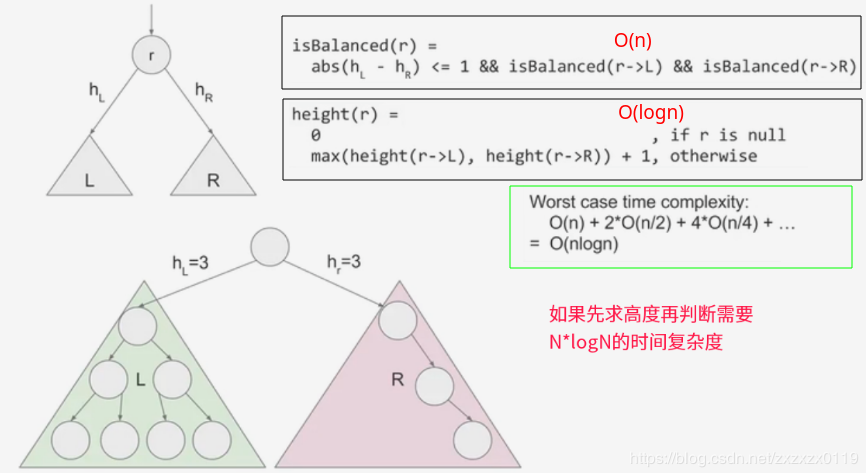
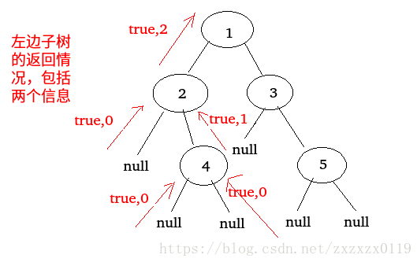

## LeetCode - 110. Balanced Binary Tree(判断一棵树是否是平衡二叉树)
 - O(N*logN)解法
 - O(n)解法

### [题目链接](https://leetcode.com/problems/balanced-binary-tree/description/)

> https://leetcode.com/problems/balanced-binary-tree/description/

#### 题目


这个题目**剑指offer**中也出现过。

#### 解析
### O(N*logN)解法
 * 首先我们知道平衡二叉树**是一棵空树或它的左右两个子树的高度差的绝对值不超过`1`，并且左右两个子树都是一棵平衡二叉树**；
 * 我们可以使用一个获取树的高度的函数。然后递归比较左右子树是不是平衡二叉树且左右子树的高度不超过`1`即可。




```java
class Solution {
    public boolean isBalanced(TreeNode root) {
        if(root == null)
            return true;
        return isBalanced(root.left) && isBalanced(root.right) && Math.abs( height(root.left)-height(root.right) ) <= 1;
    }
    
    private int height(TreeNode node){
        if(node == null)
            return 0;
        return Math.max(height(node.left),height(node.right)) + 1;
    }
}
```

***
### O(n)解法
这个题目重点是理解使用递归函数的技巧和套路： 
 所以假如我们要判断一个以x开头的结点是否为一颗平衡二叉树，则要满足以下几点 : 
 - 它的左子树要给它一个左子树本身是不是平衡二叉树的信息；
 - 它的右子树要给它一个右子树本身是不是平衡二叉树的信息；
 - 它的左子树要给它左子树高度的信息；
 - 它的右子树要给它右子树高度的信息；

所以我们知道上面的几点之后，可以完全按照上面写出一个递归结构函数，因为子树返回的信息中既包含高度信息，又包含子树是不是也是一颗平衡二叉树的信息，所以这里把这个信息封装成一个结构。

**这里和`O(n*logn)`方法不同的是，我们求的是一个结构体，递归函数同时返回了两个信息: 高度和子树是否平衡，如果不平衡，我们就不再判断直接`false`了)。**

```java
class Solution {
    //返回两个值 高度和子树是否平衡
    private class ReturnData{
        public int h;
        public boolean isB;
        public ReturnData(int h,boolean isB){
            this.h = h;
            this.isB = isB;
        }
    }
    
    public boolean isBalanced(TreeNode root) {
        if(root == null)
            return true;
        return balanced(root).isB;
    }
    
    private ReturnData balanced(TreeNode node){
        if(node == null){
            return new ReturnData(0,true);
        }
        ReturnData L = balanced(node.left);
        if(!L.isB)
            return new ReturnData(0,false);
        ReturnData R = balanced(node.right);
        if(!R.isB)
            return new ReturnData(0,false);
        return new ReturnData( Math.max(L.h,R.h)+1, Math.abs(L.h - R.h) <= 1 );
    }
}
```

如下面的树，其中的返回类型的变化，以及子树的遍历。



或者简化: 

```java
class Solution {
    
    public boolean isBalanced(TreeNode root) {
        if(root == null)
            return true;
        boolean[] res = new boolean[1];
        res[0] = true;
        height(root,res);
        return res[0];
    }
    
    private int height(TreeNode node,boolean[] res){
        if(node == null)
            return 0;
        int LH = height(node.left,res);
        if(!res[0])
            return 0;
        int RH = height(node.right,res);
        if(!res[0])
            return 0;
        if(Math.abs(LH-RH) > 1)
            res[0] = false;
        return Math.max(LH,RH) + 1;
    }
}
```
或者写成全局变量：

```java
class Solution {
    
    public boolean res;
    
    public boolean isBalanced(TreeNode root) {
        if(root == null)
            return true;
        res = true;
        height(root);
        return res;
    }
    
    private int height(TreeNode node){
        if(node == null)
            return 0;
        int LH = height(node.left);
        if(!res)
            return 0;
        int RH = height(node.right);
        if(!res)
            return 0;
        if(Math.abs(LH-RH) > 1)
            res = false;
        return Math.max(LH,RH) + 1;
    }
}
```

再简化:

```java
class Solution {
    public boolean isBalanced(TreeNode root) {
        if(root == null)
            return true;
        return height(root) > -1;
    }
    private int height(TreeNode node){
        if(node == null)
            return 0;
        int LH = height(node.left);
        int RH = height(node.right);
        if(Math.abs(LH-RH) > 1 || LH == -1 || RH == -1)
            return -1;
        return Math.max(LH,RH) + 1;
    }
}
```
