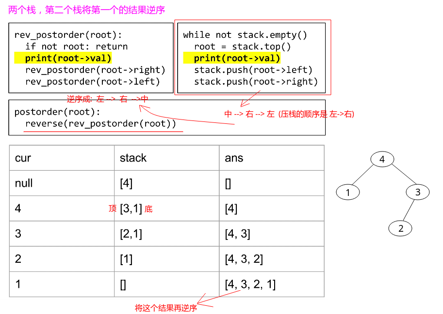

## LeetCode - 145. Binary Tree Postorder Traversal(实现后序遍历)(三种非递归方式)
 - 递归
 - 双栈法
 - 设置`pre`结点法
 -  `morris`遍历

***
#### [题目链接](https://leetcode.com/problems/binary-tree-postorder-traversal/description/)

> https://leetcode.com/problems/binary-tree-postorder-traversal/description/

#### 题目


### 递归
这个很简单。
```cpp
class Solution {

    private List<Integer> res;

    public List<Integer> postorderTraversal(TreeNode root) {
        res = new ArrayList<>();
        rec(root);
        return res;
    }

    public void rec(TreeNode root) {
        if (root == null)
            return;
        rec(root.left);
        rec(root.right);
        res.add(root.val);
    }
}
```

当然也可以使用类似函数式编程的方式: 

```java
class Solution {
    public List<Integer> postorderTraversal(TreeNode root) {
        if (root == null)
            return new ArrayList<>();
        List<Integer> res = new ArrayList<>();
        List<Integer> L = postorderTraversal(root.left);
        List<Integer> R = postorderTraversal(root.right);
        res.addAll(L); // left
        res.addAll(R); //  right
        res.add(root.val);  // middle
        return res;
    }
}
```
`C++`写法: 

```cpp
class Solution {
public:
    vector<int> postorderTraversal(TreeNode* root) {
        if(!root)
            return {};
        vector<int>res;
        vector<int>l = postorderTraversal(root->left);
        vector<int>r = postorderTraversal(root->right);
        res.insert(res.end(), l.begin(), l.end());
        res.insert(res.end(), r.begin(), r.end());
        res.push_back(root->val);
        return res;
    }
};
```

### 双栈法
 - 我们前序遍历是：`中->左->右`，所以压栈的顺序是 `右->左`；
 - 我们可以实现遍历: `中->右->左`，所以压栈的顺序是  `左->右`；
 - 利用上面这个 ，我们遍历的时候是`中->右->左`，但是我们不遍历，将<font color = red>**这个压入另一个栈，最后逆序回来，就能得到左->右->中；**</font>





注意: 本来后面还需要用一个栈来逆序的，但是由于`List`有一个`addFirst`方法，所以可以省掉一个栈。两个栈的可以看[这篇博客](https://blog.csdn.net/zxzxzx0119/article/details/79808127#t4)。
```java
class Solution {
    /**
     * 前序非递归: 中左右  入栈:  右左
     * 我们可以实现 : 中右左 入栈:  左右(1)
     * 后续非递归: 左右中
     * 上一个(1)位置该打印的时候不打印，压入到另一栈就是后续遍历
     */
    public List<Integer> postorderTraversal(TreeNode root) {
        LinkedList<Integer> res = new LinkedList<>();
        if (root == null)
            return res;
        Stack<TreeNode> stack = new Stack<>();
        stack.push(root);
        TreeNode cur = null;
        while (!stack.isEmpty()) {
            cur = stack.pop();
            //下面这一步就是 reverse(print(root), visit(right), visit(left))
            res.addFirst(cur.val);//代替了另一个栈
            if (cur.left != null)
                stack.push(cur.left);
            if (cur.right != null)
                stack.push(cur.right);
        }
        return res;
    }
}
```
在`C++`中，可以使用`deque`来处理: 
`C++`代码: 

```cpp
class Solution {
public:
    vector<int> postorderTraversal(TreeNode* root) {
        if(!root)
            return {};
        deque<int>res; // 使用双端队列
        stack<TreeNode*>s;        
        s.push(root);
        while(!s.empty()){
            TreeNode* cur = s.top();
            s.pop();
            //下面这一步就是 reverse(print(root), visit(right), visit(left))
            res.push_front(cur->val);  // 模拟最后逆转的过程,(从头部插入) 
            if(cur->left)
                s.push(cur->left);
            if(cur->right)
                s.push(cur->right);
        }
        return vector<int>(res.begin(), res.end());  // vector(begin,end):复制[begin,end)区间内另一个数组的元素到vector中        
    }
};
```
***
### 设置`pre`结点

 - 对于任一结点`p`，先将其入栈。若`p`不存在左孩子和右孩子，则可以直接访问它。或者`p`存在左孩子或者右孩子，但是左孩子和右孩子都已经被访问过了，则可以直接访问该结点。 
 - 若非上述两种情况，则将右孩子和左孩子依次入栈。这样可以保证每次取栈顶元素时，左孩子在右孩子前面被访问，根结点在左孩子和右孩子访问之后被访问。

```java
class Solution {
    public List<Integer> postorderTraversal(TreeNode root) {
        List<Integer> res = new ArrayList<>();
        if (root == null)
            return res;
        Stack<TreeNode> stack = new Stack<>();
        stack.push(root);
        TreeNode cur = null, pre = null;
        while (!stack.isEmpty()) {
            cur = stack.peek();   // 不能直接pop
            if ((cur.left == null && cur.right == null) || ((pre != null) && (pre == cur.left || pre == cur.right))) {
                res.add(cur.val);
                pre = cur;
                stack.pop();
            } else {               // otherwise, can't visis directly
                if (cur.right != null)
                    stack.push(cur.right);
                if (cur.left != null)
                    stack.push(cur.left);
            }
        }
        return res;
    }
}
```


***
### `morris`遍历
`morris` 遍历看[这篇博客](https://blog.csdn.net/zxzxzx0119/article/details/81669909)。
```java
class Solution {
    //morris后续
    public List<Integer> postorderTraversal(TreeNode root) {
        List<Integer> res = new ArrayList<>();
        if (root == null)
            return res;
        TreeNode cur = root;
        TreeNode mostRight = null;

        while (cur != null) {
            mostRight = cur.left;
            if (mostRight != null) {

                while (mostRight.right != null && mostRight.right != cur) {
                    mostRight = mostRight.right;
                }

                if (mostRight.right == null) {
                    mostRight.right = cur;
                    cur = cur.left;
                    continue;
                } else { //第二次来的时候
                    mostRight.right = null;
                    printEdge(cur.left, res); //打印左子树的右边界
                }
            }
            cur = cur.right;
        }
        printEdge(root, res); //最后打印整棵树的右边界
        return res;
    }

    //打印边界
    private void printEdge(TreeNode head, List<Integer> res) {
        //先逆序边界
        TreeNode tail = reverseEdge(head);
        //打印
        TreeNode cur = tail;
        while (cur != null) {
            res.add(cur.val);
            cur = cur.right;
        }
        //再逆序回来
        reverseEdge(tail);
    }

    //有点类似链表的逆序
    private TreeNode reverseEdge(TreeNode cur) {
        TreeNode pre = null;
        TreeNode next = null;
        while (cur != null) {
            next = cur.right;//先保存下一个
            cur.right = pre;
            pre = cur;
            cur = next;
        }
        return pre;
    }
}
```
